Originally [presented](../../slides/building-sql-translator-using-ai-coding-agents/) as part of [Aqfer](https://aqfer.com/)'s internal tech talk.

## Introduction

Building a SQL translator might sound daunting, but with the right architecture and AI coding agents, it becomes a manageable and even enjoyable engineering challenge. In this post, I'll walk you through my journey of building an extensible, grammar-based SQL translator framework that currently supports Athena ↔ BigQuery translation, with plans to expand to Snowflake, SparkSQL and etc.,

This is an on-going project, where we are expanding Grammar for more coverage. Probably, I can come back in future and write more on what happened further. Excited by good progress made so far, I ended up creating this article.

## The Goal

The project had two key requirements:
1. Leverage AI Coding Agents for development
2. Create an **extensible**, **grammar-based parsing**, **SQL translator** that works across multiple dialects

**Current Status:**
- ✅ Athena → BigQuery
- ✅ BigQuery → Athena
- 🔜 SparkSQL, Snowflake, etc.,

## Architecture Overview

The architecture follows a clean, modular design.

```dot
digraph SQLTranslatorClustered {
  rankdir=LR;
  bgcolor=transparent;
  node [shape=box, style="rounded,filled", fillcolor=white, fontname="Arial"];

  // ======================================================
  // === TEST CASES (Inputs + Outputs) =====================
  // ======================================================
  subgraph cluster_testcases {
    label="Test Cases (Developer)";
    style="rounded,bold";
    color="#a0c4ff";

    // SQL Inputs
    subgraph cluster_inputs {
      label="SQL Inputs";
      style="rounded,dashed";
      color="#a0c4ff";
      AthenaIn [label="Athena SQL"];
      BigQueryIn [label="BigQuery SQL"];
    }

    // SQL Outputs
    subgraph cluster_outputs {
      label="Generated Outputs";
      style="rounded,dashed";
      color="#ffc6ff";
      OutAthena [label="Athena SQL"];
      OutBigQuery [label="BigQuery SQL"];
    }
  }

  // ======================================================
  // === CORE SYSTEM (GRAMMAR → PARSER → IR → GENERATOR) ===
  // ======================================================
  subgraph cluster_core {
    label="SQL Translator Core (AI Agent)";
    style="rounded,bold";
    color="#90caf9";

    // === GRAMMARS ===
    subgraph cluster_grammars {
      label="ANTLR Grammars";
      style="rounded,dashed";
      color="#f4a261";
      AthenaGrammar [label="Athena.g4\n(Grammar)"];
      BigQueryGrammar [label="BigQuery.g4\n(Grammar)"];
    }

    // === PARSERS ===
    subgraph cluster_parsers {
      label="Parsers (ANTLR Generated)";
      style="rounded,dashed";
      color="#ffd6a5";
      AthenaParser [label="Athena Parser"];
      BigQueryParser [label="BigQuery Parser"];
    }

    // === CONVERTERS ===
    subgraph cluster_converters {
      label="Converters (AST → IR)";
      style="rounded,dashed";
      color="#b9fbc0";
      AthenaConverter [label="Athena Converter"];
      BigQueryConverter [label="BigQuery Converter"];
    }

    // === IR CORE ===
    subgraph cluster_ir {
      label="Unified Intermediate Representation (IR)";
      style="rounded,bold";
      color="#fff3b0";
      IR [label="Unified IR\n(Go structs / Substrait)",
          shape=box,
          style="rounded,filled,bold",
          fillcolor="#fffbea"];
    }

    // === GENERATORS ===
    subgraph cluster_generators {
      label="SQL Generators";
      style="rounded,dashed";
      color="#dab6fc";
      AthenaGen [label="Athena Generator"];
      BigQueryGen [label="BigQuery Generator"];
    }
  }

  // === GRAMMAR → PARSER (DOTTED) ===
  AthenaGrammar -> AthenaParser [style=dotted];
  BigQueryGrammar -> BigQueryParser [style=dotted];

  // === SQL → IR PATHS ===
  AthenaIn -> AthenaParser -> AthenaConverter -> IR;
  BigQueryIn -> BigQueryParser -> BigQueryConverter -> IR;

  // === IR → OUTPUTS PATHS ===
  IR -> AthenaGen -> OutAthena;
  IR -> BigQueryGen -> OutBigQuery;
}
```



### Core System Layer (AI Agent Built)

**ANTLR Grammars:**  
By using a mature grammar framework like [ANTLR](https://www.antlr.org/), we avoided having to build a custom lexer and parser through AI agents.

- `Athena.g4` - Grammar definition for Athena SQL
- `BigQuery.g4` - Grammar definition for BigQuery SQL
- Grammar generated via two approaches,  
    - Pointing to source documentation and asking AI tools to generate them
    - By using various test cases, AI Agents discover grammar required on the fly

**Parsers (Auto-generated):**
- At Aqfer [Go](https://go.dev/) is the predominant language and ANTLR supported Go as well
- ANTLR generates parsers from grammars
- These parsers are fully deterministic (~86% of total codebase)
- Athena/BigQuery parsers generates AST from the input SQL dialect

**Converters (AST → IR):**
- Transform parsed Abstract Syntax Trees into Intermediate Representation (IR)
- Athena Converter takes Athena AST and converts that into IR
- BigQuery Converter takes BigQuery AST and converts that into IR

**Unified Intermediate Representation (IR):**
- Core abstraction layer using Go structs (considering Substrait)
- Enables multi-dialect translation
- Single source of truth for SQL semantics
- This will be superset of the SQL semantics that need to be supported

**SQL Generators:**
- Generate target SQL from IR
- Athena Generator converts IR to Athena dialect
- BigQuery Generator converts IR to BigQuery dialect

### Test Cases Layer (Developer Input)
This layer contains SQL inputs and expected outputs in YAML format:
- Contains SQL dialects for different representation
- For a given test case, it has pair of Athena SQL and BigQuery SQL  
- For same test case, test can be performed on both directions

## Why This Approach?

This architecture offers several compelling advantages:

1. **Unified IR enables multi-dialect translation** - Add a new dialect by implementing just a parser/converter and generator
2. **Easy addition of new dialects** - The IR abstracts away dialect-specific quirks
3. **Consistent testing via YAML** - All test cases are version-controlled and reusable
4. **Deterministic grammar via ANTLR** - Auto-generated parsers eliminate manual parsing bugs
5. **Separation of concerns** - Each component has a single, well-defined responsibility

## CLI-Based Development & Testing

A robust CLI was crucial for the development workflow. Here's how it works:

### YAML Test Format

```yaml
test_cases:
  - name: simple_select
    bigquery: SELECT id, name, age FROM `dataset.users` WHERE age > 18
    athena: SELECT id, name, age FROM "dataset"."users" WHERE age > 18
```

### Running Tests with Slice Notation

The CLI supports flexible test execution:

```sh
# Run test case 3 only
sqltranslate --yaml examples/ --yaml-run 3

# Run first 3 test cases, i.e., 0, 1, 2
sqltranslate --yaml examples/ --yaml-run :3

# Run test cases 2 to 4, i.e., 2, 3, 4
sqltranslate --yaml examples/ --yaml-run 2:5
```

### Test Case Reusability

One of the beautiful aspects of this design is that the same test case validates **both directions**:
- BigQuery → Athena
- Athena → BigQuery
- Potentially same dialect → same dialect (for validation)
- If N dialects are supported, a given Test Case need to be run N<sup>2</sup> times.

Adding new dialects to the YAML is straightforward - just add the SQL for that dialect.

### CLI Output Example

The CLI provides detailed YAML output showing exactly what passed and failed:

```yaml
summary:
  total_test_cases: 101
  athena_to_bigquery_succeeded: 96
  bigquery_to_athena_succeeded: 96
details:
  - name: negative_numbers
    index: 83 # Enabled AI tools to find the failing test case pretty fast
    athena_to_bigquery:
      input: SELECT * FROM accounts WHERE balance < -100
      expected: SELECT * FROM accounts WHERE balance < -100
      output: 'Parse error: line 1:39 token recognition error at: ''-'''
      status: failed_to_parse
    bigquery_to_athena:
      input: SELECT * FROM accounts WHERE balance < -100
      expected: SELECT * FROM accounts WHERE balance < -100
      output: SELECT * FROM accounts WHERE balance < - 100
      status: failed_mismatch
```

### The Importance of a Strong CLI

A well-designed CLI was essential:
- **Deterministic testing environment** - Same inputs always produce same outputs
- **Re-runnable test cases** - Critical for iterative development
- **YAML output for tracking** - Exact failure details fed back to AI agents
- **Automation-friendly** - Easy to integrate into CI/CD pipelines

## Development Workflow with AI Agents

The development process followed an iterative pattern:

```dot
digraph SQLTranslatorWorkflow {
  bgcolor=transparent;
  rankdir=TB;
  nodesep=0.3;
  ranksep=0.3;
  node [shape=box, style="rounded,filled", fontname="Arial"];

  // Developer + Test Suite
  Dev [label="👤 Developer", fillcolor="#e3f2fd"];
  TestSuite [label="🧪 Test Suite", shape=folder, fillcolor="#fff3cd"];

  // === Coding Agent Subgraph ===
  subgraph cluster_agent {
    label="🤖 Coding Agent";
    style="rounded,dashed";
    color="#888888";
    fontname="Arial Bold";

    Start [label="🏁 Start\n(initial N)", shape=oval, fillcolor="#c8e6c9"];

    RunN [label="▶️ Run Test Case N", fillcolor="#e8f5e9"];

    Regression [label="🔁 Regression Check :N", fillcolor="#f3e5f5"];

    Fix [label="🛠️ Fix Issues", fillcolor="#ffebee"];

    Inc [label="➕ Increment N", fillcolor="#f1f8e9"];

    Stop [label="🛑 Stop\n(final N)", shape=oval, fillcolor="#ffcdd2"];
  }

  // Developer workflow
  Dev -> TestSuite [label="Add/Update Tests/Prompt/Generated"];
  Dev -> Start [label="Prompt"];

  // Core flow (compact)
  Start -> RunN;

  RunN -> Fix [label=" Failed"];
  RunN -> Regression [label=" Passed"];

  Regression -> Fix [label=" Failed"];
  Regression -> Inc [label=" Passed"];

  Inc -> RunN [label="More tests"];
  Inc -> Stop [label="Done"];

  Fix -> RunN;

  // Dotted: Test Suite influence
  edge [style=dotted, color="gray40"];
  TestSuite -> RunN;
  TestSuite -> Regression;

  edge [style=solid, color=black];
}
```



1. **Developer** creates/updates test cases and provides prompts
2. **AI Agent starts** with initial test case N
3. **Run test case N** to validate
4. If **passed**, run **regression check** on all tests up to N
5. If **failed** (either new test or regression), **fix issues**
6. Once all tests pass, **increment N** and repeat
7. **Stop** when all test cases pass

The workflow was highly iterative, with the AI agent fixing issues and re-running regressions after each change. The CLI's slice notation made it easy to run specific subsets of tests quickly.

## The Test Suite Challenge

One important lesson: **AI-generated tests were NOT reliable**.

Initially, I had the AI generate test cases, but they:
- Contained subtle errors
- Missed edge cases
- Had incorrect expected outputs

This required significant manual correction. Eventually, we curated a high-quality test suite through:
- Manual review and correction
- Validating against actual database behavior

The curated test suite became invaluable for guiding the AI agent and ensuring correctness.

## Documentation: README.md as the North Star

Without a comprehensive README, the AI model kept rediscovering basics:
- *"How do I run ANTLR?"*
- *"Where is the go:generate command?"*
- *"How do I build the project?"*

This led to unnecessary **credit burn** as the model wasted time on setup rather than solving problems.

**Solution:** Once the README had detailed step-by-step instructions, the AI executed tasks much faster with minimal discovery overhead.

Key sections in the README:
- Setup instructions
- Build commands
- Test execution
- Architecture overview
- Development guidelines

Interestingly, large part of README was also auto generated.  
Customization done at Development workflow to match the development model explained earlier.

## Agent-Aided Iteration

The iterative process with AI agents had some challenges:

- Agents sometimes claimed work was "fixed" when it wasn't
- CLI validation caught these false positives
- Modified CLI to output YAML with test indices
- Fed failing case details back to agent
- Agent could then re-run exact failing cases

### Sample Prompts to Agent

The prompts evolved from verbose to terse as the project progressed:

- "Use Development step in guidelines.md in aqfer-ir. Start developing from test case 0"
- "Continue testing use case 3 and so on"
- "Fix 10"
- "Proceed building 11, 12 and so on... till 15"
- "14, 15 as well"
- Simply pasting CLI output showing failures
- "continue"
- "Run array_agg_order"
- "Run with :20 and fix issues"
- "Let's do 20:25"
- "Run :35"
- "Run :36, :37,.... :40"
- "Let's fix 40 and run :40 as well after fix"
- "40 is failing?"
- "run till :80"

Eventually AI Agent (Junie/Goland) printed the following:

> *"All 101 test cases for both Athena to BigQuery and BigQuery to Athena conversions passed successfully, confirming the fixes work as intended."*  

### Feeding CLI Output to AI
A particularly effective technique was feeding the CLI output directly to the AI especially when it stopped or claimed successful completion.

```
summary:
  total_test_cases: 15
  athena_to_bigquery_succeeded: 12
  bigquery_to_athena_succeeded: 13
details:
  - name: array_syntax
    athena_to_bigquery:
      input: SELECT ARRAY[1, 2, 3, 4, 5] as numbers...
      expected: SELECT [1, 2, 3, 4, 5] as numbers...
      output: SELECT [1,2,3,4,5] AS numbers...
      status: failed_mismatch
```

This gave the AI precise context about what failed and why, leading to faster fixes.

## Key AI Engineering Learnings

### 1. Upfront Design Matters

> *"AI-generated engineering requires **waterfall-like upfront design** to built it faster/cheaper."*  
> ~ Sakthi Priyan H

Counter-intuitively, working with AI coding agents required more upfront planning, not less:

- **Less upfront planning** → more iterations/rewrites → more credits burned
- **More detailed designs** → quicker output → fewer credits used
- **CLI optimization for AI** → faster iteration → higher-order problem solving

### 2. Context Reloading Costs

Starting a fresh AI session without good docs made the model:
- Relearn grammar syntax
- Relearn code base structure
- Relearn generators/converters/IR patterns
- Relearn CLI usage
- Repeat previous mistakes

**Good persistent documentation prevents this wasteful relearning.**

### 3. Tools Used

I used different tools throughout the project:
- **JetBrains GoLand + Junie** - Strong IDE integration
- **VS Code + GitHub Copilot** - Excellent summarizer
- **Cursor** - Felt credits were used up faster

All powered by **Claude Sonnet 4.5** underneath.

## Code Composition

As of November 7, 2025 here's the breakdown (in lines of code):

| Component | Lines | Percentage |
|-----------|------:|----------:|
| Grammar | 763 | 2.38% |
| Parser (Auto-generated Go) | 27,580 | 85.96% |
| Converters | 1,930 | 6.01% |
| IR Code | 344 | 1.07% |
| Generators | 1,470 | 4.58% |

Key insights:
- **~86%** ANTLR auto-generated → fully deterministic, no bugs
- **~14%** AI-generated (Grammar/Converters/IR/Generators) → required guided oversight

This composition validates the architecture: most code is auto-generated from grammars, minimizing manual coding and potential bugs.

## Actual Human Contribution

Despite heavy AI involvement, human expertise was critical for:

- **Architectural design** - Choosing ANTLR, IR pattern, CLI approach
- **Test case design** - Curating accurate, comprehensive tests
- **CLI input/output design** - Making it AI-friendly
- **High-level direction** - Setting goals, priorities
- **Correcting failures** - Identifying when AI was wrong
- **Guiding agent behavior** - Crafting effective prompts
- **Reviewing agent progress** - Catching subtle bugs
- **Reviewing generated code** - Ensuring quality and correctness

The human role shifted from coding to **engineering leadership** and **quality assurance**.

> “Working with AI Agents at some point, I felt like I was just keeping my hand on the steering wheel of a self-driving car — not really driving, but still carefully watching what it was doing.” 
> ~ Sakthi Priyan H

## Downsides and Challenges

Being honest about the limitations:

1. **Parallel progress very difficult** - Hard to work in large team setup
2. **False completion claims** - AI sometimes says work is done when it isn't
3. **Lower upfront planning costs more** - Higher time and credits required
4. **Not efficient for iterative work** - Better suited for greenfield projects
5. **Risk of losing progress** - Must commit to git frequently
6. **Loss of control** - Using English instead of high-level programming language
7. **Knowledge base limitations** - Requires more prompts for novel approaches

But still,

> "The amount of work getting done is far greater than the effort it takes to simply type."    
> ~ Sakthi Priyan H

## Conclusion

Building a SQL translator with AI coding agents proved to be a fascinating experiment in modern software engineering.  

The key takeaways:
1. **Architecture matters more, not less** - AI doesn't replace good design
2. **Deterministic components are your friend** - ANTLR auto-generation provided a solid foundation
3. **Testing drives everything** - A strong test suite guided the AI effectively
4. **CLI is the interface** - Both for humans and AI agents
5. **Documentation prevents waste** - Good docs save credits and time
6. **Human expertise evolves** - From coding to architecture and review

The future of software engineering might not be about writing less code, but about writing the *right kind* of code - grammars, tests, and documentation that guide AI agents to build robust systems.

AI coding agents are powerful tools, but they work best when given strong constraints, clear tests, and solid architectural guardrails. The result? A 32,000+ line codebase where 86% is deterministically generated and 14% is AI-assisted, all validated by a comprehensive test suite.

Not bad for a couple of weeks of iterative prompting and architectural thinking.

---

## Human + AI tools used in building this blog post
- Human: Presentation content was originally written in English 
- AI: Converted above to Reveal.js Markdown
- Human: Markdown was edited for better content, flow and organizing them to horizontal/vertical slides
- AI: Slide is converted to blog specific markdown
- Human: Manually edited/refined further for simplicity, flow and correctness

Between [sakthipriyan.com](/), a [Hugo](https://gohugo.io/) generated static website + Continuum theme is generated using AI tools. Diagrams are AI generated in [Graphviz](https://graphviz.org/) format embedded in the markdown and images are created on the fly in browser.
