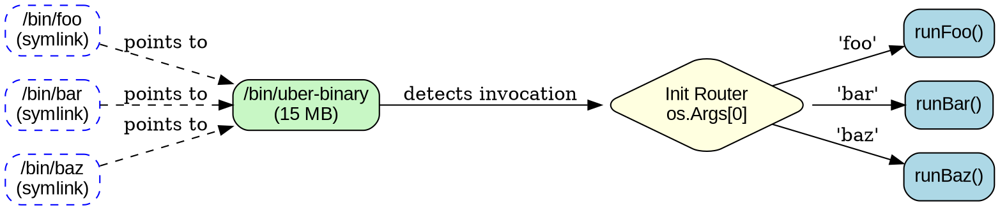
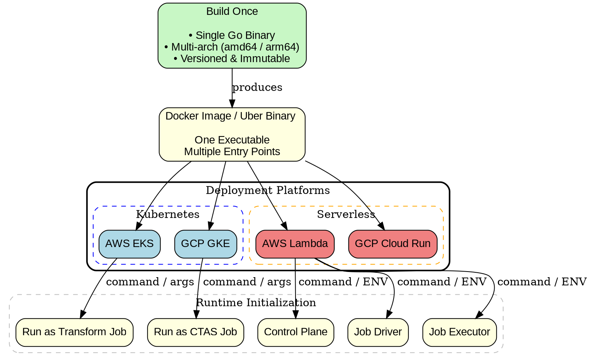

## The Problem

In modern cloud-native applications, we often build multiple binaries or docker images for different services/jobs/commands. 

- A single docker image may contain one or more binaries
- Each binary needs to be built separately
- Different binaries and/or images for various deployment options

This leads to:
- **Larger container images** — multiple binaries consuming storage
- **Greater storage costs** — duplicated dependencies across binaries
- **Higher build infrastructure costs** — building and storing multiple artifacts

## The Solution: Uber Binary Pattern

**Uber Binary Pattern is a design where a single compiled binary executes different behaviors based on how it is invoked (binary name, arguments, or environment).**

The uber binary pattern consolidates multiple command-line tools or services into a single binary. The actual command executed is determined by the name used to invoke the binary.

### How It Works

Instead of building separate binaries:
```
/bin/foo      # 10 MB
/bin/bar      # 12 MB
/bin/baz      # 11 MB
Total: 33 MB
```

You build one uber binary with symbolic links:
```
/bin/uber-binary    # 15 MB (shared code optimized)
/bin/foo -> uber-binary  (symlink)
/bin/bar -> uber-binary  (symlink)
/bin/baz -> uber-binary  (symlink)
Total: 15 MB
```

The uber binary detects which command was invoked by checking `os.Args[0]` (the program name) and routes to the appropriate logic.



> All code is statically linked at build time; routing happens at runtime.

## Implementation in Go

### Basic Structure

```go
package main

import (
    "fmt"
    "os"
    "path/filepath"
)

func main() {
    // Get the name used to invoke this binary
    invokeName := filepath.Base(os.Args[0])
    
    // Route to the appropriate command
    switch invokeName {
    case "foo":
        runFoo(os.Args[1:])
    case "bar":
        runBar(os.Args[1:])
    case "baz":
        runBaz(os.Args[1:])
    case "uber-binary":
        // Direct invocation - show help or run default
        showHelp()
    default:
        fmt.Fprintf(os.Stderr, "Unknown command: %s\n", invokeName)
        os.Exit(1)
    }
}

func runFoo(args []string) {
    fmt.Println("Running foo command with args:", args)
    // Foo implementation
}

func runBar(args []string) {
    fmt.Println("Running bar command with args:", args)
    // Bar implementation
}

func runBaz(args []string) {
    fmt.Println("Running baz command with args:", args)
    // Baz implementation
}

func showHelp() {
    fmt.Println("Usage: create symlinks named foo, bar, or baz pointing to this binary")
}
```

### Dockerfile Example

```dockerfile
FROM alpine:latest

WORKDIR /app

# Copy the pre-built binary
COPY uber-binary /usr/local/bin/uber-binary

# Create symbolic links
RUN ln -s /usr/local/bin/uber-binary /usr/local/bin/foo && \
    ln -s /usr/local/bin/uber-binary /usr/local/bin/bar && \
    ln -s /usr/local/bin/uber-binary /usr/local/bin/baz

```

### Running Different Commands

**Note:** This works because the container command overrides the invoked binary name, allowing symlink-based routing to function correctly.

```bash
# Run foo command
docker run myapp:latest foo arg1 arg2

# Run bar command  
docker run myapp:latest bar --input file.txt

# Run baz command
docker run myapp:latest baz --port 9090
```

### Kubernetes Deployment in EKS

```yaml
# foo-job.yaml
apiVersion: batch/v1
kind: Job
metadata:
  name: foo-job
spec:
  template:
    metadata:
      labels:
        app: foo
    spec:
      containers:
      - name: foo
        image: myapp:latest
        command: ["foo"]
        args: ["arg1", "arg2"]
      restartPolicy: OnFailure
---
# bar-job.yaml
apiVersion: batch/v1
kind: Job
metadata:
  name: bar-job
spec:
  template:
    metadata:
      labels:
        app: bar
    spec:
      containers:
      - name: bar
        image: myapp:latest
        command: ["bar"]
        args: ["--input", "file.txt"]
      restartPolicy: OnFailure
---
# baz-job.yaml
apiVersion: batch/v1
kind: Job
metadata:
  name: baz-job
spec:
  template:
    metadata:
      labels:
        app: baz
    spec:
      containers:
      - name: baz
        image: myapp:latest
        command: ["baz"]
        args: ["--port", "9090"]
      restartPolicy: OnFailure
```

### Subcommand-Based Approach
Instead of Symlink-based entrypoint we can use an explicit subcommands approach using one of the following libraries,
- https://github.com/spf13/cobra
- https://github.com/alecthomas/kong
- https://github.com/urfave/cli

Then each command can be run as a sub command instead.

```sh
# Run foo command
uber-binary foo arg1 arg2

# Run bar command  
uber-binary bar --input file.txt

# Run baz command
uber-binary baz --port 9090
```

## Why Uber Binaries Unlock True Build-Once-Deploy-Everywhere

The uber binary pattern's true power emerges when combined with multi-architecture builds and cross-platform deployment capabilities. This section demonstrates how a single binary can serve multiple cloud platforms and processor architectures.



### Multi-Architecture Build Impact

With dual-architecture images:
```bash
# Build for both architectures
docker buildx build --platform linux/amd64,linux/arm64 -t myapp:latest .

# Result: Two manifests, one image tag
myapp:latest
  ├── linux/amd64  (~90 MB)
  └── linux/arm64  (~85 MB)

# Deploy anywhere:
- EKS (amd64/arm64)
- GKE (amd64/arm64)  
- AWS Lambda (amd64/arm64)
- Google Cloud Run (amd64/arm64)
```

### Cloud Platform Deployment

Single uber binary enables unified deployment:

**Without uber binary:**
```
- eks-service-binary
- lambda-function-binary
- cloud-run-service-binary
= 3 separate builds, 3 images, 3 maintenance paths
```

**With uber binary:**
```
- uber-binary (with symlinks for different entry points)
= 1 build, 2 images (arm64 + amd64), 1 image manifest
= Works on EKS, GKE, Lambda, Cloud Run
```

### Environment Variable Based Mode Detection

Environment variables can be used to control command execution. This approach is particularly useful when:
- Deployed across multi runtimes such as K8S, Lambda and Cloud Run
- Need dynamic mode switching for the same invoked command

> Invocation name takes priority, ENV overrides when required.

#### Use Case: Lambda Driver/Executor Pattern

In AWS Lambda deployments, the same binary can run in different modes:

```go
package main

import (
    "fmt"
    "os"
)

func main() {
    // Check environment variable for run mode
    runMode := os.Getenv("RUN_MODE")
    
    switch runMode {
    case "driver":
        runDriver()
    case "executor":
        runExecutor()
    default:
        fmt.Fprintf(os.Stderr, "Unknown RUN_MODE: %s\n", runMode)
        os.Exit(1)
    }
}

func runDriver() {
    fmt.Println("Running in Driver mode - orchestrating tasks")
    // Driver implementation
}

func runExecutor() {
    fmt.Println("Running in Executor mode - processing tasks")
    // Executor implementation
}
```

#### Platform-Specific Configuration

Environment variables can also control platform-specific behavior:

```go
func main() {
    platform := os.Getenv("PLATFORM") // "eks", "lambda", "cloud-run"
    runMode := os.Getenv("RUN_MODE")  // "driver", "executor", "worker"
    
    // Platform-specific initialization
    switch platform {
    case "eks", "gke":
        initKubernetes()
    case "lambda":
        initLambda()
    case "cloud-run":
        initCloudRun()
    }
    
    // Mode-specific execution
    switch runMode {
    case "driver":
        runDriver()
    case "executor":
        runExecutor()
    }
}
```

#### Lambda Configuration Example

```yaml
# serverless.yml or AWS SAM template
Functions:
  Driver:
    ImageUri: myapp:latest
    Environment:
      RUN_MODE: driver
      PLATFORM: lambda
  
  Executor:
    ImageUri: myapp:latest
    Environment:
      RUN_MODE: executor
      PLATFORM: lambda
```

## Benefits

### 1. Cost Reduction
- **Smaller container images** — shared code compiled once instead of duplicated across binaries; typical savings: 40-60% reduction in total binary size
- **Lower storage costs** — reduced ECR/Container Registry consumption
- **Faster builds** — compile once instead of N times, less storage for build artifacts, faster CI/CD pipelines

### 2. Faster Initialization
- **Improved Lambda performance** — reduced image size directly translates to faster cold start times
- When multiple commands run on same instance:
  - Reduced memory footprint
  - Shared libraries loaded once
  - Better CPU cache utilization

### 3. Operational Simplicity
- **Single artifact to maintain** — one binary to version, distribute, and ensure synchronization
- **Cross-platform deployment** — same binary works on EKS, GKE, AWS Lambda, and GCP Cloud Run
- **Multi-architecture support** — build once for both arm64 and amd64 architectures
- **Two images cover all scenarios** — just two multi-arch images (arm64 + amd64) enable deployment across:
  - Kubernetes: EKS (AWS) and GKE (Google Cloud)
  - Serverless: Lambda (AWS) and Cloud Run (Google Cloud)
  - Architectures: arm64 (ARM-based: Graviton, Axion) and amd64 (x86_64)
- **Simplified deployment pipelines** — one build process serves all deployment targets
- **Flexible runtime control** — run mode can be controlled via environment variables

## When This Pattern Shines

This pattern is **best suited for**:

- **Job-based systems** — ETL pipelines, batch processing, async task workers
- **Platform teams maintaining shared tooling** — Internal CLI tools, developer utilities, infrastructure automation
- **Serverless-heavy architectures** — Lambda functions, Cloud Run services where cold start time and image size matter
- **Cost-sensitive large-scale deployments** — High-volume workloads where storage, transfer, and build costs add up

## Trade-offs

### When to Use
- Multiple related commands sharing significant code
- Container-based deployments where size matters
- Build time and infrastructure costs are important
- Commands are part of the same logical toolset

### When NOT to Use
- Completely independent tools with no shared code
- Security concerns requiring process isolation
- Need for independent versioning of different commands
- Commands have vastly different dependencies
- Have conflicting dependency versions

## Real-World Examples

This pattern is used by several popular tools:

- **BusyBox**: Unix utilities combined into a single binary
- **Git**: Many git commands are symlinks to the same binary
- **Docker**: Various docker CLI tools use this pattern
- **Kubernetes**: kubectl plugins can use this approach

## Conclusion

The uber binary pattern consolidates multiple binaries into one, reducing container image size by 40-60%, lowering build infrastructure costs, and improving Lambda cold start times. The implementation is straightforward in Go using `os.Args[0]` to detect the invocation name.

> If your commands share significant code (say ≥50%) and are deployed together, an uber binary is almost always the right default.

The real power comes from **build once, deploy everywhere**: two multi-architecture images (arm64 and amd64) work across Kubernetes (EKS, GKE), serverless platforms (Lambda, Cloud Run), and both processor architectures. This dramatically simplifies deployment pipelines and reduces operational costs.

Use this pattern when tools are related and share code, but keep them separate when they need true independence.
