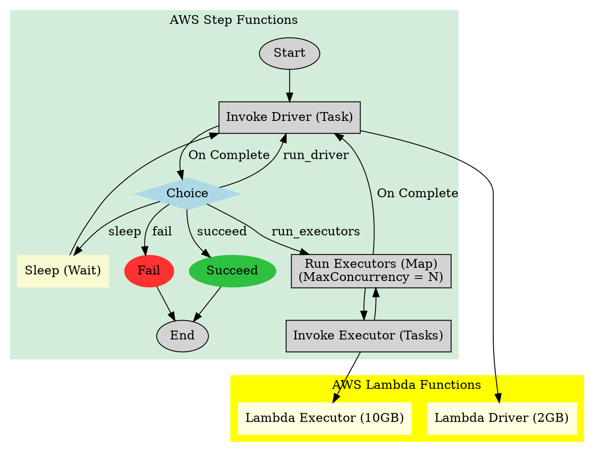

## The Problem

For years, the standard approach to processing terabytes of data involved heavy infrastructure. We relied on running Spark jobs or managing long-running services on Kubernetes clusters. While powerful, this compute-forward deployment model comes with high maintenance overhead, constant sustenance work, and the inherent friction of node and pod bring-up times.

What if we could build a truly serverless data processing framework? One that requires zero cluster maintenance, scales instantly, and scales right back down to zero?

By leveraging AWS Lambda and AWS Step Functions, it is possible to build an N-stage Driver/Executor model that can handle massive batch and micro-batch workloads without a single dedicated server. Here is how to architect it, and more importantly, how to overcome the strict limitations of serverless environments.

## The Challenges of Serverless Data Processing

AWS Lambda is an incredible tool, but it was not originally designed for heavy, stateful data processing. When moving away from cluster-based processing, you immediately hit several hard constraints:

- **Hard Time Limits**: Lambda has a strict maximum runtime of 15 minutes.
- **Compute Ceilings**: Instances max out at 10GB of memory and 6 vCPUs.
- **Network Throttling**: Network throughput is limited and throttled compared to dedicated EC2 instances.
- **No Direct Communication**: Unlike Kubernetes pods, Lambda functions cannot directly communicate with each other over the network.
- **Statelessness (Mostly)**: While Lambda instances are sometimes reused—which requires carefully resetting global variables and local files—they fundamentally lack persistent local state.

To build a data processing engine here, you cannot just lift and shift your code. You have to rethink the orchestration.

## The Solution: A State Machine-Centric Architecture

The secret to bypassing Lambda's execution limits is delegating the orchestration to AWS Step Functions. Instead of a single script trying to do everything before the 15-minute timeout, the Step Function acts as the persistent brain, triggering ephemeral compute nodes.

We modeled this using an N-stage Driver/Executor architecture.

### 1. The Driver (The Planner)

The process begins with the Step Function invoking a Driver Lambda. The Driver is responsible for task generation or performing standalone work. Because driver processing is typically sequential, we provision this Lambda with just 2GB of memory.

Crucially, the Driver does not process the bulk of the data. It calculates what needs to be done, chunks the work into a task group, and returns a state to the Step Function.

### 2. The Choice State (The Router)

Once the Driver finishes, the Step Function enters a Choice state. Based on the Driver's output, the state machine decides the next move:

- `run_executors`: Trigger the massive parallel processing phase.
- `run_driver`: Loop back to execute the next driver stage.
- `sleep`: Pause for a configured duration, then loop back to the Driver — useful for polling or micro-batch scenarios.
- `succeed` or `fail`: Terminate the job.

### 3. The Executors (The Workers)

If tasks need to be processed, the Step Function uses a Map state to fan out the work to multiple Executor Lambdas concurrently.

- **Maximized Resources**: Executor Lambdas are provisioned with the maximum 10GB of memory. This isn't necessarily because the code requires 10GB of RAM, but because AWS allocates maximum CPU and network bandwidth proportionally to memory.
- **Parallel Execution**: The Step Function handles the concurrency, launching up to 40 executors simultaneously to process the task groups.

Once the Executors finish their stage, the Step Function cycles back to the Driver to plan the next stage, effectively creating an infinite loop of compute that never hits the 15-minute timeout.

The diagram below shows the complete state machine flow:

## Overcoming State and Networking Limitations

Because Executor Lambdas cannot talk to each other, all data sharing must be externalized.

- **State Persistence**: Any state must be persisted in a shared work area rather than in memory.
- **Data Passing**: The Driver and Executors communicate across stages via AWS S3 buckets (Read/Write/Read-Only) and the AWS SSM Parameter Store.

When migrating legacy code to this model, the biggest refactoring efforts involve fixing in-memory sharing across stages and removing reliance on global variables. Everything happening outside of a defined stage must be moved inside one.

### Lambda Instance Reuse

Lambda execution environments are sometimes reused across invocations. This means credentials, environment variables, local temporary files, and any global variables from a previous invocation may still be present. Your code must explicitly reset all shared state at the start of each invocation — never assume a clean slate.

## Tuning for Performance

### Lambda Sizing

- **Driver Lambda (2GB)**: Driver work is typically sequential — planning, task chunking, state checks. 2GB (roughly 1.1 vCPUs) is sufficient. If a driver stage does anything compute-intensive, it should be extracted into an executor stage instead.
- **Executor Lambda (10GB)**: Executors are provisioned at the maximum available memory. This is not always because the workload needs 10GB of RAM — AWS scales CPU cores and network bandwidth proportionally to memory allocation, so maxing out memory also maximises throughput.

### Executor Concurrency and Workload Type

The right number of concurrent executors and worker threads within each executor depends on whether your workload is CPU-bound, memory-bound, or network-bound:

| Workload type | Workers per executor | Reasoning |
|---|---|---|
| `cpu` | ~6 | Matches available vCPUs |
| `memory` | ~3 | Reduces heap pressure per worker |
| `network` | ~24 | I/O waits allow high concurrency |

Optimize for **latency** by running more executors in parallel (up to 40), or for **stability** by running fewer (around 10) to reduce resource contention and retry storms. The system can auto-scale from 1 to 40 executors; the upper bound is driven by Step Functions and parameter store throughput limits.

## Performance Trade-offs vs Cluster Compute

Lambda is not a free lunch. Early benchmarks comparing equivalent workloads show:

- **vs EKS Fargate**: Lambda is typically faster but more expensive.
- **vs EKS EC2**: Lambda is typically slower and more expensive.

The value proposition is not raw throughput — it is **operational simplicity**. Zero cluster management, instant scale-to-zero, and no node or pod bring-up overhead make serverless the right default for low-to-moderate volume workloads or teams that cannot justify the maintenance cost of a dedicated cluster.

## The Result

By centralizing the logic in a Step Function and using Lambdas as purely functional, stateless workers, you gain an incredibly resilient architecture.

For batch jobs, this means instant launch times with no cluster spin-up overhead. For infrastructure teams, it means a compute-forward deployment model with virtually zero sustenance work. It is a paradigm shift in how we process big data—trading the complexity of cluster management for the elegance of state machine orchestration.

## System-Level Limits to Plan Around

Even with a well-designed state machine, there are hard platform limits that constrain how large a single job can grow:

- **Step Functions execution history**: Each state machine execution is capped at 25,000 events. A job with many stages and large fan-outs can approach this limit surprisingly quickly. If a single pipeline is long-running with many Driver/Executor cycles, consider splitting it into chained executions.
- **Step Functions max runtime**: A single execution can run for up to one year — so the overall pipeline lifetime is not the concern. The event cap is.
- **AWS SSM Parameter Store**: The Driver and Executors use Parameter Store for passing state and loading credentials. Parameter Store has throughput limits on API calls (standard tier: 40 TPS; higher-throughput tier: 10,000 TPS with additional cost). At 40 concurrent executors, each making multiple reads per invocation, this can become a bottleneck. Plan ahead by batching reads or caching parameter values within an invocation.

## Looking Ahead: Lambda Managed Instances

One of the most promising developments for serverless data processing is [AWS Lambda Managed Instances](https://docs.aws.amazon.com/lambda/latest/dg/lambda-managed-instances.html). Unlike the default Lambda compute type, Managed Instances run your functions on EC2 instances within your own account — including modern hardware such as Graviton4 and network-optimized instances — while AWS still handles all provisioning, patching, and scaling.

Key properties that would directly benefit the Driver/Executor model:

- **No cold starts**: Managed Instances scale to a configured minimum rather than zero, eliminating executor launch latency entirely.
- **Higher network throughput**: Network-optimized and high-bandwidth instance types remove one of the most significant bottlenecks for data-intensive workloads.
- **Multi-concurrent invocations**: A single execution environment can handle multiple invocations simultaneously, which increases executor throughput for IO-heavy stages without needing to spin up additional instances.
- **EC2 pricing**: Instance-based billing with support for Reserved Instances and Savings Plans makes high-volume, predictable workloads materially cheaper than default per-request pricing.

> **Go is not yet supported as of writing this article.** The runtime-specific guides for Managed Instances cover Java, Node.js, and Python only. Once Go support is available, this architecture becomes an even stronger candidate for high-throughput data pipelines written in Go.
