<small>sakthipriyan.com/building-systems</small>

## Building SQL Translator 
## using AI Coding Agents

<br/>

### Sakthi Priyan H  
#### Nov 20, 2025
<br/>
<br/>
---

### 🎯 Goal
> 1. Using AI Coding Agents
> 2. Create an **Extensible** 
> 3. Grammer based 
> 4. **SQL Translator framework** 

**Status**
- Current: Athena ➜ BigQuery, BigQuery ➜ Athena  
- Future: Snowflake, SparkSQL, Aqfer Fusion Job

---

### 🗺️ Architecture Overview

```dot
digraph SQLTranslatorClustered {
  rankdir=LR;
  bgcolor=transparent;
  node [shape=box, style="rounded,filled", fillcolor=white, fontname="Arial"];

  // ======================================================
  // === TEST CASES (Inputs + Outputs) =====================
  // ======================================================
  subgraph cluster_testcases {
    label="Test Cases (Developer)";
    style="rounded,bold";
    color="#a0c4ff";

    // SQL Inputs
    subgraph cluster_inputs {
      label="SQL Inputs";
      style="rounded,dashed";
      color="#a0c4ff";
      AthenaIn [label="Athena SQL"];
      BigQueryIn [label="BigQuery SQL"];
    }

    // SQL Outputs
    subgraph cluster_outputs {
      label="Generated Outputs";
      style="rounded,dashed";
      color="#ffc6ff";
      OutAthena [label="Athena SQL"];
      OutBigQuery [label="BigQuery SQL"];
    }
  }

  // ======================================================
  // === CORE SYSTEM (GRAMMAR → PARSER → IR → GENERATOR) ===
  // ======================================================
  subgraph cluster_core {
    label="SQL Translator Core (AI Agent)";
    style="rounded,bold";
    color="#90caf9";

    // === GRAMMARS ===
    subgraph cluster_grammars {
      label="ANTLR Grammars";
      style="rounded,dashed";
      color="#f4a261";
      AthenaGrammar [label="Athena.g4\n(Grammar)"];
      BigQueryGrammar [label="BigQuery.g4\n(Grammar)"];
    }

    // === PARSERS ===
    subgraph cluster_parsers {
      label="Parsers (ANTLR Generated)";
      style="rounded,dashed";
      color="#ffd6a5";
      AthenaParser [label="Athena Parser"];
      BigQueryParser [label="BigQuery Parser"];
    }

    // === CONVERTERS ===
    subgraph cluster_converters {
      label="Converters (AST → IR)";
      style="rounded,dashed";
      color="#b9fbc0";
      AthenaConverter [label="Athena Converter"];
      BigQueryConverter [label="BigQuery Converter"];
    }

    // === IR CORE ===
    subgraph cluster_ir {
      label="Unified Intermediate Representation (IR)";
      style="rounded,bold";
      color="#fff3b0";
      IR [label="Unified IR\n(Go structs / Substrait)",
          shape=box,
          style="rounded,filled,bold",
          fillcolor="#fffbea"];
    }

    // === GENERATORS ===
    subgraph cluster_generators {
      label="SQL Generators";
      style="rounded,dashed";
      color="#dab6fc";
      AthenaGen [label="Athena Generator"];
      BigQueryGen [label="BigQuery Generator"];
    }
  }

  // === GRAMMAR → PARSER (DOTTED) ===
  AthenaGrammar -> AthenaParser [style=dotted];
  BigQueryGrammar -> BigQueryParser [style=dotted];

  // === SQL → IR PATHS ===
  AthenaIn -> AthenaParser -> AthenaConverter -> IR;
  BigQueryIn -> BigQueryParser -> BigQueryConverter -> IR;

  // === IR → OUTPUTS PATHS ===
  IR -> AthenaGen -> OutAthena;
  IR -> BigQueryGen -> OutBigQuery;
}
```


---
### 🧩 Why This Approach?

- Unified IR enables multi-dialect SQL translation  
- Easy addition of new dialects  
- Consistent testing via YAML test cases  
- Uses deterministic grammar autogenerated via ANTLR  

---

### 📦 CLI-Based Dev & Testing

#### YAML format
```yaml
test_cases:
  - name: simple_select
    bigquery: SELECT id, name, age FROM `dataset.users` WHERE age > 18
    athena: SELECT id, name, age FROM "dataset"."users" WHERE age > 18
```

#### Test Runs via YAML files/dir & Slice Notation
```bash
sqltranslate --yaml examples/ --yaml-run 3
sqltranslate --yaml examples/ --yaml-run :3
sqltranslate --yaml examples/ --yaml-run 2:5
```

--

### 🧪 Test Case Reusability

The same test case is used for:

- BigQuery → Athena  
- Athena → BigQuery  
- (Potentially) Same dialect → same dialect

New dialects can be added easily to YAML.

--

### CLI Output

```yaml
summary:
  total_test_cases: 101
  athena_to_bigquery_succeeded: 96
  bigquery_to_athena_succeeded: 96
details:
  - name: negative_numbers
    index: 83
    athena_to_bigquery:
      input: SELECT * FROM accounts WHERE balance < -100
      expected: SELECT * FROM accounts WHERE balance < -100
      output: 'Parse error: line 1:39 token recognition error at: ''-'''
      status: failed_to_parse
    bigquery_to_athena:
      input: SELECT * FROM accounts WHERE balance < -100
      expected: SELECT * FROM accounts WHERE balance < -100
      output: SELECT * FROM accounts WHERE balance < - 100
      status: failed_mismatch
```

--

### 📘 The Importance of a Strong CLI

- Deterministic testing environment  
- Re-runnable test cases  
- YAML output helped track exact failures  
- Potentially **TOON** format can be used instead of YAML

---

### ⚙️ Development Workflow

```dot
digraph SQLTranslatorWorkflow {
  bgcolor=transparent;
  rankdir=TB;
  nodesep=0.3;
  ranksep=0.3;
  node [shape=box, style="rounded,filled", fontname="Arial"];

  // Developer + Test Suite
  Dev [label="👤 Developer", fillcolor="#e3f2fd"];
  TestSuite [label="🧪 Test Suite", shape=folder, fillcolor="#fff3cd"];

  // === Coding Agent Subgraph ===
  subgraph cluster_agent {
    label="🤖 Coding Agent";
    style="rounded,dashed";
    color="#888888";
    fontname="Arial Bold";

    Start [label="🏁 Start\n(initial N)", shape=oval, fillcolor="#c8e6c9"];

    RunN [label="▶️ Run Test Case N", fillcolor="#e8f5e9"];

    Regression [label="🔁 Regression Check :N", fillcolor="#f3e5f5"];

    Fix [label="🛠️ Fix Issues", fillcolor="#ffebee"];

    Inc [label="➕ Increment N", fillcolor="#f1f8e9"];

    Stop [label="🛑 Stop\n(final N)", shape=oval, fillcolor="#ffcdd2"];
  }

  // Developer workflow
  Dev -> TestSuite [label="Add/Update Tests/Prompt/Generated"];
  Dev -> Start [label="Prompt"];

  // Core flow (compact)
  Start -> RunN;

  RunN -> Fix [label=" Failed"];
  RunN -> Regression [label=" Passed"];

  Regression -> Fix [label=" Failed"];
  Regression -> Inc [label=" Passed"];

  Inc -> RunN [label="More tests"];
  Inc -> Stop [label="Done"];

  Fix -> RunN;

  // Dotted: Test Suite influence
  edge [style=dotted, color="gray40"];
  TestSuite -> RunN;
  TestSuite -> Regression;

  edge [style=solid, color=black];
}

```


---

### 📚 Test Suite

- Auto-generated tests from AI were **NOT reliable**  
- Needed manual corrections  
- Eventually curated a high-quality test suite

---

### 📄 Docs / README.md

- Without README, model starts rediscovering:  
  - *“How to run ANTLR?”*
  - *“Where is go:generate?”*
  - *“How to build?”*
- Leads to unnecssary **credit burn**  

> Once README had detailed steps →  AI executed faster with less discovery

---

### 🔂 Agent-Aided Iteration

Sometimes results were inaccurate:
- Agents claimed “fixed”
- But CLI showed mismatch  
- Running via IDE runnable configs allowed quick re-execution  
- CLI was modified to output YAML including index → Fed into Agent →
  So exact failing case could be re-run
--

### 💬 Prompts To Agent
<div class="r-stack">
<blockquote class="fragment fade-in-then-out">Use Development step in guidelines.md in aqfer-ir. Start developing from test case 0</blockquote>
<blockquote class="fragment fade-in-then-out">Continue testing use case 3 and so on</blockquote>
<blockquote class="fragment fade-in-then-out">Fix 10</blockquote>
<blockquote class="fragment fade-in-then-out">Proceed building 11, 12 and so on... till 15</blockquote>
<blockquote class="fragment fade-in-then-out">14, 15 as well</blockquote>
<blockquote class="fragment fade-in-then-out"><pre><code class="yaml">summary:
  total_test_cases: 15
  athena_to_bigquery_succeeded: 12
  bigquery_to_athena_succeeded: 13
  ...</code></pre></blockquote>
<blockquote class="fragment fade-in-then-out">continue</blockquote>
<blockquote class="fragment fade-in-then-out">Run array_agg_order</blockquote>
<blockquote class="fragment fade-in-then-out">Run with :20 and fix issues</blockquote>
<blockquote class="fragment fade-in-then-out">Let's do 20:25</blockquote>
<blockquote class="fragment fade-in-then-out">Run :35</blockquote>
<blockquote class="fragment fade-in-then-out">Run :36, :37,.... :40</blockquote>
<blockquote class="fragment fade-in-then-out">Let's fix 40 and run :40 as well after fix</blockquote>
<blockquote class="fragment fade-in-then-out">40 is failing?</blockquote>
<blockquote class="fragment fade-in-then-out">run till :80</blockquote>
<blockquote class="fragment fade-in-then-out">... eventually ...</blockquote>
<blockquote class="fragment fade-in-then-out">> All 101 test cases for both Athena to BigQuery and BigQuery to Athena conversions passed successfully, confirming the fixes work as intended.</blockquote>
</div>

--

### 💬 Prompt with CLI output

```
GOROOT=/usr/local/go #gosetup
GOPATH=/Users/sakthipriyan/go #gosetup
/usr/local/go/bin/go build -o /Users/sakthipriyan/Library/Caches/JetBrains/GoLand2025.1/tmp/GoLand/___1go_build_main_go /Users/sakthipriyan/Workspace/aqfer-ir/cmd/sqltranslate/main.go #gosetup
/Users/sakthipriyan/Library/Caches/JetBrains/GoLand2025.1/tmp/GoLand/___1go_build_main_go --yaml examples/test_cases.yaml --yaml-run :15 #gosetup
summary:
  total_test_cases: 15
  athena_to_bigquery_succeeded: 12
  bigquery_to_athena_succeeded: 13
details:
  - name: array_syntax
    athena_to_bigquery:
      input: SELECT ARRAY[1, 2, 3, 4, 5] as numbers, ARRAY['a', 'b', 'c'] as letters FROM dataset
      expected: SELECT [1, 2, 3, 4, 5] as numbers, ['a', 'b', 'c'] as letters FROM dataset
      output: SELECT [1,2,3,4,5] AS numbers, ['a','b','c'] AS letters FROM dataset
      status: failed_mismatch
    bigquery_to_athena:
      input: SELECT [1, 2, 3, 4, 5] as numbers, ['a', 'b', 'c'] as letters FROM dataset
      expected: SELECT ARRAY[1, 2, 3, 4, 5] as numbers, ARRAY['a', 'b', 'c'] as letters FROM dataset
      output: SELECT ARRAY[1,2,3,4,5] AS numbers, ARRAY['a','b','c'] AS letters FROM dataset
      status: failed_mismatch
  - name: unnest_from
    athena_to_bigquery:
      input: SELECT u.id, tag FROM users u CROSS JOIN UNNEST(u.tags) AS t(tag)
      expected: SELECT u.id, tag FROM users u, UNNEST(u.tags) AS tag
      output: SELECT u.id, tag FROM users u CROSS JOIN UNNEST(u.tags) AS tag
      status: failed_mismatch
  - name: arrays_overlap_where
    athena_to_bigquery:
      input: SELECT * FROM t WHERE ARRAYS_OVERLAP(arr1, arr2)
      expected: SELECT * FROM t WHERE ARRAY_LENGTH(ARRAY_INTERSECT(arr1, arr2)) > 0
      output: SELECT * FROM t WHERE ARRAYS_OVERLAP(arr1, arr2)
      status: failed_mismatch
    bigquery_to_athena:
      input: SELECT * FROM t WHERE ARRAY_LENGTH(ARRAY_INTERSECT(arr1, arr2)) > 0
      expected: SELECT * FROM t WHERE ARRAYS_OVERLAP(arr1, arr2)
      output: SELECT * FROM t WHERE CARDINALITY(ARRAY_INTERSECT(arr1, arr2)) > 0
      status: failed_mismatch
Process finished with the exit code 0
```
--

### 🧠 Key AI Learning

> AI-generated engineering requires <br/> 
> **waterfall-like upfront design**.

- Less upfront planning → more iterations/rewrites → more credits burned  
- More detailed designs → more quicker output with lesser credits used
- Make CLI input/output easier for AI Agents → faster/higher order iteration

--

### 🧠 Context Reloading Costs

Starting fresh made the model:
- Relearn grammar
- Relearn code base
- Relearn generators/converters/IR 
- Relearn CLI
- ...

Good persistent docs prevent this.

--

### 🤖 Tools Used Over Time

- **JetBrains Goland + Junie**  
- **VS Code + GitHub Copilot** (strong summarizer)  
- **Cursor**  

All powered by **Claude Sonnet 4.5** underneath.

--

### 🧮 Code Composition (On Nov 7)
|                      |        |            |
|----------------------|-------:|-----------:|
| **Grammar**          |    763 |  **2.38%** |
| **Parser (Gen Go)**  | 27,580 | **85.96%** |
| **Converters**       |  1,930 |  **6.01%** |
| **IR Code**          |    344 |  **1.07%** |
| **Generators**       |  1,470 |  **4.58%** |

- **~86%** - ANTLR auto-generated → fully deterministic
- **~14%** - AI-generated (Grammar / Converters / IR / Generators) → guided, manual oversight needed

---

### 🏗️ Actual Human Contribution

- Architectural design  
- Test case design  
- CLI input/output design
- High-level direction  
- Correcting failures  
- Guiding agent behavior
- Reviewing agent progress
- Reviewing generated code

---

### 🤔 Downsides
- Parallel progress very difficult (1+ team size)
- Sometimes, AI Agent says work is done but, it isn't
- Lower upfront planing, higher time/credits required
- Not efficient for an iterative/incremental work
- Risk of lossing progress if, it not committed into git
- Give up control and use English rather than high level programming language 
- Difficult/More prompts required for anything that is not available in its knowledge base

---

### 🧭 Next Steps
- Test with Production SQLs (In Progress)
- Review IR (In Progress)
- Integrate with PAIL
- Expand/Refine docs  
- Add Snowflake
- Add SparkSQL  
- Add Aqfer Fusion Job
- ...
---

### 🙏 Thank You
