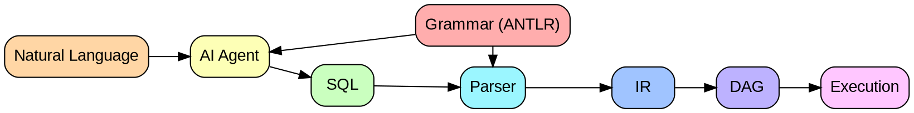
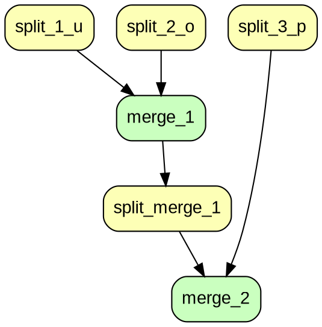

<small>sakthipriyan.com/building-systems</small>

### Natural Language Data Processing
with a
### SQL Interface for DAG Execution
<br/>

#### Sakthi Priyan H & Chandramouli G
##### Nov 13, 2025

---

#### Contents

1. Hetero Collate
2. Prototype Goals
3. Architecture
4. Demo

---

### 1️⃣ Hetero Collate

> *Ultra efficient joins using cloud storage,*
> *compared to memory based ones like Spark*

- Can collate/join multiple datasets
  - But, can do only on single set of keys
  - To join multiple datasets using different set of keys 
    it requires **multiple jobs** to be built and run
- Job developed using YAML and/or Python
  - **SQL** interface **NOT** supported currently

---

### 2️⃣ Prototype Goals
- 🟢 Natural Language interface for building jobs
- 🟢 SQL interface for the job
- 🟢 DAG Driver to run a more dynamic DAG stages
  - 🟢 Build a minature Hetero Collate with 2 stages
    - 🟢 Split stage to bucket the data
    - 🟢 Merge stage to sort/merge for a bucket


---

### 3️⃣ Architecture


--
#### 3️⃣ Architecture / Grammar (using ANTLR)
<pre><code data-line-numbers="" style="max-height:600px">grammar SimpleSQL;
query
    : selectStmt EOF
    ;
selectStmt
    : SELECT selectElements FROM tableSource (joinClause)*
    ;
selectElements
    : STAR
    | columnName (COMMA columnName)*
    ;
tableSource
    : tableName (alias=IDENTIFIER)?
    ;
joinClause
    : (INNER | LEFT | RIGHT)? JOIN tableSource ON booleanExpression
    ;
booleanExpression
    : predicate (AND predicate)*
    ;
predicate
    : fullColumnName EQ fullColumnName
    ;
fullColumnName
    : (tableName DOT)? columnName
    ;
tableName
    : IDENTIFIER
    ;
columnName
    : IDENTIFIER
    ;

// Keywords
SELECT : 'SELECT';
FROM   : 'FROM';
JOIN   : 'JOIN';
INNER  : 'INNER';
LEFT   : 'LEFT';
RIGHT  : 'RIGHT';
ON     : 'ON';
AND    : 'AND';
EQ     : '=';
STAR   : '*';
COMMA  : ',';
DOT    : '.';

// Identifiers and others
IDENTIFIER
    : [a-zA-Z_][a-zA-Z_0-9]*
    ;

WS
    : [ \t\r\n]+ -> skip
    ;
</code></pre>
--
### 3️⃣ Architecture / Query 
#### Natural Language
```txt
Retrieve all user, order and product information by joining 
users with orders on user ID, and orders with products on product ID.
```

#### SQL
```sql
SELECT * FROM users 
INNER JOIN orders ON users.id = orders.user_id 
INNER JOIN products ON orders.product_id = products.id;
```

#### Intermediate Representation
```
IR{
  Tables: [users, orders, products]
  Joins: [
    INNER JOIN orders ON users.id = orders.user_id,
    INNER JOIN products ON orders.product_id = products.id
  ]
  Select: [*]
}
```

--
#### 3️⃣ Architecture / DAG


--

#### 3️⃣ Architecture / DAG / Stages
#### 🧩 Split Stages

| Stage Name       | Dependencies | Partition Keys   |
| ---------------- | ------------ | ---------------- |
| split_1_users    | none         | [id]             |
| split_2_orders   | none         | [user_id]        |
| split_3_products | none         | [id]             |
| split_merge_1    | [merge_1]    | [product_id]     |

--
#### 3️⃣ Architecture / DAG / Stages
#### 🔗 Merge Stages

| Stage Nam  | Dependencies                      | Join Keys        | Inputs                            |
| ---------- | --------------------------------- | ---------------- | --------------------------------- |
| merge_1    | [split_1_users, split_2_orders]   | [id, user_id]    | [split_1_users, split_2_orders]   |
| merge_2    | [split_merge_1, split_3_products] | [product_id, id] | [split_merge_1, split_3_products] |

--

#### 3️⃣ Architecture / DAG / Execution
- Tables processed: 3  
- Join operations: 2  
- Bucket count: 12  
- DAG stages: 6  
- Output timestamp: 20251113121420  
- Output directory: `data/output/20251113121420`

---

### 4️⃣ Demo
