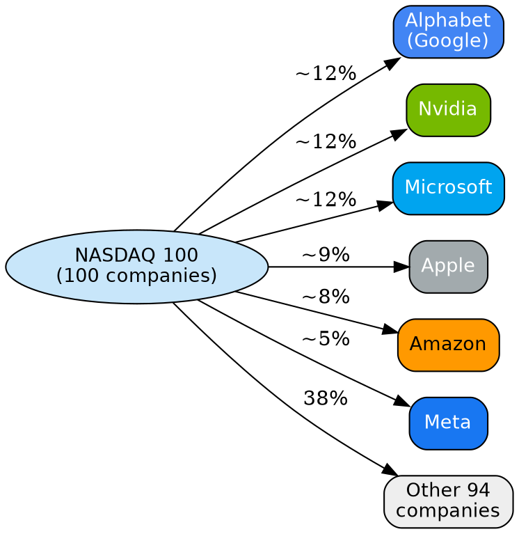
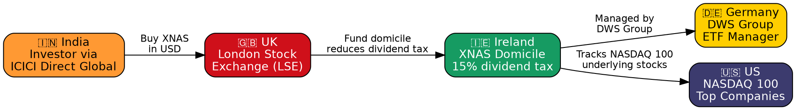
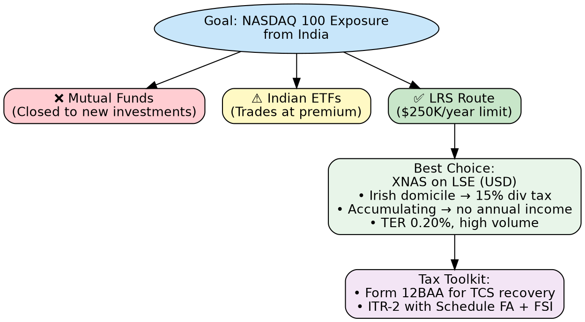

NASDAQ 100 has delivered **23% CAGR in INR terms** over the last decade — nearly double that of Nifty 50.  
Yet most Indians either avoid it or invest inefficiently.  
This post covers the *why*, the *what*, and the *how* — and the single most cost-effective route available today.

> Originally presented as a talk: [Invest in NASDAQ 100 from India](/building-wealth/slides/2025/invest-in-nasdaq-100-from-india/)

---

## Why NASDAQ 100?

The NASDAQ 100 index tracks the top 100 non-financial companies listed on NASDAQ — dominated by the world's most powerful technology firms.

| Metric | NASDAQ 100 (in INR) | Nifty 50 |
|--------|---------------------|----------|
| 10-Year CAGR | ~23% | ~11–12% |
| Currency | USD | INR |
| Sector | Tech-heavy | Diversified |

### The top 6 companies alone make up 62% of the index

**Why it matters:**
- Exposure to the world's top tech innovators in Cloud, AI, and consumer platforms
- USD-denominated — natural hedge against INR depreciation (~4%/year historically adds to returns)
- Geographic diversification beyond India equity

**Risks to be aware of:**
- High concentration in a handful of tech giants
- Sensitive to US regulatory or geopolitical backlash
- More volatile than a diversified index like S&P 500

---

## Investment Options from India

There are three logical paths — but only one is open today.

| Option | How | Status Today |
|--------|-----|--------------|
| Mutual Funds | Kotak US FoF, ICICI Prudential NASDAQ 100 | ❌ Closed to new investments |
| Indian ETF | Motilal Oswal NASDAQ 100 ETF | ⚠️ Trades at heavy premium, not tracking index |
| LRS (Direct) | Buy US/international ETFs via broker | ✅ Open — best option now |

### Why are Mutual Funds and Indian ETFs blocked?

The RBI and SEBI set an industry-level cap of **$7 billion** for overseas fund investments (a 2008-era limit, never revised). Within that, each AMC is capped at **$1 billion**.  
Most top AMCs have hit their limits — resulting in:
- No new SIP registrations in NASDAQ mutual funds
- No fresh units being created in Indian-listed NASDAQ ETFs
- The Indian ETF trading at an inflated premium to NAV

**LRS (Liberalised Remittance Scheme)** is the only viable route.

---

## Why XNAS on LSE is the Best Choice

Under LRS, you can buy stocks or ETFs available on international stock exchanges.  
The most efficient option is **XNAS** — *Xtrackers NASDAQ 100 UCITS ETF 1C*, listed on the **London Stock Exchange (LSE)** in USD.

### The Country-Hop Behind One ETF Purchase

### Why not buy a US-listed ETF directly?

| Feature | US ETF (e.g. QQQ) | XNAS on LSE |
|---------|-------------------|-------------|
| US dividend withholding tax | 30% | **15%** (Ireland treaty) |
| Dividend handling | Distributed (taxable in India) | **Accumulating** (reinvested, no payout) |
| Indian tax reporting | Complex (dividend income each year) | **Simpler** (no annual dividend) |
| Currency | USD | USD |

Irish-domiciled, accumulating ETF = **half the dividend tax + minimal annual reporting**.

### Comparing NASDAQ 100 ETFs on LSE

| ETF | TER | Volume (USD/LSE) | Domicile |
|-----|-----|-----------------|----------|
| **XNAS** (Xtrackers) | 0.20% | High | Ireland |
| ANAU (Amundi) | 0.14% | Lower | Ireland |
| CSNDX (iShares) | 0.30% | Moderate | Ireland |

XNAS strikes the best balance of **TER, USD availability, and liquidity** on LSE.

---

## Step-by-Step: How to Invest

The process is two steps: send money out, then buy the ETF.

```dot
digraph InvestFlow {
  rankdir=LR;
  bgcolor=transparent;
  node [shape=box, style="rounded,filled", fontname="Helvetica", fontsize=13];
  edge [fontname="Helvetica", fontsize=11];

  Salary  [label="💰 Salary\nAccount (INR)", fillcolor="#E3F2FD"];
  InvAcc  [label="📊 Investment\nAccount (INR)",  fillcolor="#E8F5E9"];
  M2W     [label="🏦 ICICI Money2World\nINR → USD", fillcolor="#FFF9C4"];
  IBKR    [label="🖥️ Interactive Brokers\n(via ICICI Direct Global)", fillcolor="#E0E0E0"];
  XNAS    [label="📈 XNAS ETF\n(LSE, USD)", fillcolor="#C8E6FA"];

  Salary -> InvAcc [label="Monthly allocation"];
  InvAcc -> M2W    [label="₹ for NASDAQ\nbucket"];
  M2W    -> IBKR   [label="USD credited\nT or T+1"];
  IBKR   -> XNAS   [label="Place buy order\n$4 commission"];
}
```

### Step 1: Transfer Money via ICICI Money2World

1. Log into ICICI Bank → **Fund Transfer → Money2World**
2. Enter amount (e.g. $200), review INR equivalent and charges
3. Select purpose: **LRS - Other** (investment in overseas securities)
4. Choose saved recipient: your IBKR account
5. Fill in end-use details and submit

> ICICI Direct customers can apply a coupon code to reduce remittance charges. Money typically credits the same day or T+1.

### Step 2: Place Buy Order on IBKR

1. Log into **ICICI Direct → Global Invest → Invest Now** (opens IBKR interface)
2. Search for ticker `XNAS`, exchange `LSE`
3. Compare the previous day's NAV vs the current market price (note: data is delayed ~15 min)
4. Place a limit order at or near the market price
5. IBKR charges **$4 per order** — so use a meaningful ticket size (≥ $200 to keep commission under 2%)

---

## Cost Overhead

All-in cost to invest in XNAS from India ranges from **1–3%** per buy transaction.

| Cost Component | Approximate Impact |
|----------------|-------------------|
| INR → USD bank spread + GST | ~1% |
| ETF market price vs NAV | ±0–2% |
| IBKR commission | $4/order (~1% at $400) |
| XNAS annual TER | 0.20%/year |
| **TCS (if >₹10L/year)** | **20%** (claimable via Form 12BAA) |

For **long-term horizons (10–20 years)**, this one-time overhead is small relative to the underlying index returns. The key is to **batch investments** into fewer, larger orders rather than many small ones.

---

## Taxation

### TCS: The 20% Upfront Bite (and How to Recover It)

Remittances above **₹10 lakh/year** incur **TCS @ 20%** on the excess amount.

**Earlier:** You had to wait until ITR filing to claim TCS as a refund — a 12+ month cycle.  
**Now (since Oct 2024):** **Form 12BAA** lets you declare the TCS paid to your employer, who adjusts it against your monthly salary TDS. The government's upfront take gets normalised across remaining pay months — no long wait for refund.

> If you and your spouse both invest under your individual LRS limits, you effectively **double the ₹10L threshold** to ₹20L before TCS applies.

### ITR-2 Filing: Additional Disclosures

Holding foreign assets requires filing **ITR-2** (not ITR-1).

| Schedule | What to Declare |
|----------|----------------|
| **Schedule FA** | Foreign assets held — ETF units, broker account details, cost of acquisition |
| **Schedule FSI** | Foreign income — gains realised on sale of ETF units |

> **Non-disclosure of foreign assets** attracts severe penalties under the Black Money Act, 2015. Always declare.

Since XNAS is **accumulating** (no dividend paid), there is **no annual income to report** until you sell — making year-on-year reporting minimal compared to a dividend-distributing ETF.

When you eventually sell:
- Convert USD amounts to INR using RBI reference rates
- Calculate indexed/unindexed gains as applicable
- Report under Schedule FSI

---

## Summary

NASDAQ 100 offers unmatched long-term growth for Indian investors willing to navigate the LRS route. With mutual funds closed and domestic ETFs broken, **XNAS on LSE via IBKR is currently the most efficient, tax-optimised path** — accumulating structure, low TER, Irish domicile, and a single INR→USD conversion.

It involves more paperwork than a mutual fund. But for a buy-and-hold investor building multi-decade wealth, it's worth every step.

---

*Disclaimer: This is an educational post based on personal experience. It is not financial advice. Investments carry risk. Consult a qualified financial advisor before making investment decisions. Comply with applicable Indian laws and regulations.*
