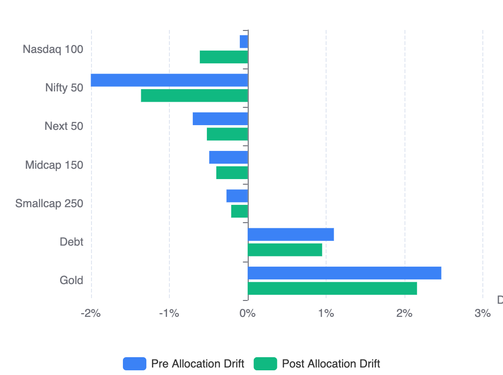
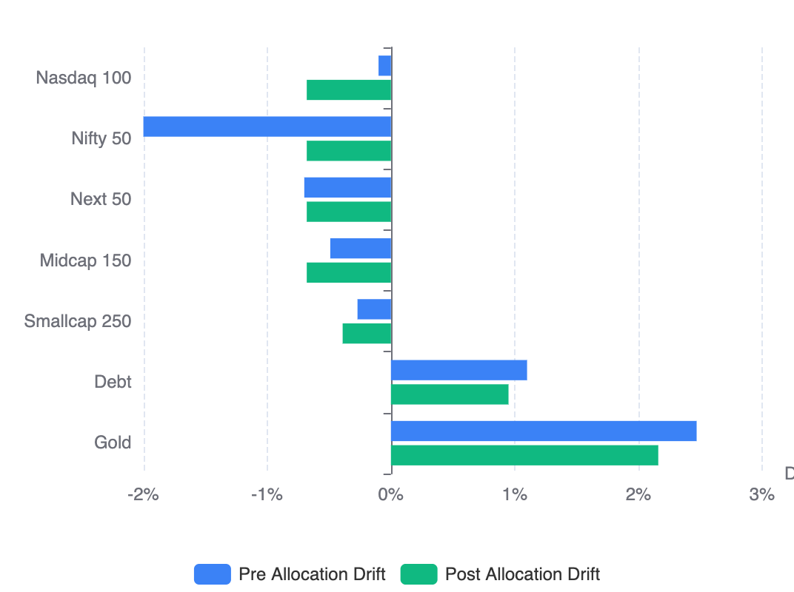

## From Proportional Drift to Even Drift Optimization: Rethinking Portfolio Rebalancing

When I switched from static SIP allocation to cashflow rebalancing 3–4 years ago, it was already a major upgrade.

Instead of blindly investing fixed percentages every month, new capital was dynamically allocated toward underweight assets. Recently, I published that engine publicly as the **[RealValue Family SIP Allocator](/building-wealth/tools/realvalue-family-sip-allocator/)**.

But over the last few months, after adding detailed drift visualizations and studying month-over-month portfolio behavior, I realized something important:

> Simply reducing drift is not enough.
> The real objective is reducing drift imbalance across the entire portfolio.

That realization led to the evolution from **Proportional Drift Allocation** to **Even Drift Optimization**.

Read [Why Static SIP Allocation Is Inefficient (And How Cashflow Rebalancing Fixes It)](why-static-sip-allocation-is-inefficient-and-how-cashflow-rebalancing-fixes-it/) if you are new to cashflow rebalancing.

This post specifically details the evolution of the allocator model itself.

## The Original Model: Proportional Drift Allocation

The original allocator followed a fairly intuitive rule:

> Allocate new investments proportional to how far each asset is from its target allocation.

So:

1. If an asset is underweight by 2%, allocate more.
2. If another asset is underweight by 1%, allocate less.
3. If an asset is overweight, stop allocating.

Simple. Logical. Efficient.

Using current market values (May 23, 2026) and the next monthly investment cycle, the allocator produced the following result.

| Asset Class  |      Target |  Pre Actual | Pre Drift | Allocation Share | Post Actual | Post Drift |
| ------------ | ----------: | ----------: | --------: | ---------------: | ----------: | ---------: |
| Nasdaq 100   |      40.00% |      39.90% |    -0.10% |           19.50% |      39.39% |     -0.61% |
| Nifty 50     |      20.00% |      18.00% |    -2.00% |           43.75% |      18.64% |     -1.36% |
| Next 50      |      10.00% |       9.30% |    -0.70% |           16.75% |       9.48% |     -0.52% |
| Midcap 150   |      10.00% |       9.51% |    -0.49% |           13.00% |       9.60% |     -0.40% |
| Smallcap 250 |       5.00% |       4.73% |    -0.27% |            7.00% |       4.79% |     -0.21% |
| Debt         |       5.00% |       6.10% |    +1.10% |            0.00% |       5.95% |     +0.95% |
| Gold         |      10.00% |      12.47% |    +2.47% |            0.00% |      12.16% |     +2.16% |
| **Total**    | **100.00%** | **100.00%** | **3.57%** |      **100.00%** | **100.00%** |  **3.10%** |

At first glance, this looks good.

* Every asset moved closer to its target allocation.
* Total portfolio drift reduced.
* Underweight assets received most of the capital.

But there was a deeper structural issue.

The portfolio remained uneven after allocation.

Some assets became nearly aligned while others remained significantly misaligned.

For example:

* Smallcap 250 ended at **-0.21% drift**
* Midcap 150 ended at **-0.40% drift**
* But Nifty 50 still remained deeply underweight at **-1.36% drift**

Over time, this created unstable correction behavior:

* some assets repeatedly stayed under-corrected
* others oscillated near target
* post-allocation drift patterns changed unpredictably month to month

The portfolio kept “improving,” but rarely converged toward a stable equilibrium state.

The problem was subtle:

> Proportional drift allocation optimizes individual assets locally.
> It does not optimize the portfolio globally.

## The New Model: Even Drift Optimization

The new model changes the optimization objective entirely.

Instead of asking:

**“How much should each asset get proportional to its drift?”**

It asks:

**“What allocation creates the most evenly distributed residual drift across the portfolio?”**

This is a fundamentally different optimization problem.

Instead of minimizing drift independently, the optimizer minimizes **drift dispersion**.

The goal becomes:

> Push the entire portfolio toward the tightest achievable equilibrium state.

Using the exact same portfolio and same monthly contribution, the new optimizer produced this allocation:

| Asset Class  |      Target |  Pre Actual | Pre Drift | Allocation Share | Post Actual | Post Drift |
| ------------ | ----------: | ----------: | --------: | ---------------: | ----------: | ---------: |
| Nasdaq 100   |      40.00% |      39.90% |    -0.10% |           16.63% |      39.32% |     -0.68% |
| Nifty 50     |      20.00% |      18.00% |    -2.00% |           71.00% |      19.32% |     -0.68% |
| Next 50      |      10.00% |       9.30% |    -0.70% |           10.38% |       9.32% |     -0.68% |
| Midcap 150   |      10.00% |       9.51% |    -0.49% |            2.00% |       9.32% |     -0.68% |
| Smallcap 250 |       5.00% |       4.73% |    -0.27% |            0.00% |       4.61% |     -0.39% |
| Debt         |       5.00% |       6.10% |    +1.10% |            0.00% |       5.95% |     +0.95% |
| Gold         |      10.00% |      12.47% |    +2.47% |            0.00% |      12.16% |     +2.16% |
| **Total**    | **100.00%** | **100.00%** | **3.57%** |      **100.00%** | **100.00%** |  **3.10%** |

At first, the allocation looks counterintuitive.

* Nifty 50 receives dramatically more capital
* Midcap receives almost nothing
* Smallcap receives zero
* Allocation is no longer proportional

But the post-allocation structure reveals the real breakthrough.

## The Breakthrough: Drift Band Compression & Variance Reduction

Traditional rebalancing systems mostly measure individual drift reduction and distance from target.

But the key improvement is not just lower absolute drift.

It is **drift band compression** and **variance reduction**.

Because variance measures how unevenly imbalance is distributed, the true optimization signal is to minimize imbalance dispersion itself.

### Drift Band Comparison

| Asset Class  | Proportional Allocation | Even Drift Optimization |
| ------------ | ----------------------: | ----------------------: |
| Nifty 50     |                  -1.36% |                  -0.68% |
| Nasdaq 100   |                  -0.61% |                  -0.68% |
| Next 50      |                  -0.52% |                  -0.68% |
| Midcap 150   |                  -0.40% |                  -0.68% |
| Smallcap 250 |                  -0.21% |                  -0.39% |
| **Drift Visual** |  |  |

This reveals the key conceptual shift in the optimization model:

| Metric                     | Proportional Allocation                                 | Even Drift Optimization                                   |
| -------------------------- | ------------------------------------------------------- | --------------------------------------------------------- |
| **Optimization Focus**     | Reduce individual drift (Local optimization)            | Reduce drift dispersion (Global optimization)             |
| **Correction Target**      | Correction magnitude (Asset-centric correction)         | Structural balance (Portfolio equilibrium seeking)        |
| **Negative Drift Range**   | -1.36% to -0.21%                                        | -0.68% to -0.39%                                          |
| **Spread**                 | 1.15 percentage points                                  | 0.29 percentage points (~75% compression)                 |
| **Imbalance Distribution** | Uneven residual drift distribution                      | Harmonized residual drift distribution                    |
| **Asset State**            | Some assets "very wrong", others "almost correct"       | Portfolio converges toward a common equilibrium state     |

## Why This Changes SIP Allocation Fundamentally

Traditional SIP systems were designed primarily for simplicity:

* fixed monthly contribution
* fixed allocation percentages
* periodic rebalancing

But portfolios are dynamic systems.

And dynamic systems require adaptive correction mechanisms.

Even Drift Optimization effectively turns SIP allocation into:

* perpetual rebalancing
* continuous equilibrium seeking
* flow-based portfolio stabilization

The portfolio becomes self-correcting every month using incoming cashflows alone.

No selling required.

## Final Thought

The original proportional drift allocator was already a major improvement over static SIP allocation.

But Even Drift Optimization represents the next evolution.

It reframes portfolio management from:

> “How do we allocate money?”

to:

> “What is the tightest achievable equilibrium state this portfolio can reach with finite monthly cashflows?”

That is a far deeper optimization problem.
