> **📖 [The Global Indian Investor](/building-wealth/books/the-global-indian-investor/)**
>
> Learn how to build a globally diversified portfolio from India. **7 of 12 chapters are live**, covering LRS, FX, global indexes, and Irish ETFs.

---

When remitting money abroad, Indian investors face a persistent trade-off:

- **Public banks** (e.g., Bank of Baroda): Lowest FX spreads on FX Retail, but slower manual execution
- **Private banks** (e.g., ICICI Bank): Fast and reliable remittance infrastructure, but higher FX spreads

**FX Retail via Bharat Connect** breaks this trade-off entirely. You lock an FX deal at the public bank's near-interbank rate through the **BHIM app**, and execute the actual wire transfer through **ICICI Bank's Money2World** — combining the best of both channels.

> I had earlier [compared FX Retail Web vs Bharat Connect rates](/building-wealth/blogs/inr-to-usd-fx-retail-web-vs-fx-retail-bharat-connect-vs-direct-bank-rates/) theoretically. This post documents my **first live transaction** through this hybrid channel.

> Switching from the default ICICI Bank rate (₹96.54/USD) to this hybrid channel (₹95.105/USD) saves **₹1,435 per $1,000 transferred** — for just 3 extra minutes via BHIM.

## The Hybrid Flow

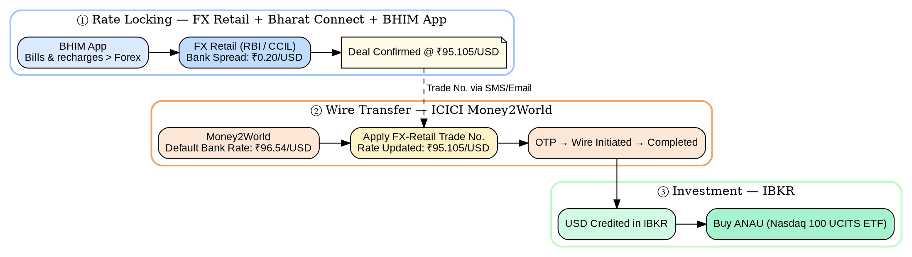

> The key insight: the FX rate is locked on Bharat Connect at the **public bank spread level @ 20p/USD, but the bank executing the actual wire can be a private bank with faster online remittance.**

### Why This Hybrid Flow Works
1. FX rate discovery happens on the [CCIL FX Retail platform](https://www.clearcorp.co.in/web/clearcorp/fx-retail1)
2. [Bharat Connect](https://www.bharat-connect.com/forex/) exposes the deal booking via [BHIM](https://www.bhimupi.org.in/)
3. The actual remittance is executed by the relationship bank ([ICICI Bank](https://www.icici.bank.in/))

---

## Step 1: Booking the FX Deal via BHIM App

The BHIM app includes a **Forex** option under **Bills**, routing through the **Bharat Connect Forex** network. This gives access to FX Retail rates from multiple relationship banks — select your preferred bank, enter the amount, confirm the rate, and book the deal.

  

    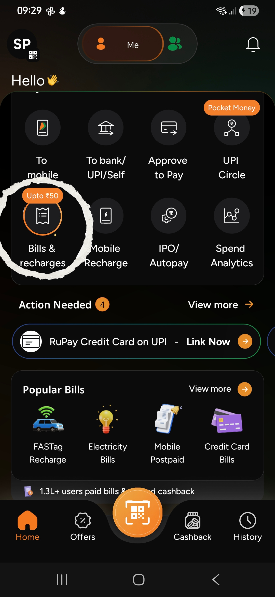
    
Step 1/10: Go to Bills & recharges

  

  

    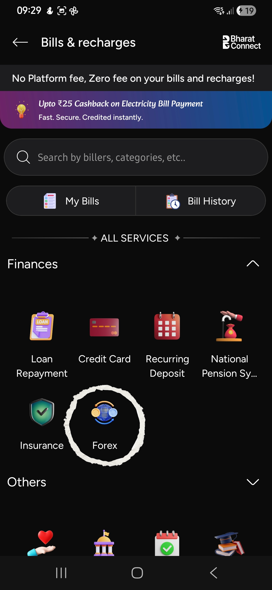
    
Step 2/10: Expand Finances and select Forex

  

  

    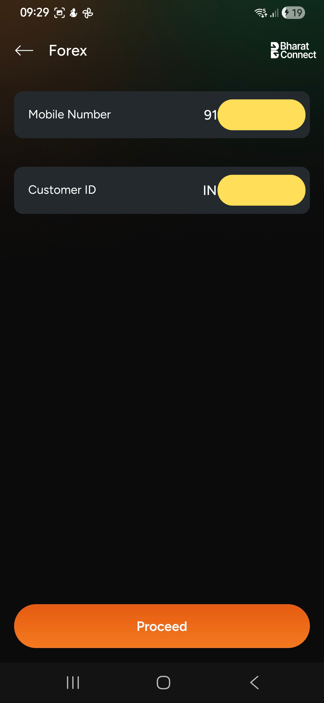
    
Step 3/10: If FX Retail is already set up, the screen displays the registered mobile number and customer ID. Just Proceed.

  

  

    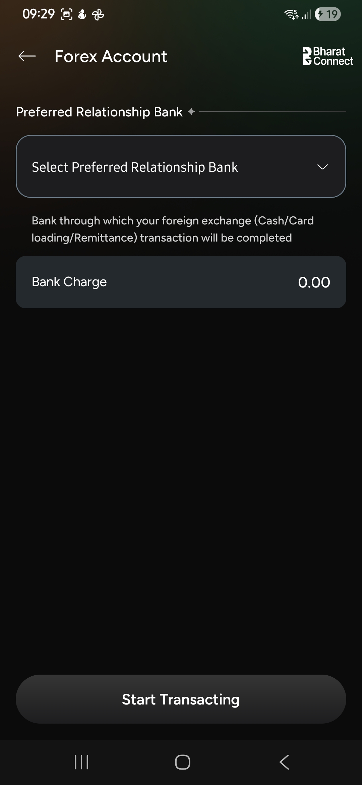
    
Step 4/10: We have to select the Preferred Relationship Bank (RB) to execute this Forex transaction

  

  

    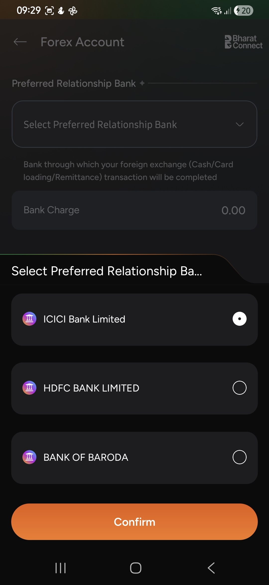
    
Step 5/10: I had 3 banks under RB. I picked ICICI since I was using it for all my <a href="/building-wealth/slides/managing-money-flows-2026/#/3/3">investment routing</a>

  

  

    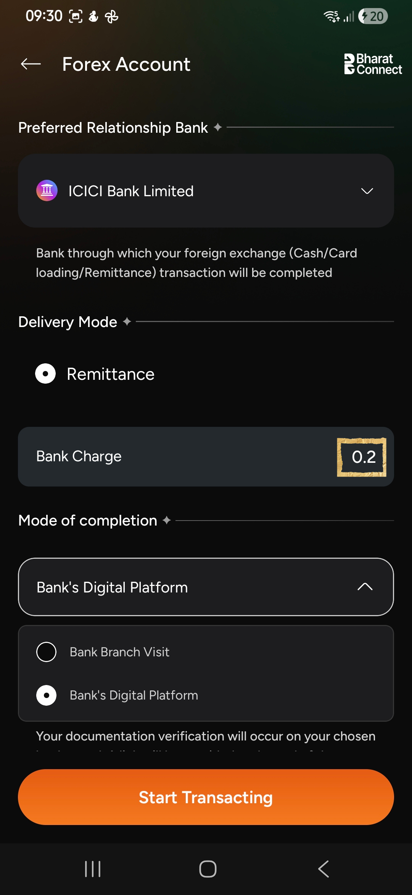
    
Step 6/10: Bank Charge means ₹0.20 per USD over the CCIL FX Retail rate. With zero negotiations we get excellent rate.

  

  

    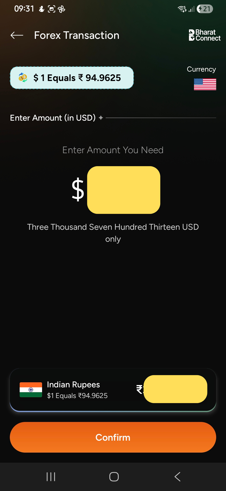
    
Step 7/10: $1 = ₹ 94.9625 The quoted rate includes a ₹0.10 protective buffer, used by FX Retail to account for small market movements before settlement. You can enter USD amount you want to transfer here. INR is shown for that excluding bank processing fee + GST + FX GST. Refer <a target="_blank" href="/building-wealth/tools/realvalue-fx-engine/#v1udd20260505r95.0625b94.8625a3000f1000y0g12m3">this</a> for complete breakup

  

  

    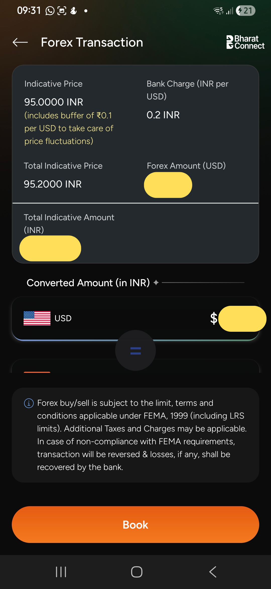
    
Step 8/10: The rate fluctuates in real time, so the booked rate may differ slightly from the preview. You can select Book.

  

  

    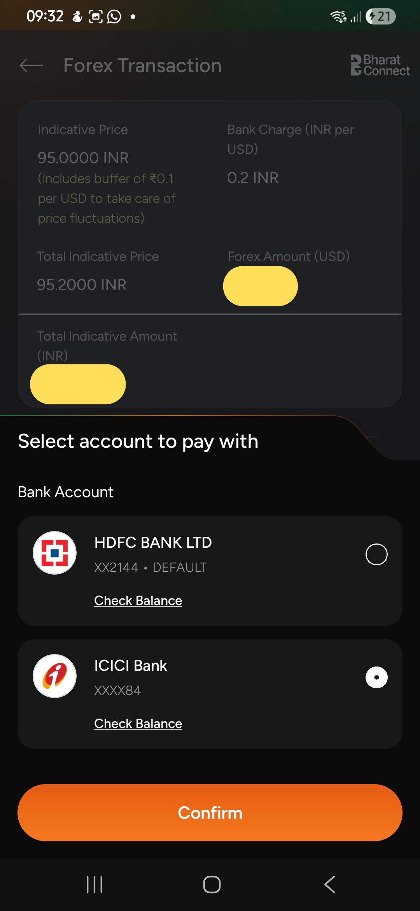
    
Step 9/10: You will be shown the list of bank accounts linked to BHIM. If a bank account was newly linked to BHIM, UPI may enforce a ₹5,000 limit for the first 24 hours.

  

  

    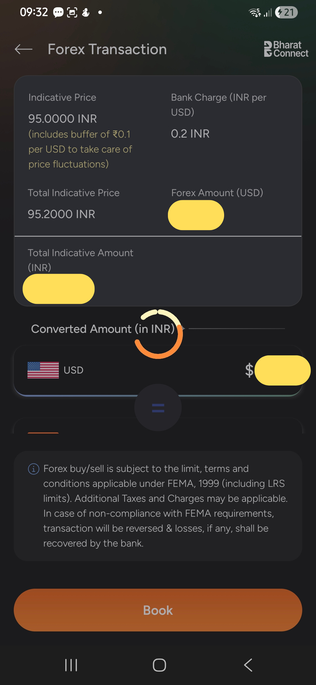
    
Step 10/10: The BHIM UI may appear to hang for a few seconds while the transaction is processed. While it was circling, I received Email/SMS from FX Retail and ICICI Bank as well. It didn't show any success/failure at that time for me. I simply closed the app.

  

  

    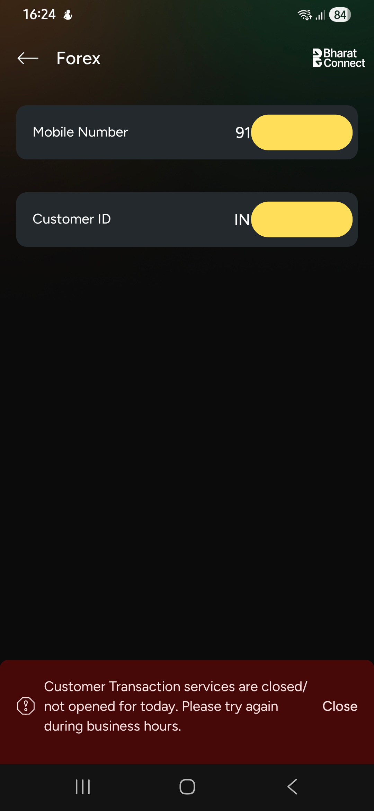
    
<b>Market hours from 9:15AM to 3:30PM.</b> You will see this in non market hours — "Customer Transaction services are closed. Please try again during business hours."

  

> The entire transaction took just **3 minutes**, including the time spent calculating the USD amount via the [RealValue FX Engine](/building-wealth/tools/realvalue-fx-engine/#v1udd20260505r95.105b94.905a1000f1000y0g12m3) and capturing the screenshots for this article.

The FX deal was confirmed instantly by SMS:

> **9:32 AM** — `Trade No 20260504XXXXXX Buy CASH for USD XXX @ 95.1050 INR. — FX-Retail (Clearcorp)`

A second SMS from ICICI Bank confirmed the deal was linked and ready to utilise:

> **9:33 AM** — `Forex Deal booked with ICICI Bank FX-Retail Trade No. 20260504XXXXXX is available for utilisation.`

---

## Step 2: Completing the Remittance via ICICI Money2World

With the FX-Retail Trade Number in hand, the next step is to initiate the wire transfer on **ICICI Bank's Money2World** portal. The portal defaults to ICICI's standard rate — but entering the trade number applies the locked Bharat Connect rate automatically.

  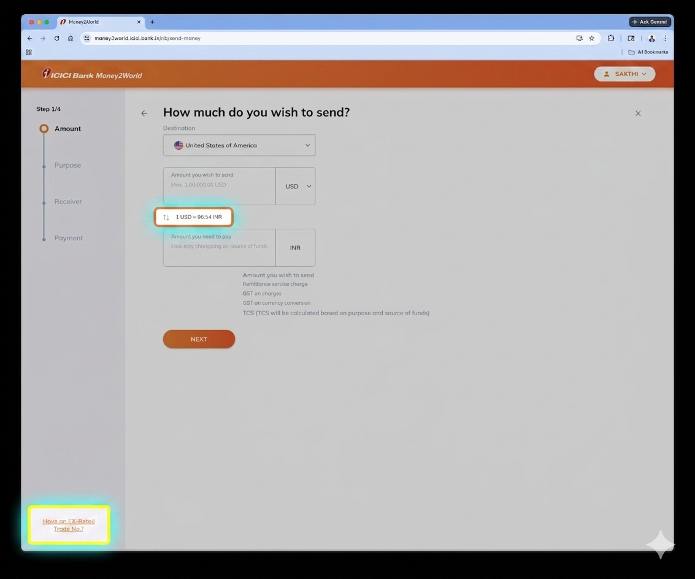
  
Step 1/3: Default rate displayed is <strong><a href="/building-wealth/tools/realvalue-fx-engine/#v1udd20260505r96.54b94.905a1000f1000y0g12m3">₹96.54/USD</a></strong>. The "Have an FX-Retail Trade No.?" link at the bottom-left switches the transaction to the pre-booked deal rate.

  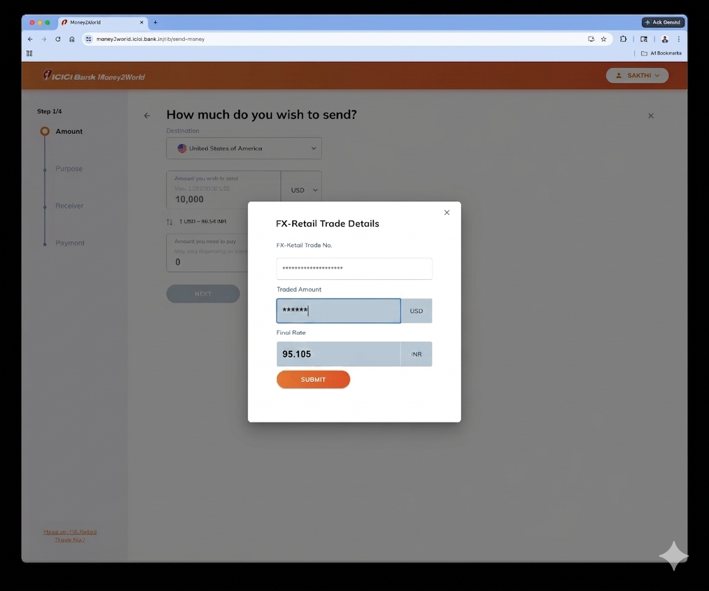
  
Step 2/3: FX-Retail Trade Details modal — entering Trade No. <code>20260504XXXXXX</code> fetches the locked rate of <strong><a href="/building-wealth/tools/realvalue-fx-engine/#v1udd20260505r95.105b94.905a1000f1000y0g12m3">₹95.105/USD</a></strong>, replacing the default ICICI rate and saving <b>₹1.435/USD</b>.

  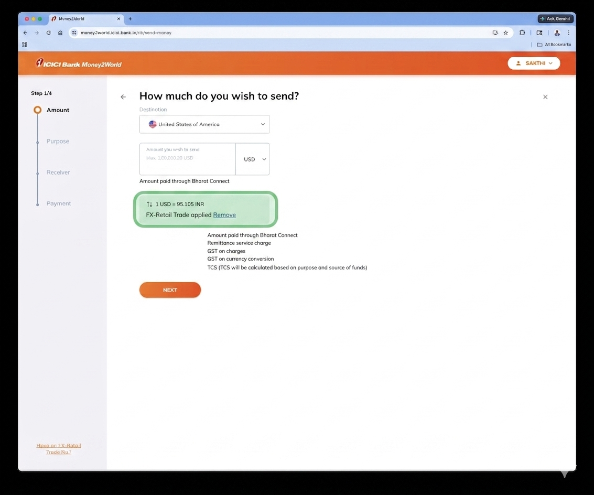
  
Step 3/3: Transaction confirmed at <strong>1 USD = ₹95.105</strong> via FX-Retail + Bharat Connect. From here, it is the usual flow.

## Transaction Timeline

The complete flow — from deal booking to funds landing in IBKR — completed in under **2 hours**.

| Time | Event |
|:-----|:------|
| **9:32 AM** | FX-Retail deal booked via BHIM — @ `₹95.1050` |
| **9:32 AM** | FX-Retail trade confirmation sms/email received |
| **9:33 AM** | ICICI Bank SMS: deal available for utilisation |
| **9:42 AM** | ICICI Bank confirms Money2World transfer initiated |
| **10:00 AM (Approx)**| Added Deposit notice to IBKR |
| **11:11 AM** | Money2World transfer completed (Received SWIFT copy) |
| **11:26 AM** | ICICI confirms overseas funds credited to receiver account |
| **11:27 AM** | IBKR deposit notification: USD wire available in account |

> In **2 hours** money is available in the broker account.  
> The speed almost felt like a domestic NEFT transfer.

The Money2World step itself took about 10 minutes, slightly longer only because I was capturing screenshots for this article and reporting a UI issue to ICICI (their exchange dropdown currently does not include SIX Swiss Exchange, where ANAU is listed).

**Both BHIM and Money2World actions can be completed in ~5 mins in total**

## Potential Savings from FX Retail + Bharat Connect

> Optimizing FX spreads is one of the few investing improvements that carries zero market risk.

The savings are deployed as extra USD into equity. Assuming **~$50/month saved**, invested for **20 years** at **16% XIRR** with **10% annual step-up** and **15% capital gains tax**:

| Metric | Value (USD) | Value (INR at ₹95.1) |
|:---|---:|---:|
| Total Invested | $34,404 | ₹32.7 lakh |
| Portfolio Value (Pre-Tax) | $138,349 | ₹1.32 crore |
| Portfolio Value (Post-Tax) | $122,757 | ₹1.17 crore |

> **₹1.17 crore** compounded purely from FX spread savings. Projected using [RealValue SIP Engine](/building-wealth/tools/realvalue-sip-engine/#v1otd20yf202605c0lm0.05kg16h10i6t15p20y)

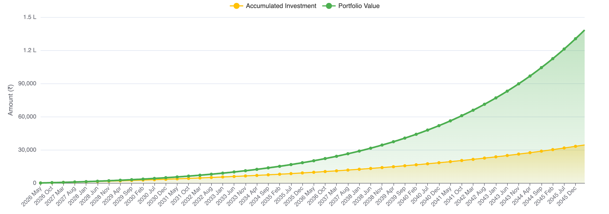

**Note on Inflation**: These are nominal values. At 6% annual inflation over 20 years, the real purchasing power of ₹1.17 crore would be roughly ₹36 lakh in today’s terms. Still meaningful — and still effectively free money from optimizing a recurring cost. 

## End-to-End: From INR to Invested

With USD available in IBKR, the month's allocation was deployed the same afternoon.
The funds arrived so quickly that I actually had to wait for the European markets to open at 1:30 PM IST.

| Field | Value |
|:------|:------|
| Instrument | ANAU (Nasdaq 100 — Irish UCITS ETF) |
| Action | Buy |
| Execution Time | 1:52 PM |
| IBKR Tiered Fee | $1.91 |

*Another $2.09 savings here by moving from indirect fixed plan with $4 min fee (Earlier opened via ICICI Direct Global) to direct tiered plan ($1.7 min fee).*

## Summary

> FX Retail via Bharat Connect is the best option for outward remittance up to ₹5 lakh per transaction via BHIM / UPI without any negotiations with the Relationship Bank.

By combining the near-interbank rate locked via BHIM with ICICI's remittance execution speed, this hybrid approach delivers public bank pricing at private bank performance. 

For Indian investors making regular monthly remittances for global investing, optimizing this single step can recover a meaningful amount over the long run — without changing the investment strategy at all.

### Downsides

- It is a multi party transaction: FX Retail + Bharat Connect + BHIM + ICICI Bank. If anything goes wrong, it may take a while to fix.
- Available only for outward remittance and limited to ₹5 lakhs via BHIM/UPI (Actual limit coming from UPI's limit of 5 lakhs for this kind of transaction. I have seen $25,000 Remittance limit somewhere but not sure who is supporting that)

### Public Banks

For public sector banks, even at a ₹5 lakh remittance, a **₹0.10/USD lower markup saves only about $2** compared to the ₹0.20/USD spread used in this flow. However, achieving that marginal improvement typically requires **manual paperwork and a 1–2 day processing cycle**.

That delay introduces its own costs — **capital remains idle until the transfer completes**, and the process often depends on **branch staff availability and follow-ups**. For regular monthly investments, the convenience and speed of an online channel can outweigh such small incremental FX savings.

### FX Retail Web

Once ICICI Bank enables the requested **₹0.20/USD spread** on the **FX Retail Web portal**, I will likely switch back to using that channel. Currently the web interface is configured with an **unreasonable 1.75% markup**, which makes it far less competitive than the Bharat Connect route.

Using FX Retail Web would also simplify the transaction flow considerably. Instead of the current chain — **FX Retail → Bharat Connect → BHIM App → ICICI Bank** — the process would involve just **FX Retail and ICICI Bank**. Fewer intermediaries, fewer steps, and one less app on the phone.

I installed BHIM purely for this forex use case. For day-to-day payments I am already comfortable with Samsung Wallet and Google Pay (mainly for UPI Circle usage as documented [here](/building-wealth/slides/managing-money-flows-2026/#/4/1)), so keeping BHIM around solely for remittances feels unnecessary.

Another small drawback with the Bharat Connect flow is the **₹0.10 rate buffer** used during rate discovery. It slightly distorts the USD calculation when planning the remittance amount. In this transaction, I ended up **not deploying the entire INR amount originally allocated**.

## Disclaimer
### For educational purpose only
> This post reflects my personal experience and is not investment or financial advice. Forex rates, bank spreads and Bharat Connect channel availability may change.
