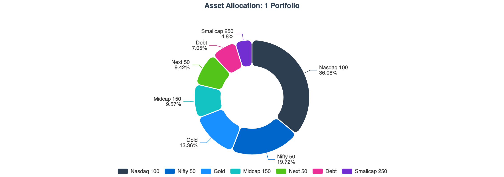

This is my first post in publishing the state of my portfolio. Planning to do this yearly by April first week.  

## Portfolio Summary
  

The portfolio is structured around ~~four~~ **three** distinct goal buckets, each with its own investment mandate and risk profile.  
The overall portfolio delivered **12.63% XIRR**.

| Goal | Purpose |XIRR | Allocation | 
|------|----|-----:|----------:|
| **1 Portfolio** | **The Core Portfolio** for Building Wealth | 16.48% | 92.04% |
| **Emergency** | To cater to **emergencies** |7.46% | 5.08% |
| **Travel** | To cover domestic/international **trips** | 7.16% | 2.63% |
| ~~Retirement~~ | **Transactional Mistake** that have to clean up | 5.62% | 0.25% |
| **Total** | |**12.63%** | **100.00%** |

Note: *Data includes investment done till April 2, 2026. XIRR computed with latest available NAVs.*

## 1 Portfolio — Asset Class Breakdown

100% equity on index funds/etfs now after a mega clean up and rebalancing I did. One time act to clean up my past behaviors.

| Asset Class | XIRR | Current Allocation | Target FY 2025-26 | Target FY 2026-27 |
|-------------|-----:|-------------------:|------------------:|------------------:|
| Nasdaq 100 | 26.57% | 36.08% | 35% | 40% |
| Nifty 50 | 1.45% | 19.73% | 20% | 20% |
| Next 50 | −23.33% | 9.42% | 10% | 10% |
| Midcap 150 | −22.14% | 9.57% | 10% | 10% |
| Smallcap 250 | −20.46% | 4.80% | 5% | 5% |
| Debt | 7.06% | 7.05% | 10% | 5% |
| Gold | 41.24% | 13.36% | 10% | 10% |
| **Total** | **16.48%** | **100.00%** | **100%** | **100%** |

Notes:
- Target FY 2025-26 - Asset allocation target I set for Financial Year 2025-26
- Target TY 2026-27 - Asset allocation target I am setting for Tax Year 2026-27

You can look at [this slide](/building-wealth/slides/my-asset-allocation-rebalancing/) or watch [this video](/building-wealth/videos/my-asset-allocation-rebalancing-explained/) for how I evolved over time and also evolved after publishing the slide.

### Nasdaq 100 — 26.57% XIRR

The top equity performer, driven by sustained strength in US technology through my journey.
I started investing into Nasdaq 100 via Indian Mutual Fund route. I got struck when industry reached the limits. This probably led to some 

 Despite these returns, the current 36.08% allocation sits below the 40% target — Nasdaq remains underweight. This is because gold grew disproportionately, consuming its share of the total portfolio. As a result, Nasdaq continues to attract the largest share of new monthly investments via the drift-based allocation.

### Gold — 41.24% XIRR

The portfolio's standout performer for FY 2025-26. Driven by global macro uncertainty and continued central bank buying, gold stands at 13.36% of the core portfolio — significantly above the 10% target. Gold receives zero new allocation in the current investment cycle.

### Nifty 50 — 1.45% XIRR

Indian large-cap equities delivered near-flat returns, reflective of the broader Nifty 50 performance through the year. Allocation is at 19.73%, close to the 20% target.

### Midcap 150, Next 50, Smallcap 250 — Deeply Negative XIRR

These three segments had a difficult FY 2025-26. Mid and small cap indices corrected 25–40% from their September 2024 peaks.

The sharply negative XIRRs — particularly Smallcap 250 at −20.46% — reflect both the market correction and the loss harvesting executed under the [Perpetual Rebalancing](/building-wealth/blogs/2026/perpetual-rebalancing-framework/) framework. Under this framework, units purchased at higher prices were sold during the downturn to lock in capital losses (usable for LTCG offset), and fresh units were purchased at the prevailing lower prices. The XIRR now measures performance from this reset, lower cost basis — so the numbers look extreme negative but must be read in that context.

This is the framework working as intended: losses are harvested and converted into tax-saving capital loss carryforwards, while the portfolio stays invested in the same asset classes in comparable funds.

### Debt — 7.06% XIRR

Steady, predictable returns. Debt is modestly overweight at 7.05% vs the FY 2025-26 target of 5%, and receives no allocation in the current investment cycle.

---

## Emergency Fund

| Asset Class | XIRR | Allocation |
|-------------|-----:|----------:|
| Hybrid | 8.77% | 82.01% |
| Liquid | 6.93% | 14.44% |
| Arbitrage | 6.56% | 3.55% |
| **Total** | **7.46%** | **100.00%** |

The emergency fund holds three layers, each calibrated for liquidity and capital safety:

- **Hybrid funds** (conservative category): Core holding. Delivers stable 8.77% XIRR with very low volatility.
- **Liquid funds**: For immediate access if needed. 6.93% XIRR.
- **Arbitrage funds**: Tax-efficient short-term parking. 6.56% XIRR.

Overall 7.46% XIRR is a solid outcome for a near-zero-risk allocation.

---

## Travel Fund

| Asset Class | XIRR | Allocation |
|-------------|-----:|----------:|
| Arbitrage | 7.10% | 100.00% |
| **Total** | **7.10%** | **100.00%** |

Entirely held in arbitrage funds — providing near-debt returns with equity fund taxation (LTCG at 12.5% after one year, versus debt fund taxation at slab rate). Well-suited for a medium-term spending goal.

---

## Retirement Fund

| Asset Class | XIRR | Allocation |
|-------------|-----:|----------:|
| Active | 5.66% | 100.00% |
| **Total** | **5.66%** | **100.00%** |
Planned is only 3 buckets, here 4th one is a mistake I made and I have to couple of years to clean it up.
In its early stages — currently a single actively managed fund. This bucket will be built up meaningfully in successive financial years as the core portfolio matures.

---

## Drift Correction: Next Investment Allocation

The 1 Portfolio uses the [Perpetual Rebalancing](/building-wealth/blogs/2026/perpetual-rebalancing-framework/) framework — monthly investments are directed exclusively to underweight assets, proportional to their deficit from target. No selling occurs during normal market conditions. New money does the rebalancing.

The table below consolidates the current state, next investment allocation, and the new FY 2026-27 target allocation in one view:

- **FY 2025-26 Target**: Target allocation under the outgoing financial year
- **Current**: Actual allocation as of today
- **Pre Drift**: Current deviation from FY 2025-26 target (sum of absolute values = total drift)
- **New Invest**: Percentage of next monthly investment directed to each asset
- **Post Alloc**: Estimated allocation after the investment
- **Post Drift**: Estimated drift after investment
- **FY 2026-27 Target**: New target allocation effective this financial year

| Asset Class | FY25-26 Target | Current | Pre Drift | New Invest | Post Alloc | Post Drift | FY26-27 Target |
|-------------|---------------:|--------:|----------:|-----------:|-----------:|-----------:|---------------:|
| Nasdaq 100 | 40.00% | 36.22% | −3.78% | 58.57% | 36.79% | −3.21% | 35.00% |
| Nifty 50 | 20.00% | 19.04% | −0.96% | 17.86% | 19.01% | −0.99% | 20.00% |
| Next 50 | 10.00% | 9.49% | −0.51% | 9.29% | 9.49% | −0.51% | 10.00% |
| Midcap 150 | 10.00% | 9.55% | −0.45% | 8.57% | 9.52% | −0.48% | 10.00% |
| Smallcap 250 | 5.00% | 4.69% | −0.31% | 5.71% | 4.72% | −0.28% | 5.00% |
| Debt | 5.00% | 7.11% | +2.11% | 0.00% | 6.92% | +1.92% | 10.00% |
| Gold | 10.00% | 13.91% | +3.91% | 0.00% | 13.55% | +3.55% | 10.00% |
| **Total** | **100.00%** | **100.00%** | **6.02%** | **100.00%** | **100.00%** | **5.48%** | **100.00%** |

**Key observations from this month's allocation:**

- **Nasdaq 100 receives 58.57%** of the next investment — the most underweight asset, and therefore the top priority
- **Gold and Debt receive zero** — both are overweight relative to their FY 2025-26 targets
- **Total portfolio drift reduces** from 6.02% to 5.48% after a single investment cycle — gradual, continuous improvement

---

## Target Allocation Shift: FY 2026-27

From April 2026, the 1 Portfolio target allocation is updated:

| Asset Class | FY 2025-26 | FY 2026-27 | Change |
|-------------|----------:|----------:|------:|
| Nasdaq 100 | 40% | 35% | −5% |
| Nifty 50 | 20% | 20% | — |
| Next 50 | 10% | 10% | — |
| Midcap 150 | 10% | 10% | — |
| Smallcap 250 | 5% | 5% | — |
| Debt | 5% | 10% | +5% |
| Gold | 10% | 10% | — |
| **Total** | **100%** | **100%** | |

**Debt +5% → 10%**: As the total portfolio size grows, the case for more debt increases. A larger debt allocation provides portfolio stability, reduces volatility, and creates dry powder during equity dislocations. In the current environment — elevated global macro uncertainty, ongoing tariff risks, and geopolitical volatility — increasing the debt buffer adds meaningful balance.

**Nasdaq −5% → 35%**: Nasdaq has been the standout performer, but its target is trimmed modestly to make room for the higher debt allocation. 35% is still a very meaningful allocation — the largest single position — and reflects continued conviction in international diversification and US technology growth. Notably, Nasdaq's current actual allocation of 36.22% is now only modestly above the new 35% target, meaning it will progressively receive less new investment compared to the prior year.

**Impact on next allocation**: Under the FY 2026-27 targets, Debt's situation inverts dramatically — from +2.11% overweight (under 5% target) to −2.89% underweight (under 10% target). Starting from May 2026, Debt will begin receiving a portion of monthly investments for the first time in a while.

---

## FX Cost Optimization: Funding IBKR

For international investments via [Interactive Brokers](https://www.interactivebrokers.com/), the foreign exchange transaction cost on INR-to-USD conversion is a recurring drag that compounds over years of regular funding. Optimizing it matters.

| Parameter | ICICI (Current) | FX Retail + BoB (Plan) |
|-----------|----------------:|-----------------------:|
| Interbank Rate | ₹92.98/USD | ₹92.98/USD |
| Bank Rate | ₹93.43/USD | ₹93.08/USD |
| FX Spread | ₹0.45/USD | ₹0.10/USD |
| Processing Fee | ₹1,000 + GST | ₹1,250 + GST |
| Effective Rate | ₹93.80/USD | ₹93.52/USD |
| **Transaction Cost** | **0.89%** | **0.58%** |

Switching to [FX Retail](/building-wealth/blogs/2026/funding-ibkr-from-india-fx-retail/) with Bank of Baroda reduces the effective transaction cost from **0.89% to 0.58%** — a saving of ~0.31% per transfer. The key driver is BoB's exceptionally low FX spread of just ₹0.10/USD through FX Retail, compared to ₹0.45/USD with ICICI's standard remittance rate.

Note that BoB's processing fee is slightly higher (₹1,250 vs ₹1,000), but this is more than offset by the much lower FX spread on larger transfer amounts.

**Next step — Direct IBKR**: Currently operating via an indirect route. Moving to a direct IBKR account will reduce brokerage by an additional **$2–3 per transaction**, with no per-transaction intermediary overhead.

---

## FY 2025-26 at a Glance

| Dimension | Result |
|-----------|--------|
| Total Portfolio XIRR | 12.62% |
| 1 Portfolio XIRR | 16.48% |
| Best performer | Gold — 41.24% XIRR |
| Worst performer | Smallcap 250 — −20.46% XIRR |
| Loss harvesting | Done — Mid, Small, Next 50 |
| Portfolio drift (end of year) | 6.02% |
| FX cost — current | 0.89% via ICICI |
| FX cost — target | 0.58% via FX Retail + BoB |

For FY 2026-27, the priorities are:

1. Resume monthly SIPs under the new target allocation — Debt now becomes an active investment destination
2. Activate FX Retail + BoB for all IBKR funding transfers
3. Complete the transition to direct IBKR
4. Continue the Perpetual Rebalancing framework — let markets recover mid/small segments without panic
