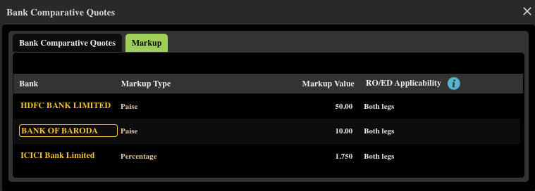

Foreign exchange rates shown on Google or financial websites rarely reflect the **actual rate you get from banks**. Banks apply spreads, margins, and additional fees depending on the channel used to execute the transaction.

> I rely on the **[RealValue FX Engine](/building-wealth/tools/realvalue-fx-engine/)** (a tool I built) to calculate the true transaction cost and compare various forex rates.

I had written earlier about the **[FX Retail](/building-wealth/blogs/funding-interactive-brokers-from-india-using-fx-retail/)** platform provided by RBI/CCIL. Recently, I discovered another channel — **FX Retail via Bharat Connect** — accessible through apps like **BHIM**. I knew about this when I discovered FX Retail but never seen in actual app till today.

I was able to see the **Bharat Connect Forex option** inside both the **BHIM app** and the **Bank of Baroda mobile app**.

## Prerequisite: FX Retail Relationship Setup

To use FX Retail, you must first configure a **relationship bank** in the FX Retail system.

I currently have relationships set up with:

1. ICICI Bank  
2. HDFC Bank  
3. Bank of Baroda  

(in that order).

Banks typically assign FX spreads based on multiple factors such as:

- transaction volume  
- income profile  
- overall relationship value  

Since I convert a **meaningful amount of INR to USD** (due to higher savings and significant allocation to **Nasdaq 100** in my portfolio), I was able to observe how different spreads are assigned.

## Observations from FX Retail Web

On the **FX Retail Web portals**, banks currently offer the following spreads:

| Bank | Spread |
|-----|-----|
| ICICI | 1.75% (default for past ~2 months) |
| HDFC | ₹0.50 per USD (Originally 1.2%) |
| Bank of Baroda | ₹0.10 per USD (Original) |

### Screenshot from FX Retail  

Interestingly, ICICI had offered a **₹0.90 discount** on their direct banking platform, but the FX Retail Web system still shows **1.75%**, which is significantly worse.

## Discovery: Bharat Connect Forex

When I checked **BHIM → Bills → Forex**, the spreads shown were different:

| Bank | Spread |
|-----|-----|
| ICICI | ₹0.20 per USD |
| HDFC | ₹0.20 per USD |
| Bank of Baroda | ₹0.10 per USD |

This suggests that banks might be **unofficially capped around ₹0.20/USD** on the Bharat Connect channel.  
**I still need to verify this through an actual transaction** (planning to test it with ICICI sometime).  
Another interesting observation: The **base price used in Bharat Connect is ~₹0.10 higher than the FX Retail Web market price**.

## Market Reference Rate
The mid-market rate (commonly shown on Google) at 12–1 PM on 8 April 2026 time was:

| Source | Rate |
|------|------|
| Google Mid-Market | **1 USD = ₹92.54** |

This rate is **not available to retail customers**. Banks always apply a markup.

## FX Retail via Bharat Connect (Transactions up to ₹5 Lakhs)

Banks offering FX through **Bharat Connect Forex** appear to add a small fixed spread.

| Bank | Rate Calculation | Effective Rate |
|-----|-----|-----|
| ICICI / HDFC | 92.645 + ₹0.20 | **₹92.845** |
| Bank of Baroda | 92.645 + ₹0.10 | **₹92.745** |

*(I have not executed a transaction yet — this is based on the quoted rates.)*

### Observations

- Spread ranges from **₹0.10 – ₹0.20 per USD**
- Very close to the mid-market rate
- Likely one of the **most competitive retail FX options**
- For HDFC it was showing both Currency/Remittance option. Whereas others I was only seeing Remittance option. Though FX Retail says Forex card supported, I couldn't see that option at all.

Even without negotiating special rates, simply using this system could produce a very competitive effective markup.

For example: Base markup (~₹0.10 market difference) + ₹0.20 spread ≈ ₹0.30/USD  
This is **far better than typical retail bank rates**, which can easily exceed ₹1/USD.

Further optimization may require negotiating spreads directly with banks, but **ease of use vs optimisation** becomes an important trade-off.

## FX Retail Web

Rates shown on bank forex web portals include larger spreads or percentage margins.

| Bank | Base Rate | Extra Margin | Effective Rate | Notes |
|-----|-----|-----|-----|-----|
| ICICI Bank | 92.5475 | +1.75% | ~₹94.17 | Current |
| ICICI Bank | 92.5475 | +₹0.20 | **₹92.7475** | Rate I requested |
| HDFC Bank | 92.5500 | +₹0.50 | **₹93.05** | Current |
| Bank of Baroda | 92.5500 | +₹0.10 | **₹92.65** | Current |

### Observations
- For HDFC used to write email and for ICICI can be self serve for this limit setup.
- In case of BoB, I was able to set up higher trading limit upfront.

## Direct Bank Quoted Rates

Rates visible directly on bank platforms at the same time:

| Bank | Standard Rate | Discounted Rate I got |
|-----|-----|-----|
| ICICI Bank | ₹94.04 | ₹93.15 |
| HDFC Bank | ₹94.14 | — |
| Bank of Baroda | ₹93.04 | — |

### Observations

The difference from mid-market ranged from roughly: **₹0.50 to ₹1.60 per USD**  
For larger transactions, this difference becomes significant.

Example:

| Amount | Extra Cost (₹1 difference) |
|------|------|
| $1,000 | ₹1,000 |
| $10,000 | ₹10,000 |
| $50,000 | ₹50,000 |

## Bank vs Channel Matrix

| Bank | Direct Bank | FX Retail Web | FX Retail Bharat Connect |
|-----|-----|-----|-----|
| **ICICI** | ✅ Currently in Use (1) | ⚠️ Available but not preferred | 🟡 Planned (4) |
| **HDFC** | ✅ Used in past | ✅ Used in past (2) | ❌ Not planning |
| **Bank of Baroda (BoB)** | ❌ No | 🟡 Planned (3) | ❌ Not planning |

1. Best rate I have with direct bank discount
2. Best rate I transacted in FX Retail
3. Best rate I have in FX Retail, yet to transact
4. Backup option if 3 is not good in other aspects

## Why This Matters

- If you are investing internationally at scale, **FX optimisation becomes surprisingly important**.
- Optimising FX spreads to invest an extra **$10/month** can [add **$24,330** (~₹22 lakhs)](/building-wealth/tools/realvalue-sip-engine/#v1otd22yf202604c0lm0.01kg24h10i6t15p22y) in real (inflation-adjusted) value over 22 years.
- Small efficiencies, compounded over time, can meaningfully impact long-term wealth.

## Next steps
- To test FX Retail Web option for BoB and see how frictionless it is
- If there are issues, I will test Fx Retail via Bharat Connect for ICICI Bank
