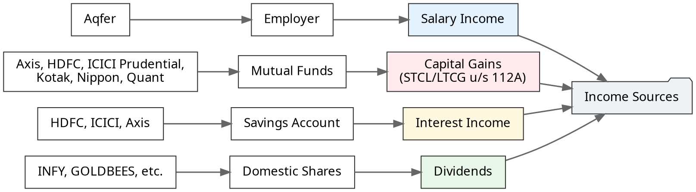
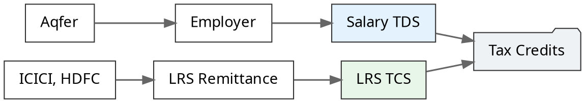
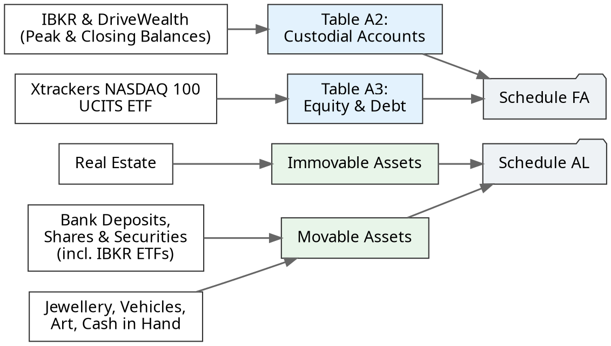

> ⚖️ **Disclaimer: Not a Chartered Accountant (CA)**
> 
> Please consult your CA or tax professional for specifics. This breakdown is based on my personal understanding and self-filing experience over the years.
The goal of this post is to document exactly what I have done to simplify my own tax filing work for next year. I am publishing it publicly so it may be useful for others directly or indirectly via AI tools.

Filing Income Tax Returns (ITR-2) for **Financial Year 2025–26 (Assessment Year 2026–27)** requires an exact, schedule-by-schedule reconciliation when you manage salary, domestic mutual funds, real estate, bank deposits, LRS remittances, and foreign assets like Irish-domiciled UCITS ETFs via Interactive Brokers (IBKR).

Rather than high-level generalizations, this post **backtracks each section of the filed ITR-2 return schedule-by-schedule**, demonstrating how every income head is computed, how special tax rates apply, how foreign assets are disclosed across **Schedule FA** (Calendar Year) and **Schedule AL** (Financial Year), and how Tax Collected at Source (TCS) offsets tax liability.

## 📅 Filing Timeline & Process

| Date/Time | Event |
| :--- | :--- |
| **Jul 25, 2026 21:48** | Successfully filed and received "Confirmation on e-Verification of Income Tax Return". *(Typically I file once I receive the Form 16 unlike this year)* |
| **Aug 6, 2026 06:47** | Received "INTIMATION u/s 143(1) OF THE INCOME TAX ACT, 1961" email confirming the refund. *(Exact refund amount as filed)* |
| **Aug 6, 2026 16:33** | Received SMS from SBI confirming ₹440 refund credited to the account. |
| **Aug 10, 2026 19:42** | Received final "Your Refund has been credited" email. |

> Phenomenal processing by the IT department; at least I didn't expect that to happen this fast. All happened in such quick succession that I actually remembered the exact refund amount!

### 🔍 Preparation & Review Workflow

- **Collect various documents** from multiple sources.
- **Focus on individual sections** and fill them up one by one.
- To fill up aggregated numbers, **compute them in Google Sheets** (Dual purpose: current year tracking and next year reference).
- **Verify each section** manually and also with the help of AI Tools.
- **Verify the overall JSON against previous year** (which reveals actual income growth, what we added new, what was removed, and how assets have grown compared to previous year).

## 🌳 System Overview

Here is the exact data flow from raw income streams into ITR-2 schedules, leading to total tax computation and final tax credit reconciliation.

### Income Sources

This diagram breaks down the various income sources that make up my total income for the year.

Beyond these, I also have tax-exempt interest and growth from retirement products such as [EPF, PPF, and NPS](/building-wealth/slides/financial-tools/#/4/3).

### Tax Credits

This diagram illustrates how your total tax liability is offset by my tax credits like TDS and TCS. 

By [using Form 12BAA to report TCS to my employer](/building-wealth/blogs/using-form-12baa-to-reduce-cashflow-drag-on-international-investments/), the Salary TDS was already adjusted against the LRS TCS.  
*Note: For the current financial year, this declaration is now done using the newly introduced [Form 122](https://www.incometaxindia.gov.in/w/form-no.-122).*

### Asset Disclosures

This diagram visualizes the mandatory asset disclosures under Schedule FA (for foreign holdings) and Schedule AL (for total net worth).

## 📂 Documents Downloaded

Need to download following documents for various sections required.
I am organizing them into Google Drive and a Google Sheet for all computations. 

| Source / Entity | Documents | Required For |
| :--- | :--- | :--- |
| **IT Department** | Form 26AS, AIS, TIS | Cross-verifying all data |
| **Employer** | Form 16 (Part A & B) | Schedule S, Schedule TDS1 |
| **Banks** | Account Statements, Interest Certificates | Schedule AL, Schedule OS |
| **Mutual Funds** | Capital Gains Statement (via MFCentral) | Schedule CG, Schedule 112A |
| **Shares** | Holding Statement / Cost Basis (ICICI Direct) | Schedule AL |
| **Foreign Investments** | Flex Report, Activity Statement (IBKR) | Schedule FA, Schedule AL |
| **EPF & NPS** | Account Statements | N/A (Personal Net-Worth only) |

## Income Schedules

### 1. Schedule S <small>(Schedule Salary)</small>

This is the most straightforward schedule. The numbers are pulled directly from Form 16, making it the simplest one to fill up. In the New Tax Regime (Section 115BAC), salary computation is streamlined:

#### Key Breakdown
- **Gross Salary**: **&lt;redacted&gt;** (Employer).
  - Includes basic salary, allowances, special perquisites, and minor ancillary payments like Hack Day Prizes.
- **Standard Deduction (Sec 16ia)**: **75,000** (upgraded standard deduction limit).
- **Total Income under Head Salaries**: **&lt;redacted&gt;**.

### 2. Schedule OS <small>(Income from Other Sources)</small>

All non-salary regular income is declared here. This schedule requires adding up the individual details and comparing them against the AIS/TIS to ensure no mismatches.

- **Interest from Savings Bank Accounts & Dividends**: **~₹6,000**
  - Reconciled across multiple savings accounts and domestic dividends received.
- **Total Income under Schedule OS**: **~₹6,000**.

### 3. Schedule CG & 112A <small>(Capital Gains)</small>

This schedule reconciles realized [redemptions](/building-wealth/slides/red-days-productive-days-portfolio-reset/) ([watch video](/building-wealth/videos/red-days-productive-days-portfolio-reset/)) across equity mutual funds. This was my first time doing an STCL (Short-Term Capital Loss) setoff, and I had to take help from AI to figure out how it has to be broken down by various time periods. 

An interesting discovery that took a while to figure out: if you have an STCL, you don't report it at an individual breakup level. I initially tried entering positive/negative numbers for STCG and the portal wasn't allowing negative values. In my experience on the portal, STCL was automatically adjusted against LTCG.

Another challenge was entering lot-level details for Section 112A. I used AI to create a working CSV file that could be successfully uploaded to the portal. 

*Quirk*: The portal validation didn't allow decimal values (paise) and forced rounding up. There was a ₹4 total difference. Interestingly, when the ITR intimation came in, they showed the total correctly including this difference! So internally, they sum up with paise but don't allow us to enter them. Either way, it didn't impact the final outcome.

#### A. Short-Term Capital Loss (STCL) Setoff
- **Equity MF Redemptions**: Consideration against acquisition cost.
- **Realized STCL**: **&lt;redacted&gt;**.

#### B. Long-Term Capital Gains (LTCG under Section 112A)
- Total equity mutual fund sales proceeds: **&lt;redacted&gt;**.
- Total cost of acquisition: **&lt;redacted&gt;**.
- Gross LTCG: **&lt;redacted&gt;**.
- **Setoff of STCL**: After setting off STCL (&lt;redacted&gt;) against LTCG, **Net Taxable LTCG = &lt;redacted&gt;**.
- **Special Tax Rate (Schedule SI)**: Taxed at the special rate of **12.5%** = **&lt;redacted&gt;**.

## Tax Schedules

The tax schedules were pretty much entirely auto-filled from the portal data. I just reviewed them to ensure everything matched my computations.

### 1. Schedule TDS1 & TCS <small>(Taxes Paid)</small>

These schedules aggregate all the taxes that have already been paid on your behalf:
- **Employer Salary TDS (Schedule TDS1)**: **&lt;redacted&gt;** deducted and deposited by employer.
- **LRS Remittance TCS (Schedule TCS)**: **&lt;redacted&gt;** collected and remitted by banks on foreign transfers.

### 2. Part B-TI & Part B-TTI <small>(Tax Refund Settlement)</small>

#### A. Total Income Computation (Part B-TI)
- **Salary Income**: &lt;redacted&gt;
- **Income from Other Sources**: &lt;redacted&gt;
- **Capital Gains (Special Rate 12.5%)**: &lt;redacted&gt;
- **Gross Total Income (GTI) / Total Income**: **&lt;redacted&gt;**

#### B. Tax Liability & Surcharge Breakdown (Part B-TTI)
- **Tax at Normal Slab Rates**: &lt;redacted&gt;
- **Tax at Special Rates (12.5% on LTCG)**: &lt;redacted&gt;
- **Surcharge**: **&lt;redacted&gt;**
- **Health & Education Cess (4%)**: **&lt;redacted&gt;**
- **Gross Tax Liability**: **&lt;redacted&gt;**

#### C. Taxes Paid & Final Refund Calculation
- **Total Taxes Paid (from Schedule TDS1 & TCS)**: **&lt;redacted&gt;**
- **Net Refund Due**: **₹440**

## Disclosure Schedules

### 1. Schedule FA <small>(Foreign Assets — Calendar Year 2025)</small>

This is my first time doing Schedule FA, so it took me more time to understand all the intricate details. Schedule FA is a mandatory disclosure under the Black Money Act for any foreign account held during the **Calendar Year (Jan 1, 2025 – Dec 31, 2025)**.

I had to make two key decision points here:
1. **Reporting Level**: For Table A2, I chose to report the full broker account-level details. (Some sources/tools suggest reporting only the cash balance, but I decided to be comprehensive).
2. **Peak Balance Computation**: To compute the peak balance, I found the peak USD balance and then converted that specific peak into INR using the SBI TT BUY rate. (I actually cloned a tool earlier to parse SBI rate PDFs and generate a yearly JSON for this exact purpose, available at [data.sakthipriyan.com](https://data.sakthipriyan.com)). Some sources suggest applying the SBI TT BUY rate to the balance every single day to find the absolute INR peak, which I think is an incorrect interpretation.

#### Table A2: Details of Foreign Custodial Accounts

1. **Interactive Brokers LLC** (Country: United States)
   - **Account Open Date**: Mid 2025
   - **Peak Balance during Period**: **₹&lt;redacted&gt;** ($&lt;redacted&gt; converted at SBI TT Buying Rate of ₹&lt;redacted&gt;)
   - **Closing Balance as of Dec 31, 2025**: **₹&lt;redacted&gt;** ($&lt;redacted&gt; converted at SBI TT Buying Rate of ₹&lt;redacted&gt;)

2. **DriveWealth LLC** (Country: United States)
   - **Account Open Date**: End 2024
   - **Peak Balance & Closing Balance**: **₹0**  
     Account inactive/empty. Opened via INDmoney but never used due to reasons detailed in [Chapter 6: What to Buy - Irish ETFs vs US ETFs](/building-wealth/books/the-global-indian-investor/06-what-to-buy-irish-etfs/). I have since fully closed this account, which means one less entry to worry about for next year's ITR!

#### A Note on Past Omissions & The Black Money Act

I genuinely missed reporting this zero-balance account in the previous year's ITR, simply because I was not aware that a completely unused, zero-balance account still had to be disclosed. 

Under Section 43 of the **Black Money Act**, non-disclosure of a foreign asset carries a terrifying flat penalty of **₹10 lakhs**—even for zero-balance accounts! Fortunately, there is a statutory relaxation: the penalty does not apply if the aggregate value of foreign movable assets does not exceed ₹20 lakhs (effective **October 1, 2024**, via the Finance (No. 2) Act, 2024). Since my balance was exactly ₹0, I was protected from the draconian penalty, though the IT department still actively expects and encourages proper disclosure. 

> **🌍 Interested in international investing?**  
> For a comprehensive guide on building a globally diversified portfolio from India, check out my book: **[The Global Indian Investor](/building-wealth/books/the-global-indian-investor/)**. A dedicated chapter will exclusively cover deep-dives into Schedule FA and Schedule AL reporting for Interactive Brokers (IBKR) accounts.

I initially thought of correcting the past omission by filing an Updated Return (ITR-U). However, based on my understanding of the ITR-U rules, you **cannot** file an ITR-U merely to update a disclosure in Schedule FA. An ITR-U is only permitted if it results in additional income and additional tax liability. I would have had to declare "fake" earnings and pay unnecessary tax just to fix a zero-balance disclosure! Consequently, I decided to simply report it correctly this year.

#### Table A3: Details of Foreign Equity and Debt Interest

This was much simpler since I only had 1 asset in the broker account (the ETF). 
- To get the **Peak Balance** and **Closing Balance**, I just reused the exact same Flex Query report mentioned above. 
- However, to compute the **Initial Value of Investment**, I had to generate a separate Activity Statement which gives the cost basis for every single lot, and then apply the respective SBI TT BUY rate to sum it all up into INR.

**Reported Asset Details:**

- **Entity**: *Xtrackers (IE) plc - Xtrackers NASDAQ 100 UCITS ETF 1C* (Country: Ireland)
- **Nature of Entity**: Exchange Traded Fund (ETF)
- **Interest Acquiring Date**: Mid 2025
- **Initial Value of Investment**: **&lt;redacted&gt;** *(Sum of lot-wise cost basis converted via SBI TT BUY rates)*
- **Peak Balance**: **&lt;redacted&gt;** *(From Flex Query)*
- **Closing Balance (Dec 31, 2025)**: **&lt;redacted&gt;** *(From Flex Query)*

### 2. Schedule AL <small>(Assets & Liabilities at Financial Year End — March 31, 2026)</small>

Since total income exceeds a certain threshold (which changes over time), **Schedule AL** requires reporting all domestic and foreign assets held as of **March 31, 2026**. 

This schedule required a lot more work to get every entry precisely right. A critical nuance is that the reporting basis is a mix depending on the asset class: **Shares, Securities, and Real Estate** are reported at their historic **Acquisition Cost**, whereas liquid assets like **Bank Deposits and Cash** are reported at their **Exact Balance** on March 31.

| Asset Category | Reporting Basis | Breakdown / Notes |
| :--- | :--- | :--- |
| **Immovable: Residential Property** | Acquisition Cost | House property |
| **Deposits in Bank** | Exact Balance | HDFC, ICICI, Bank of Baroda (BoB) and PPF balance |
| **Shares and Securities** | Acquisition Cost | Indian Stocks, Mutual Funds, IBKR ETFs, IBKR Cash |
| **Insurance Policies** | Premiums Paid | N/A |
| **Loans and Advances Given** | Principal Amount | N/A |
| **Jewellery, Bullion etc.** | Acquisition Cost* | Gold |
| **Art & Antiquities** | Acquisition Cost | Art works |
| **Vehicles, Yachts, Boats, Aircrafts** | Acquisition Cost | Vehicles at cost |
| **Cash in Hand** | Exact Balance | Cash balance on March 31 |

#### Notes on Asset Reporting

1. **Gold & Jewellery**: Although the schedule technically requires reporting at *acquisition cost*, I reported the **market value**. This is because a significant portion of the gold was received as gifts over time, meaning I do not have the original purchase bills to determine the historic cost. *(Note: What I did here is a pragmatic workaround; the strict technical rule expects reporting at the original acquisition cost of the previous owner).*
2. **PPF, NPS & EPF**: PPF goes under bank savings. However, there is no clarity or dedicated fields to report NPS balances in Schedule AL. Although I collected these numbers to understand my true net worth standing, they are omitted from the formal tax schedule.

## 🎯 Tax Planning & Rebalancing

A significant part of this year's filing success was the precise tax planning I did. By March end, I was doing a "[hard rebalancing](/building-wealth/slides/red-days-productive-days-portfolio-reset/)" ([watch video](/building-wealth/videos/red-days-productive-days-portfolio-reset/))—exiting actively managed funds and moving into passive ones, as well as buying Irish-domiciled NASDAQ 100 ETFs. 

During this process, I intentionally utilized the Tax Collected at Source (TCS) on international remittances. I planned the routing such that the tax I had to pay as advance tax was fully covered by the TCS, intentionally including some extra buffer to safely account for any unforeseen dividends and bank interests. My goal was to land a low 4-digit tax refund (to avoid falling short and paying penalties). Ultimately, managing to get it all the way down to a 3-digit refund of precisely **₹440** proved that this was a very successful and highly accurate calculation!

## 💡 Summary of Key Learnings

1. **Exact Setoff Mechanics**: Short-Term Capital Loss (&lt;redacted&gt;) is seamlessly set off against Long-Term Capital Gains before applying the 12.5% special tax rate under Section 112A.
2. **LRS TCS Offsets High Tax Liability**: Remittance TCS collected by banks was fully absorbed against total tax liability (including surcharge). Thanks to precise planning during my March rebalancing, this resulted in a clean refund of just **₹440** instead of a large self-assessment tax payout.
3. **Calendar Year vs Financial Year Integrity**: Schedule FA accurate reporting (CY 2025 peak &lt;redacted&gt;) aligns perfectly with Schedule AL year-end asset cost (&lt;redacted&gt; in IBKR ETFs), giving me confidence that my disclosures were internally consistent across both schedules.
4. **Avoiding Schedule FSI, TR & Form 67**: By [intentionally choosing Irish-domiciled accumulating ETFs](/building-wealth/books/the-global-indian-investor/06-what-to-buy-irish-etfs/#3-taxation-paperwork-administrative-complexity) (which automatically reinvest dividends instead of distributing them) and making no sales during the year, I completely avoided foreign dividend withholding tax and foreign capital gains. This means zero foreign income to report, and no need to deal with the complex headache of reporting Foreign Source Income (Schedule FSI), claiming Foreign Tax Credits (Schedule TR), or filing Form 67.

## 🧹 The Long-Term Simplification Goal

Documenting this complex filing process has reinforced my desire to drastically simplify my tax and investment operating system. While it may take a while to fully execute due to lock-ins, I eventually want to exit three specific asset classes to reduce reporting overhead:
1. **NPS**: Waiting to hit the minimum 5-year limit to exit.
2. **PPF**: Waiting out the 15-year lock-in period.
3. **Direct Shares (Dividend Tracking)**: I plan to exit most individual domestic stocks entirely, though I am waiting for a market rebound to sell some of them. Ultimately, I will probably just keep GOLDBEES and the INFY shares I received as an employee back in 2013.
4. **Bank Accounts (Interest & Cash Drag)**: I aim to reduce bank interest income further. Keeping excess cash in the bank not only adds to the reporting overhead but also suffers from cash drag. I am consciously moving spending to credit cards to keep the actual cash required minimal.

Once this consolidation is complete, my income reporting will be reduced to just Salary and Bank Interest. Capital Gains will only be triggered when there is actual selling (e.g., for LTCG tax harvesting). Nothing else will complicate the return!

> *(Note on redactions: To maintain personal privacy while keeping the computational narrative intact, I have disclosed exact small figures (like standard deduction and the final refund) but have replaced absolute large figures (like gross salary and asset balances) with `<redacted>`.)*

## 🔗 Related Reading
- [Funding Interactive Brokers from India Using FX Retail](/building-wealth/blogs/funding-interactive-brokers-from-india-using-fx-retail/)
- [How to Invest in NASDAQ 100 from India (Mutual Funds, ETFs, and IBKR Guide)](/building-wealth/blogs/how-to-invest-in-nasdaq-100-from-india-mutual-funds-etfs-and-ibkr-guide/)
- [State of the Portfolio: Returns, Allocation and Strategy — Edition 1](/building-wealth/blogs/state-of-the-portfolio-returns-allocation-and-strategy-edition-1/)
