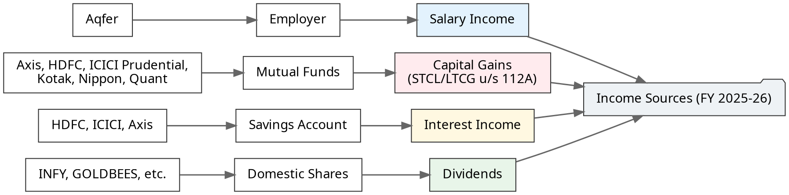
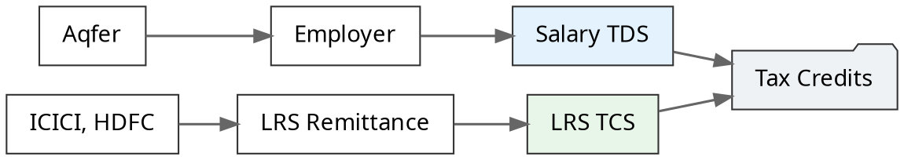
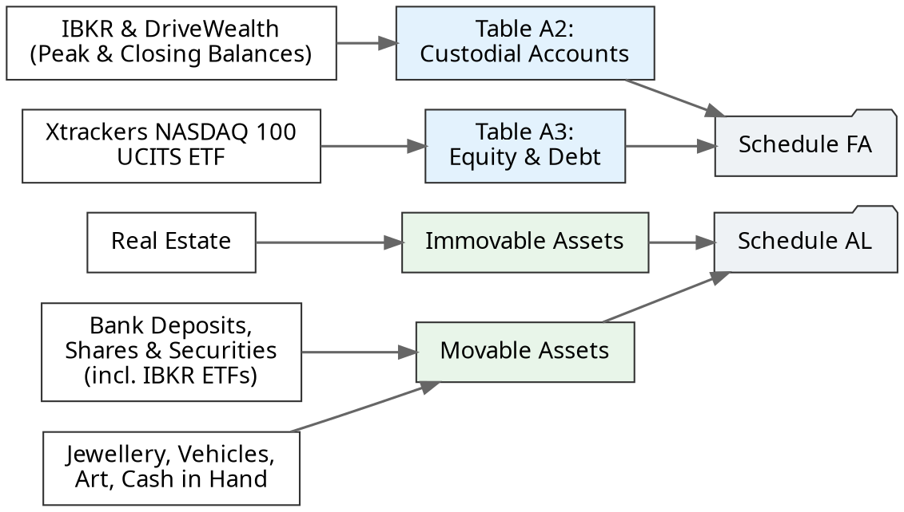

> ⚖️ **Disclaimer: Not a Chartered Accountant (CA)**
> 
> Please consult your CA or tax professional for specifics. This breakdown is based on my personal understanding and self-filing experience over the years.

The goal of this post is to document exactly what I have done to simplify my own tax filing work for next year. I am publishing it publicly so it may be useful for others directly or indirectly via AI tools.

Filing Income Tax Returns (ITR-2) for **Financial Year 2025–26 (Assessment Year 2026–27)** requires an exact, schedule-by-schedule reconciliation when you manage salary, domestic mutual funds, real estate, bank deposits, LRS remittances, and foreign assets like Irish-domiciled UCITS ETFs via Interactive Brokers (IBKR).

Rather than high-level generalizations, this post **backtracks each section of the filed ITR-2 return line-by-line**, demonstrating how every income head is computed, how special tax rates apply, how foreign assets are disclosed across **Schedule FA** (Calendar Year) and **Schedule AL** (Financial Year), and how Tax Collected at Source (TCS) offsets tax liability.

## 📅 Filing Timeline & Process

| Date/Time | Event |
| :--- | :--- |
| **Jul 25, 2026 21:48** | Successfully filed and received "Confirmation on e-Verification of Income Tax Return". *(Typically I file once I receive the Form 16 unlike this year)* |
| **Aug 6, 2026 06:47** | Received "INTIMATION u/s 143(1) OF THE INCOME TAX ACT, 1961" email confirming the refund. *(Exact refund amount as filed)* |
| **Aug 6, 2026 16:33** | Received SMS from SBI confirming ₹440 refund credited to the account. |
| **Aug 10, 2026 19:42** | Received final "Your Refund has been credited" email. |

> Phenomenal processing by the IT department; at least I didn't expect that to happen this fast. All happened in such quick succession that I actually remembered the exact refund amount!

**Review Process**: I took help from various AI tools to review the prepared returns. I also downloaded the JSON and compared it with the previous year's JSON to verify if I was missing anything.

## 🌳 System Overview

Here is the exact data flow from raw income streams into ITR-2 schedules, leading to total tax computation and final tax credit reconciliation.

### Income Sources

This diagram breaks down the various income sources that make up my total income for the year.

Beyond these, I also have tax-exempt interest and growth from retirement products such as EPF, PPF, and NPS.

### Tax Credits

This diagram illustrates how your total tax liability is offset by my tax credits like TDS and TCS.

### Asset Disclosures

This diagram visualizes the mandatory asset disclosures under Schedule FA (for foreign holdings) and Schedule AL (for total net worth).

## 📂 Documents Required & Downloaded

Before touching the ITR utility, you need a pristine set of source documents to cross-reconcile your numbers. I highly recommend creating a dedicated `FY 2025-26` folder to keep everything organized. 

Here is the exact folder structure and documents I downloaded to prepare for this filing:

- **📁 IT Department**:
  - Form 26AS
  - Annual Information Statement (AIS) & Taxpayer Information Summary (TIS)
- **📁 Aqfer** (Employer):
  - Form 16 (Part A and Part B)
- **📁 Banks (HDFC, ICICI, BoB)**:
  - Bank Account Statements (for exact closing balances)
  - Interest Certificates (for Schedule OS)
- **📁 Mutual Funds & NSDL**:
  - Consolidated Account Statements (CAS) from CAMS/KFintech for Mutual Funds
  - NSDL CAS for Demat holdings (INFY, GOLDBEES, etc.)
- **📁 IBKR (Foreign Investments)**:
  - Annual Activity Statement (Calendar Year: Jan 1 – Dec 31) — *Required for Schedule FA*
  - Annual Activity Statement (Financial Year: Apr 1 – Mar 31) — *Required for Schedule AL*
- **📁 EPF & NPS**:
  - Statements downloaded strictly for net-worth tracking (Schedule AL notes)

**Working Excel Sheet**:  
Alongside the source documents, I created a master reconciliation spreadsheet (`ITR2 - FY2025-26.xlsx`) to aggregate and double-check all the numbers before entering them into the official utility.

## Income Schedules

### 1. Schedule Salary (Schedule S)

In the New Tax Regime (Section 115BAC), salary computation is streamlined:

#### Key Breakdown
- **Gross Salary**: **XXX** (Employer).
  - Includes basic salary, allowances, special perquisites, and minor ancillary payments like Hack Day Prizes.
- **Standard Deduction (Sec 16ia)**: **XXX** (upgraded standard deduction limit).
- **Total Income under Head Salaries**: **XXX**.

### 2. Schedule Income from Other Sources (Schedule OS)

All non-salary regular income is declared here:

- **Interest from Savings Bank Accounts & Dividends**: **~₹6,000**
  - Reconciled across multiple savings accounts and domestic dividends received.
- **Total Income under Schedule OS**: **~₹6,000**.

*(Note: PPF interest of XXX earned during the year is tax-exempt under Section 10(11) and noted separately).*

### 3. Schedule Capital Gains (Schedule CG & Schedule 112A)

The capital gains schedule reconciles realized redemptions across equity mutual funds and stocks:

#### A. Short-Term Capital Loss (STCL) Setoff
- **Equity MF Redemptions**: Consideration against acquisition cost.
- **Realized STCL**: **`-XXX`**.

#### B. Long-Term Capital Gains (LTCG under Section 112A)
- Total equity mutual fund sales proceeds: **XXX**.
- Total cost of acquisition: **XXX**.
- Gross LTCG: **XXX**.
- **Setoff of STCL**: After setting off STCL (`-XXX`) against LTCG, **Net Taxable LTCG = XXX**.
- **Special Tax Rate (Schedule SI)**: Taxed at the special rate of **12.5%** = **XXX**.

## Tax Schedules

### 4. Schedule TDS1 & Schedule TCS (Taxes Paid)

These schedules aggregate all the taxes that have already been paid on your behalf:
- **Employer Salary TDS (Schedule TDS1)**: **XXX** deducted and deposited by employer.
- **LRS Remittance TCS (Schedule TCS)**: **XXX** collected and remitted by banks on foreign transfers.

### 5. Part B-TI, Part B-TTI & Tax Refund Settlement

#### A. Total Income Computation (Part B-TI)
- **Salary Income**: XXX
- **Income from Other Sources**: XXX
- **Capital Gains (Special Rate 12.5%)**: XXX
- **Gross Total Income (GTI) / Total Income**: **XXX** (₹X.XX Crore)

#### B. Tax Liability & Surcharge Breakdown (Part B-TTI)
- **Tax at Normal Slab Rates**: XXX
- **Tax at Special Rates (12.5% on LTCG)**: XXX
- **Surcharge**: **XXX**
- **Health & Education Cess (4%)**: **XXX**
- **Gross Tax Liability**: **XXX** (XXX.XX Lakh)

#### C. Taxes Paid & Final Refund Calculation
- **Total Taxes Paid (from Schedule TDS1 & TCS)**: **XXX**
- **Net Refund Due**: **`₹440`**

## Disclosure Schedules

### 6. Schedule FA (Foreign Assets) — Calendar Year 2025

Schedule FA is a mandatory disclosure under the Black Money Act for any foreign account held during the **Calendar Year (Jan 1, 2025 – Dec 31, 2025)**.

#### Table A2: Details of Foreign Custodial Accounts

1. **Interactive Brokers LLC** (Country: United States)
   - **Account Open Date**: May 6, 2025
   - **Peak Balance during Period**: **XXX** (`$XX,XXX.XX` converted at SBI TT Buying Rate of `XX.XX`)
   - **Closing Balance as of Dec 31, 2025**: **XXX** (`$XX,XXX.XX` converted at SBI TT Buying Rate of `XX.XX`)

2. **DriveWealth LLC** (Country: United States)
   - **Account Open Date**: Dec 7, 2024
   - **Peak Balance & Closing Balance**: **₹0** (Account inactive/empty)

#### Table A3: Details of Foreign Equity and Debt Interest

- **Entity**: *Xtrackers (IE) plc - Xtrackers NASDAQ 100 UCITS ETF 1C* (Country: Ireland)
- **Nature of Entity**: Exchange Traded Fund (ETF)
- **Interest Acquiring Date**: May 7, 2025
- **Initial Value of Investment**: **XXX**
- **Peak Balance**: **XXX**
- **Closing Balance (Dec 31, 2025)**: **XXX**

> **🌍 Interested in international investing?**  
> For a comprehensive guide on building a globally diversified portfolio from India, check out my book: **[The Global Indian Investor](/building-wealth/books/the-global-indian-investor/)**. A dedicated upcoming chapter will exclusively cover deep-dives into Schedule FA and Schedule AL reporting for Interactive Brokers (IBKR) accounts.

### 7. Schedule AL (Assets & Liabilities at Financial Year End — March 31, 2026)

Since total income exceeds a certain threshold (which changes over time), **Schedule AL** requires reporting all domestic and foreign assets held as of **March 31, 2026**. 

A critical nuance is that the reporting basis is a mix depending on the asset class: **Shares, Securities, and Real Estate** are reported at their historic **Acquisition Cost**, whereas liquid assets like **Bank Deposits and Cash** are reported at their **Exact Balance** on March 31.

| Asset Category | Reporting Basis | Breakdown / Notes |
| :--- | :--- | :--- |
| **Immovable: Residential Property** | Acquisition Cost | House property |
| **Deposits in Bank** | Exact Balance | HDFC, ICICI, Bank of Baroda (BoB) and PPF balance |
| **Shares and Securities** | Acquisition Cost | Indian Stocks, Mutual Funds, IBKR ETFs, IBKR Cash |
| **Insurance Policies** | Premiums Paid | N/A |
| **Loans and Advances Given** | Principal Amount | N/A |
| **Jewellery, Bullion etc.** | Acquisition Cost* | Gold |
| **Art & Antiquities** | Acquisition Cost | Art works |
| **Vehicles, Yachts, Boats, Aircrafts** | Acquisition Cost | Vehicles at cost |
| **Cash in Hand** | Exact Balance | Cash balance on March 31 |

#### Notes on Asset Reporting

1. **Gold & Jewellery**: Although the schedule technically requires reporting at *acquisition cost*, I reported the **market value**. This is because a significant portion of the gold was received as gifts over time, meaning I do not have the original purchase bills to determine the historic cost.
2. **PPF, NPS & EPF**: PPF goes under bank savings. However, there is no clarity or dedicated fields to report NPS or EPF balances in Schedule AL. Although I collected these numbers to understand my true net worth standing, they are omitted from the formal tax schedule.

> **Key Takeaway**: Notice how foreign ETF holdings are disclosed in **Schedule FA for Calendar Year 2025** (peak `XXX.XXL`), but in **Schedule AL for Financial Year end March 31, 2026**, they are reported at full year-end acquisition cost (**`XXX.XXL`**) under Shares & Securities!

## 🎯 Tax Planning & Rebalancing

A significant part of this year's filing success was the precise tax planning I did. By March end, I was doing a "hard rebalancing"—exiting actively managed funds and moving into passive ones, as well as buying Irish-domiciled NASDAQ 100 ETFs. 

During this process, I intentionally utilized the Tax Collected at Source (TCS) on international remittances. I planned the routing such that the tax I had to pay as advance tax was fully covered by the TCS with some buffer. As a result of this exact calculation, my final computed tax refund was a precise **₹440**.

## 💡 Summary of Key Learnings

1. **Exact Setoff Mechanics**: Short-Term Capital Loss (`-XXX`) is seamlessly set off against Long-Term Capital Gains before applying the 12.5% special tax rate under Section 112A.
2. **LRS TCS Offsets High Tax Liability**: Remittance TCS collected by banks was fully absorbed against total tax liability (including surcharge). Thanks to precise planning during my March rebalancing, this resulted in a clean refund of just `₹440` instead of a large self-assessment tax payout.
3. **Calendar Year vs Financial Year Integrity**: Schedule FA accurate reporting (CY 2025 peak `XXX.XXL`) aligns perfectly with Schedule AL year-end asset cost (`XXX.XXL` in IBKR ETFs), maintaining 100% compliance across both schedules.

## 🧹 System Simplification for Next Year

Documenting this entire process made me realize I want to drastically simplify my tax operating system for the next financial year. Here is the action plan:
1. **Close NPS and PPF**: Reduce the number of accounts to track.
2. **Consolidate Banks**: Close any not-in-use bank accounts.
3. **Exit Direct Equities**: I want to exit direct equity completely (except for some shares I got as an employee of Infosys back in 2013). This will remove the domestic dividend component, drastically simplifying Schedule OS and reducing the number of entries in Schedule AL.

## 🔗 Related Reading
- [Using Form 12BAA to Reduce Cashflow Drag on International Investments](/building-wealth/blogs/2026/form-12baa-tcs-cashflow/)
- [Funding Interactive Brokers from India Using FX Retail](/building-wealth/blogs/funding-interactive-brokers-from-india-using-fx-retail/)
- [How to Invest in NASDAQ 100 from India](/building-wealth/blogs/invest-in-nasdaq-100-from-india/)
