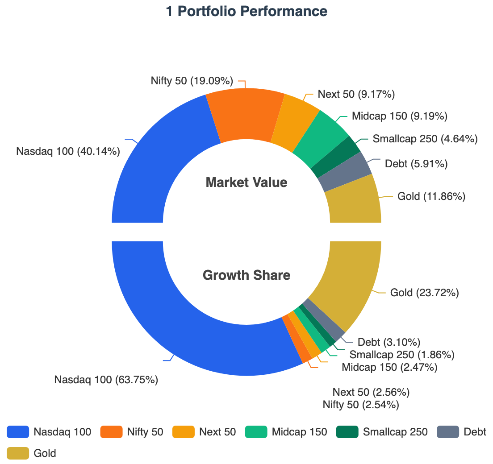
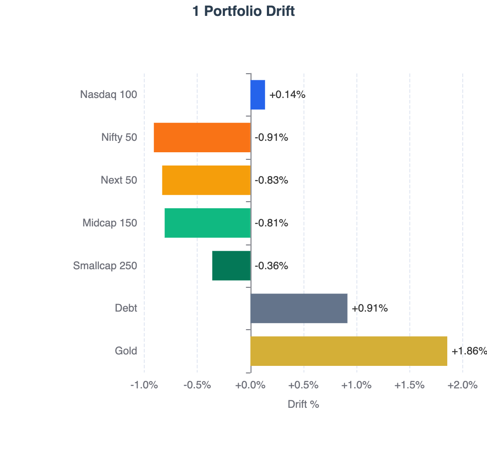
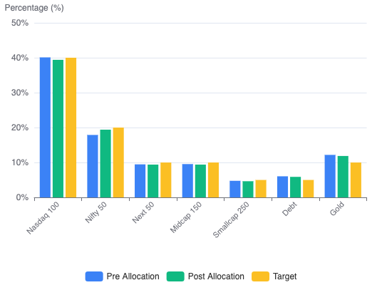
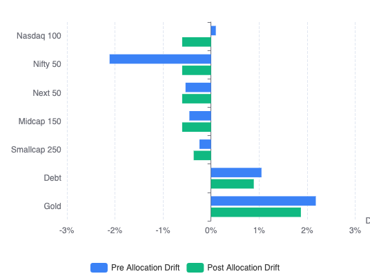

Portfolio XIRR improved to 21.67%, drift remains contained at 2.86%, and this month's main change was moving from Proportional Drift Correction to Even Drift Optimization.

I am publishing two portfolio reports:

| Report                       | Frequency                | Purpose                                                                           |
| ---------------------------- | ---------------------- | --------------------------------------------------------------------------------- |
| **[State of the Portfolio](/building-wealth/tags/state-of-the-portfolio/)**   | Annual (April)         | Comprehensive yearly review of performance, allocation and strategy.              |
| **[State of the 1 Portfolio](/building-wealth/tags/state-of-the-1-portfolio/)** | Monthly (Except April) | Regular portfolio updates covering returns, allocation, learnings and improvements |

The **1 Portfolio** represents the core long-term wealth portfolio, excluding the Emergency and Travel funds.

## Portfolio Snapshot — June 2026

| Metric               | Value                           |
| -------------------- | ------------------------------- |
| Portfolio Strategy   | **Global Multi-Asset Passive** Investing using  **Indian Mutual Funds** & **Irish ETFs**      |
| 1 Portfolio XIRR  | **21.67%**                      |
| Target Equity Allocation    | **85.00%**                        |
| Current Equity Allocation    | **81.43%**                        |
| Largest Market Values         | **Nasdaq 100 (40.07%)**, **Nifty 50 (19.11%)**         |
| Rebalancing Method   | **[Perpetual Rebalancing](/building-wealth/tags/perpetual-rebalancing/)** |
| Indian Mutual Funds | **[mf central](https://www.mfcentral.com/)**               |
| International Broker | **[Interactive Brokers (IBKR)](https://www.interactivebrokers.co.in/en/home.php) (Tiered)**               |
| FX Optimization      | **[FX Retail](https://www.fxretail.co.in/) + [Bharat Connect Forex](https://www.bharat-connect.com/forex/)** via BHIM.  <small>Read [this post](/building-wealth/blogs/fx-retail-via-bharat-connect-private-bank-speed-at-public-bank-rates-a-live-transaction-walkthrough/) for more details.</small>  |

## 1 Portfolio — Performance & Drift

Following is the current state of the **1 Portfolio**.

| Asset Class      |       XIRR | Growth Share | Current Allocation  <small>(on June 4, 2026)</small> | Target Allocation  <small>(for TY 2026-27)</small> |                                   Drift |
| :--------------- | ---------: | -----------: | -------------------------------------------------------: | -----------------------------------------------------: | --------------------------------------: |
| **Nasdaq 100**   |     40.07% |       63.61% |                                                   40.07% |                                                 40.00% | +0.07% |
| **Nifty 50**     |      2.14% |        2.55% |                                                   19.11% |                                                 20.00% |   -0.89% |
| **Next 50**      |     26.20% |        2.57% |                                                    9.18% |                                                 10.00% |   -0.82% |
| **Midcap 150**   |     24.54% |        2.48% |                                                    9.20% |                                                 10.00% |   -0.80% |
| **Smallcap 250** |     43.24% |        1.87% |                                                    4.65% |                                                  5.00% |   -0.35% |
| **Debt**         |      7.12% |        3.11% |                                                    5.92% |                                                  5.00% | +0.92% |
| **Gold**         |     41.81% |       23.81% |                                                   11.87% |                                                 10.00% | +1.87% |
| **Total**        | **21.67%** |  **100.00%** |                                              **100.00%** |                                            **100.00%** |                               **+2.86%** |

### Definitions

* **Asset Class**: Underlying asset class within the 1 Portfolio.
* **XIRR**: Annualized return generated by investments in the asset class.
* **Growth Share**: Percentage of total portfolio gains contributed by the asset class.
* **Current Allocation**: Current percentage of portfolio market value allocated to the asset class.
* **Target Allocation**: Desired long-term allocation for the asset class.
* **Drift**: Difference between current allocation and target allocation (positive = overweight, negative = underweight).
* **Total Drift**: Calculated as the sum of positive deviations from target allocations. A higher drift indicates the portfolio is further away from its target allocation. Conceptually, it represents the percentage of the portfolio that would need to be sold and reallocated to reach the target allocation precisely (ignoring taxes, transaction costs, and other practical constraints).

### Notes
- This snapshot is taken a week after monthly investment
- Next 50, Midcap 150, Smallcap 250 show higher XIRR because of recent [hard rebalancing](/building-wealth/slides/red-days-productive-days-portfolio-reset/).

> Used **[RealValue Portfolio](/building-wealth/tools/realvalue-portfolio/)** to tag goals/asset classes to derive the XIRR.  
> **Your data stays with you! All processing done in your browser!**

  
  <!-- First Image Container -->
  

    
  

  <!-- Second Image Container -->
  

    
  

### Key Performance Drivers

- **Concentrated Growth**: The Nasdaq 100 is the undisputed powerhouse of the portfolio. Nearly at target allocation now (+0.07% drift), it accounts for **63.61%** of the total growth share. It appears [the allocator](/building-wealth/tools/realvalue-family-sip-allocator/) will stop directing new investments to it very soon.
- **Gold Outperformance**: Gold has significantly exceeded expectations with a **41.81% XIRR**, and still carries the largest positive drift in the portfolio (**+1.87%**).
- **Domestic Lag**: The Nifty 50 remains the primary laggard with an XIRR of only **2.14%**, contributing just **2.55%** to the overall growth share despite being the second-largest allocation. All four Indian equity indices (Nifty 50, Next 50, Midcap 150, and Smallcap 250) contributed just **9.47%** of total growth share compared to their current combined allocation of **42.14%**.

> In a globally diversified portfolio, performance leadership rotates continuously.
> The objective is not to predict the next winner, but to systematically rebalance capital toward undervalued assets.

My Strategy is to use **Perpetual Rebalancing** to do both **Value Buying** (buy assets with negative drift) and **Momentum Capturing** (dynamically sell over a period of 6 months to reduce overall drift from say 10% to 4%). I will write about this in detail later.

## Drift Correction aka Monthly Investment

The table below consolidates the current state, monthly investment allocation and the target allocation in one view:

| Asset Class      |     Current |                               Pre Drift |  New Invest |  Post Invest |                              Post Drift |      Target |
| :--------------- | ----------: | --------------------------------------: | ----------: | ----------: | --------------------------------------: | ----------: |
| **Nasdaq 100**   |      40.10% | +0.10% |      12.44% |      39.40% |   -0.60% |      40.00% |
| **Nifty 50**     |      17.89% |   -2.11% |      77.44% |      19.40% |   -0.60% |      20.00% |
| **Next 50**      |       9.47% |   -0.53% |       6.59% |       9.40% |   -0.60% |      10.00% |
| **Midcap 150**   |       9.55% |   -0.45% |       3.54% |       9.40% |   -0.60% |      10.00% |
| **Smallcap 250** |       4.76% |   -0.24% |       0.00% |       4.64% |   -0.36% |       5.00% |
| **Debt**         |       6.05% | +1.05% |       0.00% |       5.89% | +0.89% |       5.00% |
| **Gold**         |      12.18% | +2.18% |       0.00% |      11.87% | +1.87% |      10.00% |
| **Total**   | **100.00%** | **3.33%** | **100.00%** | **100.00%** |  **2.76%** | **100.00%** |

### Definitions
- **Asset Class**: Underlying asset class part of the 1 Portfolio
- **Current**: Current portfolio allocation before new investment
- **Pre Drift**: Current deviation from target (sum of positive values = total drift)
- **New Invest**: Percentage of next monthly investment directed to each asset class
- **Post Alloc**: Estimated market value after the investment
- **Post Drift**: Estimated drift after investment
- **Target**: Target allocation for the asset class
- **Total Drift**: Drift is calculated as the sum of positive deviations from target allocations

> Used the **[RealValue Family SIP Allocator](/building-wealth/tools/realvalue-family-sip-allocator/)** framework used for monthly allocation. \
> Allocations are directed exclusively to underweight assets and [evenly spread the drift](/building-wealth/blogs/perpetual-rebalancing-engineering-a-mathematically-superior-sip-allocator/).

  
  <!-- First Image Container -->
  

    
  

  <!-- Second Image Container -->
  

    
  

> New Allocation:	**2.60%**, Drift Correction:	**0.57%** (from **3.33%** to **2.76%**)

### Key Observations from this month's allocation
* **Nifty 50 receives 77.44%** of the next investment. With a **-2.11% drift**, it is currently the most underweight asset class and therefore becomes the primary destination for fresh capital.
* **Nasdaq 100 still receives 12.44%** of the monthly investment.
* **Selective Equity Allocation** — The remaining investment is directed to **Next 50 (6.59%)** and **Midcap 150 (3.54%)**. **Smallcap 250 receives no allocation**, as correcting larger drifts elsewhere provides a more efficient path toward the target portfolio.
* **Gold and Debt receive zero** — both assets remain overweight. By directing no new funds to these asset classes, their allocation gradually declines toward the target as the equity portion of the portfolio grows.
* **Total portfolio drift reduces** from **3.33% to 2.76%** — a meaningful **0.57% correction** achieved solely through a single monthly cash flow, without requiring any sales or triggering potential tax consequences.

## System Optimizations

### Now: Salary Day = Investment Day

Earlier, I transferred **fixed money** from my Salary Account to my Investment Account on the **1st of every month automatically**. Depending on weekends and holidays, deployment could be delayed by 3–5 days after salary credit.

#### Dynamic allocation
This year, I moved from a fixed allocation model to a more dynamic one that considers the cash already available across supporting accounts such as Expense and Medical accounts. See [Managing Money Flows 2026](/building-wealth/slides/managing-money-flows-2026/) for more details on my bank account setup.

For example, if my Medical Account has a target balance of ₹10,000 and it already contains ₹5,000, I only need to top it up by ₹5,000 instead of transferring the usual ₹10,000. The remaining ₹5,000 can be redirected to investments immediately.

#### Immediate deployment
As a result, I can now manually move funds and invest on the same day the salary is credited rather than waiting until the start of the next month. Same-day deployment is feasible whenever there is adequate time between salary credit and the applicable transaction cut-off times and I am available to execute the transfers and investments:

* **Mutual Funds:** Before the applicable fund cut-off time (typically around **3:00 PM**) for the day's NAV.
* **RBI FX-Retail (Bharat Connect):** Within the FX-Retail transaction window, which is typically **9:15 AM to 3:30 PM** on forex working days.

A small optimization, but one that reduces idle cash, improves savings rate and capital efficiency, and allows investments to start compounding a few days earlier every month.

### Even Drift Optimization

Earlier, I allocated new investments proportional to negative drift. **The larger the drift, the larger the allocation.**

This month, I moved to an **even drift optimization** model. **Instead of simply reducing drift, the allocator attempts to leave all underweight asset classes with a similar post-investment drift.** The goal is to make the portfolio converge toward target allocation more uniformly over time. [Drift Correction aka Monthly Investment](#drift-correction-aka-monthly-investment) table shows that most of the post drift of the assets are at **-0.60%**.

A side effect is that priority shifts toward larger asset classes. Under the earlier approach, asset classes with smaller target allocations often converged to their targets faster. With **Even Drift Optimization**, asset classes with larger target allocations are typically prioritized because they have a greater impact on the portfolio's overall drift profile, resulting in a more balanced convergence across the entire portfolio.

See [Perpetual Rebalancing: Engineering a Mathematically Superior SIP Allocator](/building-wealth/blogs/perpetual-rebalancing-engineering-a-mathematically-superior-sip-allocator/) for more details.

## Execution Friction
### Forex transaction cost
The main challenge is that as the Nasdaq continues to rally, it becomes increasingly overweight relative to its target allocation. As a result, the allocator directs less and less new capital toward it.

When the allocator is sending larger amounts to Nasdaq, transaction costs are less of a concern because the fixed forex remittance charges get spread across a larger investment amount. However, when the allocator only recommends a small allocation, the fixed components of the remittance cost become significant and can materially increase the effective transaction cost.

I am generally comfortable with transaction costs of up to around **1.5%**, as the potential opportunity cost of waiting until the next month could be higher if Nasdaq continues to perform well. The problem arises when the recommended investment amount falls into the low four-digit or even three-digit USD range, where fixed remittance fees become disproportionately expensive.

This is pushing me to explore alternatives such as **IDFC First Bank** and **AU Small Finance Bank**, both of which reportedly waive or reduce forex processing fees. For smaller transactions, eliminating the fixed processing fee can significantly reduce the overall cost and make frequent, low-volume deployments economically viable.

### Transaction Mistakes
I am still getting familiar with the IBKR web interface. While placing an order, I intended to reduce the quantity by **1 share**, but the **– button was adjusting the quantity by 10 shares** and I didn't notice before the order was executed.

As a result, I had to place additional corrective trades, which unnecessarily increased my brokerage costs. In previous transactions, my commissions were typically around **$1.90**, whereas this month I ended up paying roughly **$4.35 per order** across multiple orders.

The monetary impact is small, but it was entirely avoidable and serves as a reminder that execution details matter just as much as allocation decisions.

I suspect the IBKR Desktop application provides better visibility and control than the web interface. I'll likely explore it before the next transaction and pay closer attention to order quantities and estimated commissions before submitting trades.

## Reflections

### What I learned
- The recovery in equities improved the overall market value of the 1 Portfolio
- Most importantly, **drift came down to 2.76% after new allocation but went up to 2.86% as of this writing**
- Moved my investment day from first working day of month to last working day of previous month to improve capital deployment speed
- Drift correction using Even Drift Optimization looks cleaner than proportional approach

### What I need to improve
- Need to consistently hit the sub $2 for broker cost with single transaction
- Fixed forex processing fees remain the biggest friction point for low-volume international allocations

### New Discovery
- As part of research for [The Global Indian Investor](/building-wealth/books/the-global-indian-investor/) I discovered that [Gold ETCs](https://www.justetf.com/en/search.html?search=ETFS&index=Gold&dc=IE&quoteCurrency=USD&resetPage=true) (0.12% TER) are much cheaper than Indian Gold ETFs/Mutual Funds (0.29% to 0.90% TER) more details available in the upcoming chapter

### Expected Allocation Trends
- I expect US equity strength to continue for the next few months
- Nasdaq will swing up so fast that I will stop allocating to it this year sometime
- Nifty performance remains muted relative to global equities and may require policy catalysts to regain leadership
- I will see Gold/Debt fund allocation by the allocator this year
- At the current rate of drift reduction, a Zero Drift Portfolio appears increasingly achievable.

## Transparency Note

> This portfolio reflects my personal investment strategy and risk tolerance. It is not investment advice.
