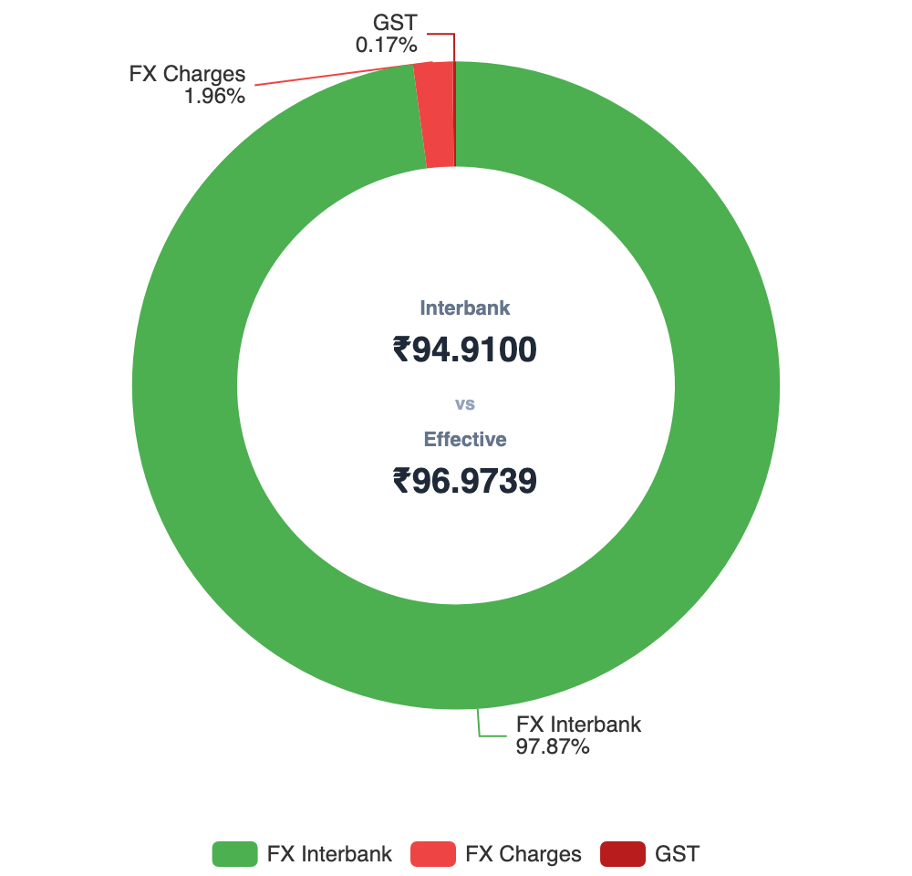
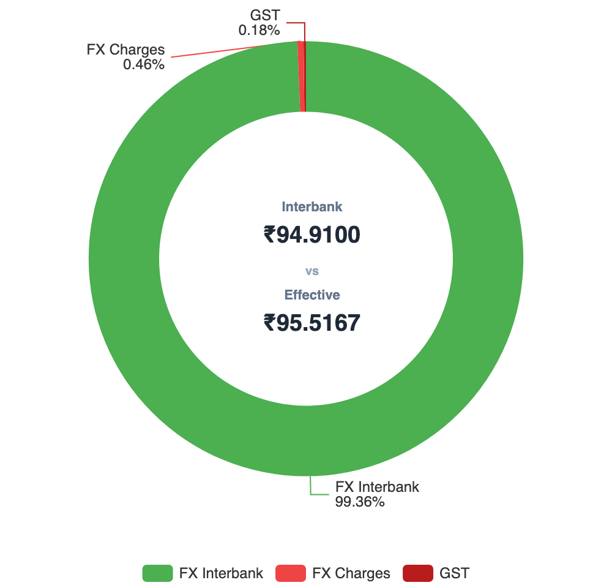
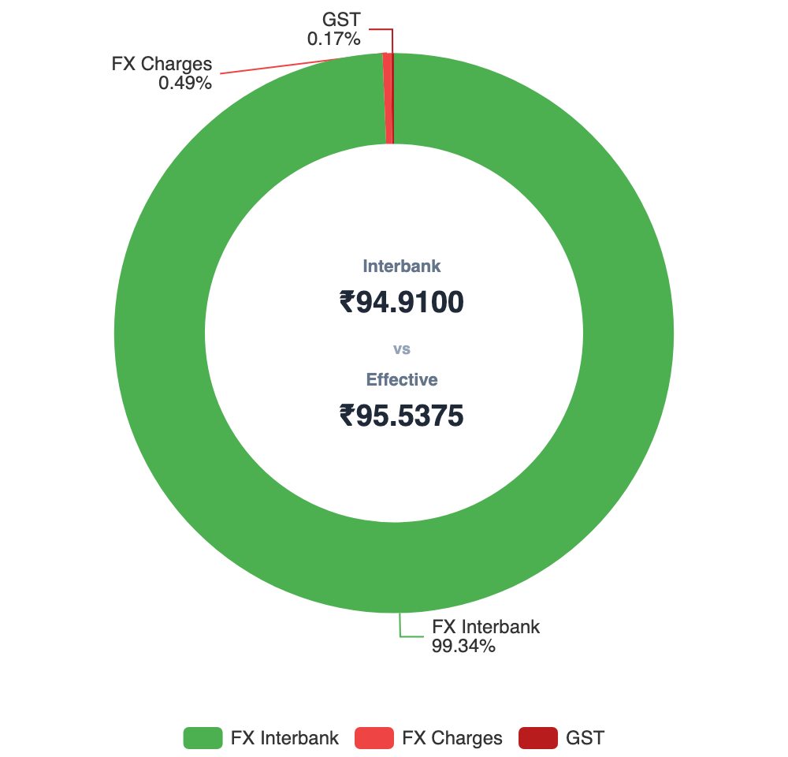

I am publishing two portfolio reports:
* **State of the Portfolio (Annual)** — published every April [[first edition here](/building-wealth/blogs/state-of-the-portfolio-returns-allocation-and-strategy-edition-1/)]  
* **State of the 1 Portfolio (Monthly)** — published every other month [Current one is the first edition]

The **1 Portfolio** represents the core long-term wealth portfolio, excluding the Emergency and Travel funds.

---

## Portfolio Snapshot — May 2026

| Metric               | Value                           |
| -------------------- | ------------------------------- |
| Portfolio Strategy   | **Global Multi-Asset Passive** Investing using  **Indian Mutual Funds** & **Irish ETFs**      |
| 1 Portfolio XIRR  | **19.13%**                      |
| Total Portfolio XIRR | **14.13%**                      |
| Target Equity Allocation    | **85%**                        |
| Largest Market Value        | **Nasdaq 100 (37.65%)**         |
| Rebalancing Method   | **Perpetual Rebalancing** |
| International Broker | **IBKR (Tiered)**               |
| FX Optimization      | **FX Retail + Bharat Connect** via BHIM  |

---

## The Portfolio Summary
The overall portfolio delivered **14.13% XIRR**.

| Goal | Purpose |XIRR | Growth Share | 
|------|----|-----:|----------:|
| **1 Portfolio** | **The Core Portfolio** for Building Wealth | 19.13% | 93.43% |
| **Emergency** | To cater to **emergencies** |7.38% | 5.64% |
| **Travel** | To cover domestic/international **trips** | 7.08% | 0.84% |
| ~~Retirement~~ | Legacy transactional error currently waiting for clean up| 7.12% | 0.09% |
| **Total** | |**14.13%** | **100.00%** |

Notes: 
- XIRR computed using latest NAVs available on May 1, 2026 before May month investments
- XIRR computation excluded all 0 balance funds which were exited earlier
- Emergency Fund had significant historical volume in a liquid fund, so pulling down the overall XIRR
- The portfolio is currently in the 8-figure INR range.

---

## 1 Portfolio — Asset Class Breakdown

Following is the current state of the **1 Portfolio**.

| Asset Class | XIRR | Growth Share | Current Allocation   <small>(on May 1, 2026)</small> | Target Allocation  <small>(for TY 2026-27)</small> | Drift |
|:---|---:|---:|---:|---:|---:|
| **Nasdaq 100** | 35.30% | 56.95% | 37.65% | 40% | -2.35% |
| **Nifty 50** | 4.06% | 5.58% | 18.92% | 20% | -1.08% |
| **Next 50** | 35.26% | 2.89% | 9.67% | 10% | -0.33% |
| **Midcap 150** | 27.94% | 2.40% | 9.69% | 10% | -0.31% |
| **Smallcap 250** | 53.32% | 1.86% | 4.97%| 5% | -0.03% |
| **Debt** | 7.29% | 3.66% | 6.50% | 5% | +1.50% |
| **Gold** | 41.56% | 26.68% | 12.59% | 10% | +2.59% |
| **Total** | **19.13%** | **100%** | **100%** | **100%** | **4.09%** |

*Growth Share represents the percentage contribution of each asset class to the portfolio’s total gains.*

> Used **[RealValue Portfolio](/building-wealth/tools/realvalue-portfolio/)** to tag goals/asset classes to derive the XIRR.  
> **Your data stays with you! All processing done in your browser!**
> 
> Currently supports CAMS + KFinTech combined PDF (Indian Mutual Funds) and IBKR (International Investments). 
> Check it out if you want to build your own report for domestic investment or international ones or both!  

  
  <!-- First Image Container -->
  

    
  

  <!-- Second Image Container -->
  

    
  

### Key Performance Drivers

- **Concentrated Growth**: The Nasdaq 100 is the undisputed powerhouse of the portfolio. Despite being slightly underweight currently, it accounts for 56.95% of the total growth share. Underweight is mainly due to change in target allocation from 35% to 40%.
- **Gold Outperformance**: Gold has significantly exceeded expectations with a 41.56% XIRR, leading to the largest positive drift in the portfolio (+2.59%). Gold outperformance peaked at +7% above target before I merged multiple goals and performed hard rebalancing.
- **Domestic Lag**: The Nifty 50 remains the primary laggard with an XIRR of only 4.06%, contributing just 5.58% to the overall growth share despite being the second-largest allocation.

> In a globally diversified portfolio, performance leadership rotates continuously.
> The objective is not to predict the next winner, but to systematically rebalance capital toward undervalued assets.

> My Strategy is to use **Perpetual Rebalancing** to do both **Value Buying** (buy assets with negative drift) and **Momentum Capturing** (dynamically sell over a period of 6 months to reduce overall drift from say 10% to 4%).

---

## Drift Correction aka Monthly Investment Allocation for May 2026

The table below consolidates the current state, May 2026 investment allocation and the target allocation in one view:

| Asset Class | Current | Pre Drift | New Invest | Post Alloc | Post Drift | Target |
|:---|---:|---:|---:|---:|---:|---:|
| **Nasdaq 100** | 37.65% | -2.35% | 53.79% | 38.00% | -2.00% | 40.00% |
| **Nifty 50** | 18.92% | -1.08% | 25.76% | 19.07% | -0.93% | 20.00% |
| **Next 50** | 9.67% | -0.33% | 9.09% | 9.66% | -0.34% | 10.00% |
| **Midcap 150** | 9.69% | -0.31% | 9.09% | 9.68% | -0.32% | 10.00% |
| **Smallcap 250** | 4.97% | -0.03% | 2.27% | 4.91% | -0.09% | 5.00% |
| **Debt** | 6.50% | +1.50% | 0.00% | 6.36% | +1.36% | 5.00% |
| **Gold** | 12.59% | +2.59% | 0.00% | 12.32% | +2.32% | 10.00% |
| **Total** | **100.00%** | **4.09%** | **100.00%** | **100.00%** | **3.67%** | **100.00%** |

### Definitions
- **Asset Class**: Underlying asset class part of the 1 Portfolio
- **Current**: Actual market value
- **Pre Drift**: Current deviation from target (sum of positive values = total drift)
- **New Invest**: Percentage of next monthly investment directed to each asset class
- **Post Alloc**: Estimated market value after the investment
- **Post Drift**: Estimated drift after investment
- **Target**: Target allocation for the asset class
- **Total Drift**: Drift is calculated as the sum of positive deviations from target allocations

> Used the **[RealValue Family SIP Allocator](/building-wealth/tools/realvalue-family-sip-allocator/)** framework — monthly investments are directed exclusively to underweight assets, proportional to their deficit from target. Includes support for Multiple investor and TCS adjusted allocation for International investments.

  
  <!-- First Image Container -->
  

    
  

  <!-- Second Image Container -->
  

    
  

> New Allocation:	**2.25%**, Drift Correction:	**0.42%** (from **4.09%** to **3.67%**)

### Key Observations from this month's allocation
*   **Nasdaq 100 receives 53.79%** of the next investment — as the most underweight asset relative to its large 40% target, it remains the primary destination for fresh capital.
*  **Tiered Domestic Allocation** - Fresh funds are being funneled into Nifty 50 (25.76%), mid-tier equities (~9% each for Next 50 and Midcap 150) and smallcaps (2.27%) to ensure the entire equity sleeve moves upward in unison.
*   **Gold and Debt receive zero** — both assets are currently overweight. By directing no new funds here, their weightage naturally "drifts" down toward the target as the equity base grows.
*   **Total portfolio drift reduces** from 4.09% to 3.67% — a meaningful **0.42% correction** achieved solely through a single monthly cash flow, avoiding the tax impact of selling winners.

---

## Optimizing International Investment

**For International Investment, Forex Cost and Broker Cost will be a huge drag if not optimized.**

### Direct IBKR Account
For Broker Cost optimization, I set up a direct account with IBKR with tiered pricing.  
Earlier used an account created via ICICI Direct Global which was using a fixed pricing model.

#### Main differences are
1. Direct IBKR access gets full access to the IBKR environment including Desktop app
2. Tiered pricing minimum is ~$1.7 where as Fixed plan I was using earlier was minimum $4
3. There was a fixed ₹999/year plan I subscribed with ICICI Direct Global. With direct IBKR it is $0/year

#### Migration In Progress
* I was able to move the residual Cash from older account to the newer one seamlessly
* Positions are still in the old account but planning to move them to the new account as well
* Planning to buy this month allocation in the new account

### Forex Optimization
For international investments, the foreign exchange transaction cost on INR-to-USD conversion is a recurring drag that compounds over years of regular funding. Optimizing it matters.

| | Option 1 | Option 2 | Option 3 |
|:---|---:|---:|---:|
| Bank | **ICICI Bank** | **Bank of Baroda** | **ICICI Bank** |
| Channel | Direct Bank | FX Retail Web | FX Retail + Bharat Connect + BHIM
| Interbank Rate | ₹94.91/USD | ₹94.91/USD | ₹94.91/USD |
| Bank Rate | ₹96.54/USD | ₹95.01/USD | ₹95.11/USD |
| FX Spread | ₹1.63/USD | ₹0.10/USD | ₹0.20/USD |
| Processing Fee | ₹1,000 + GST | ₹1,250 + GST | ₹1,000 + GST |
| Effective Rate | ₹96.97/USD | ₹95.52/USD | ₹95.54/USD |
| **Transaction Cost %** | **2.17%** | **0.64%** | **0.66%** |
| Visual Reference |  |  |  |

- Computation based on 2 May 2026 mid-market rate from public sources (Google) and ICICI FX rate in Money2World. (FX Retail ones just added 10p/USD or 20p/USD as applicable). Computed using my actual allocation (6 figure INR).
- The higher the allocation, the lower the effective transaction cost
- Switching to [FX Retail](https://fxretail.co.in) with Bank of Baroda reduces the effective transaction cost from **2.17% to 0.64%** — a saving of ~1.53% per transfer. The key driver is BoB's exceptionally low FX spread of just ₹0.10/USD through FX Retail. 
- Interestingly, FX Retail via Bharat Connect (using apps such as BHIM) allows private banks to process forex transfers with only a ₹0.20/USD markup. **So we get the speed of private banks at the cost of public bank.**

> Used the **[RealValue FX Engine](/building-wealth/tools/realvalue-fx-engine/)** to find the true transaction cost and compare various rates.  
> Using to compute/track TCS for Form 122 (previously known as 12BAA Form) and to find the TCS opportunity cost.

---
## Key lessons for me
- Equity recovering improved overall market value of the 1 Portfolio
- Most importantly, drift came down to 4.09% even prior to new allocation
- Broker cost optimized for Global Investment
- Still optimizing the FX Cost with newer channels like FX Retail via Bharat Connect
- Speed of capital deployment is as important as Markup optimizations for Global Investment

### Forward Expectations | Guessing the Future Allocation
- I am anticipating that equity recovery/growth will continue for few months
- Nasdaq will swing up so fast that I will stop allocating to it this year sometime
- I will see Gold/Debt fund allocation by the system this year
- Nifty performance remains muted relative to global equities and may require policy catalysts to regain leadership
- Still not sure If I will hit 0% drift perfection this year!

## Transparency Note

> This portfolio reflects my personal investment strategy and risk tolerance. It is not investment advice.
