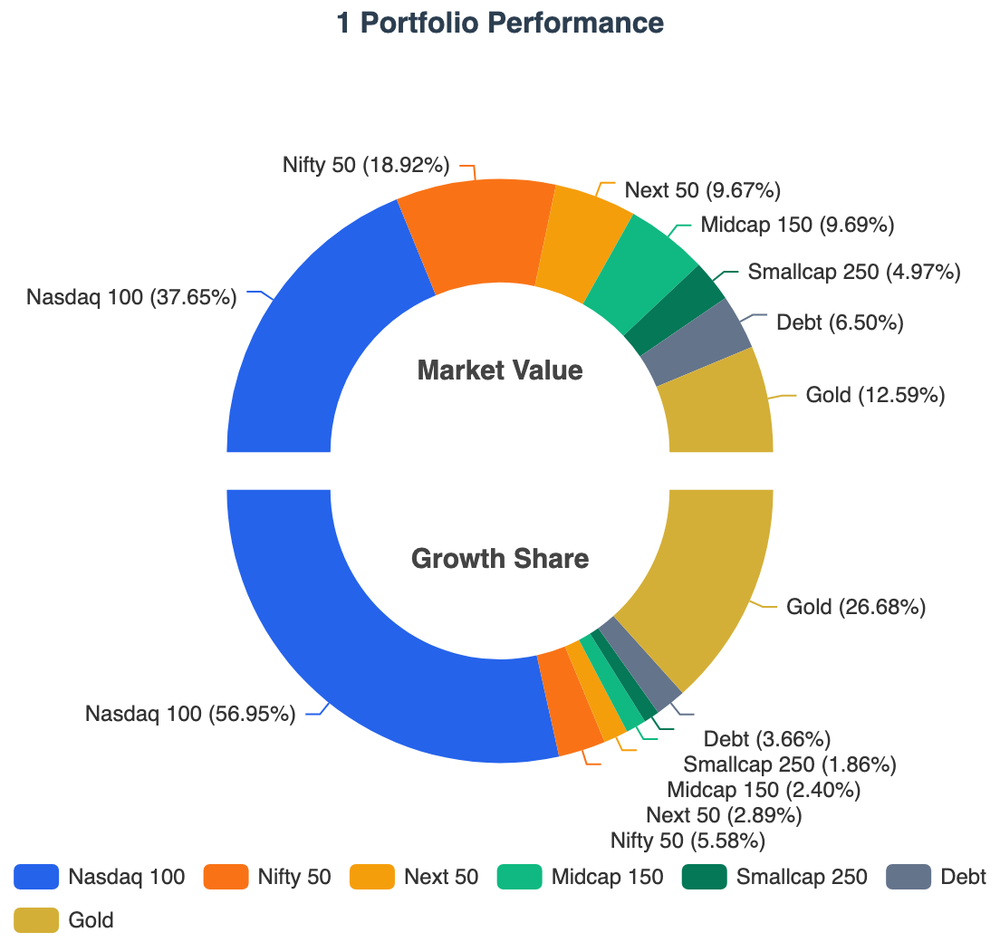
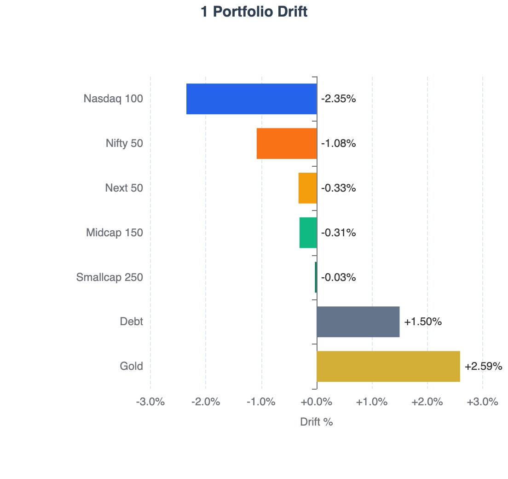
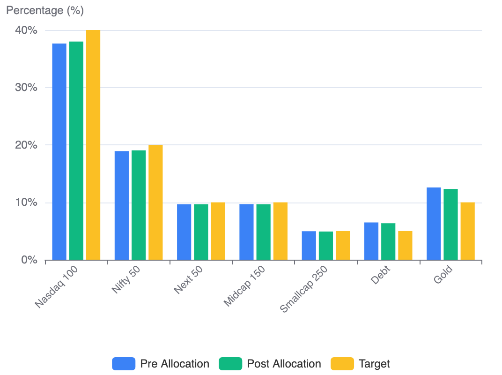
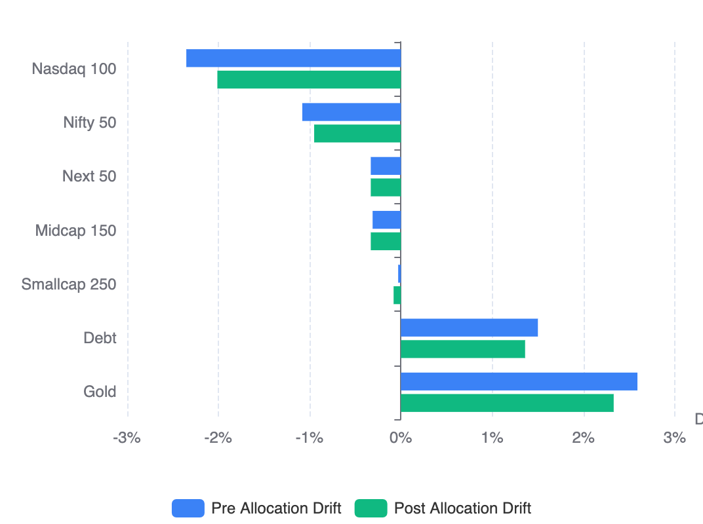

I am planning to publish,  
1) The state of **the portfolio** every April [[first edition here](/building-wealth/blogs/state-of-the-portfolio-returns-allocation-and-strategy-edition-1/)]
2) The state of the **1 Portfolio** all other months [Current article is the first one]

**1 Portfolio** is the core portfolio apart from the Emergency and Travel Funds.

## The Portfolio Summary
The overall portfolio delivered **14.13% XIRR**.

| Goal | Purpose |XIRR | Growth Share | 
|------|----|-----:|----------:|
| **1 Portfolio** | **The Core Portfolio** for Building Wealth | 19.13% | 93.43% |
| **Emergency** | To cater to **emergencies** |7.38% | 5.64% |
| **Travel** | To cover domestic/international **trips** | 7.08% | 0.84% |
| ~~Retirement~~ | **Transactional Mistake** that have to clean up | 7.12% | 0.09% |
| **Total** | |**14.13%** | **100.00%** |

Notes: 
- XIRR computed using latest NAVs available on May 1, 2026 before May month investments
- XIRR computation excluding all 0 balance funds which I used in past
- Emergency Fund had significant historical volume in a liquid fund, so pulling down the overall XIRR

> Used **[RealValue Portfolio](/building-wealth/tools/realvalue-portfolio/)** to tag categories/asset classes to derive the XIRR.  
> **Your data stays with you! All processing done in your browser!**
>
> Currently supports CAMS + KFinTech combined PDF (Indian Mutual Funds) and IBKR (International Investments). 
> You should check it out if you want to build your report!  

## 1 Portfolio — Asset Class Breakdown

Following is the current state of the **1 Portfolio**.

| Asset Class | XIRR | Growth Share | Current Allocation   <small>(on May 1, 2026)</small> | Target Allocation  <small>(for TY 2026-27)</small> | Drift |
|:---|---:|---:|---:|---:|---:|
| **Nasdaq 100** | 35.30% | 56.95% | 37.65% | 40% | -2.35% |
| **Nifty 50** | 4.06% | 5.58% | 18.92% | 20% | -1.08% |
| **Next 50** | 35.26% | 2.89% | 9.67% | 10% | -0.33% |
| **Midcap 150** | 27.94% | 2.40% | 9.69% | 10% | -0.31% |
| **Smallcap 250** | 53.32% | 1.86% | 4.97% | 5% | -0.03% |
| **Debt** | 7.29% | 3.66% | 6.50% | 5% | +1.50% |
| **Gold** | 41.56% | 26.68% | 12.59% | 10% | +2.59% |
| **Total** | **19.13%** | **100%** | **100%** | **100%** | **4.09%** |

  
  <!-- First Image Container -->
  

    
  

  <!-- Second Image Container -->
  

    
  

### Key Performance Drivers

- **Concentrated Growth**: The Nasdaq 100 is the undisputed powerhouse of the portfolio. Despite being slightly underweight currently, it accounts for 56.95% of the total growth share. Underweight is mainly due to change in target allocation from 35% to 40%.
- **Gold Outperformance**: Gold has significantly exceeded expectations with a 41.56% XIRR, leading to the largest positive drift in the portfolio (+2.59%). Gold outperformance was even higher (+7%) prior to merging multiple goals/rebalancing.
- **Domestic Lag**: The Nifty 50 remains the primary laggard with an XIRR of only 4.06%, contributing just 5.58% to the overall growth share despite being the second-largest allocation.

> In a **Gloabl Multi Asset Portfolio**, some assets will always be over performing while others lag.  
> Overtime over performer will become under performer and vice versa.  

> My Strategy is to use **Perpetual Rebalancing** to do both **Value Buying** (buy assets with negative drift) and **Moment Capturing** (dynamically sell over a period of 6 months to reduce overall drift from say 10% to 4%).

## Transparency Note

> This portfolio reflects my personal investment strategy and risk tolerance. It is not an investment advice.

---

## Drift Correction aka Monthly Investment Allocation for May 2026

The table below consolidates the current state, May 2026 investment allocation and the target allocation in one view:

| Asset Class | Current | Pre Drift | New Invest | Post Alloc | Post Drift | Target |
|:---|---:|---:|---:|---:|---:|---:|
| **Nasdaq 100** | 37.65% | -2.35% | 53.79% | 38.00% | -2.00% | 40.00% |
| **Nifty 50** | 18.92% | -1.08% | 25.76% | 19.07% | -0.93% | 20.00% |
| **Next 50** | 9.67% | -0.33% | 9.09% | 9.66% | -0.34% | 10.00% |
| **Midcap 150** | 9.69% | -0.31% | 9.09% | 9.68% | -0.32% | 10.00% |
| **Smallcap 250** | 4.97% | -0.03% | 2.27% | 4.91% | -0.09% | 5.00% |
| **Debt** | 6.50% | +1.50% | 0.00% | 6.36% | +1.36% | 5.00% |
| **Gold** | 12.59% | +2.59% | 0.00% | 12.32% | +2.32% | 10.00% |
| **Total** | **100.00%** | **4.09%** | **100.00%** | **100.00%** | **3.67%** | **100.00%** |

### Column Definitions
- **Asset Class**: Underlying asset class part of the 1 Portfolio
- **Current**: Actual market value
- **Pre Drift**: Current deviation from target (sum of positive values = total drift)
- **New Invest**: Percentage of next monthly investment directed to each asset class
- **Post Alloc**: Estimated market value after the investment
- **Post Drift**: Estimated drift after investment
- **Target**: Target allocation for the asset class

  
  <!-- First Image Container -->
  

    
  

  <!-- Second Image Container -->
  

    
  

> New Allocation:	**2.25%**, Drift Correction:	**0.42%** (from **4.09%** to **3.67%**)

### Key Observations from this month's allocation
*   **Nasdaq 100 receives 53.79%** of the next investment — as the most underweight asset relative to its large 40% target, it remains the primary destination for fresh capital.
*  **Tiered Domestic Allocation** - Fresh funds are being funneled into Nifty 50 (25.76%), mid-tier equities (~9% each for Next 50 and Midcap 150) and smallcaps (2.27%) to ensure the entire equity sleeve moves upward in unison.
*   **Gold and Debt receive zero** — both assets are currently overweight. By directing no new funds here, their weightage naturally "drifts" down toward the target as the equity base grows.
*   **Total portfolio drift reduces** from 4.09% to 3.67% — a meaningful **0.42% correction** achieved solely through a single monthly cash flow, avoiding the tax impact of selling winners.

> The 1 Portfolio uses the **[RealValue Family SIP Allocator](/building-wealth/tools/realvalue-family-sip-allocator/)** framework — monthly investments are directed exclusively to underweight assets, proportional to their deficit from target. No selling occurs during normal market conditions. New money does the rebalancing.   
> Includes support for Multiple investor and TCS adjusted allocation for International investments.

---

## FX Cost Optimization: Funding IBKR

> I use **[RealValue FX Engine](/building-wealth/tools/realvalue-fx-engine/)** to find the true transaction cost and compare various rates.  
> Using to compute/track TCS for 12BAA form and to find the TCS opportunity cost.

For international investments via [Interactive Brokers](https://www.interactivebrokers.co.in/), the foreign exchange transaction cost on INR-to-USD conversion is a recurring drag that compounds over years of regular funding. Optimizing it matters.

Following comparison for three thousand dollars. [ICICI (Current)](/building-wealth/tools/realvalue-fx-engine/#v1udd20260403r93.12b92.67a3000f1000y0g12m3) vs [FX Retail + BoB (Plan)](/building-wealth/tools/realvalue-fx-engine/#v1udd20260403r92.77b92.67a3000f1250y0g12m3)

| Parameter | ICICI (Current) | FX Retail + BoB (Plan) |
|-----------|----------------:|-----------------------:|
| Interbank Rate | ₹92.67/USD | ₹92.67/USD |
| Bank Rate | ₹93.12/USD | ₹92.77/USD |
| FX Spread | ₹0.45/USD | ₹0.10/USD |
| Processing Fee | ₹1,000 + GST | ₹1,250 + GST |
| Effective Rate | ₹93.63/USD | ₹93.38/USD |
| **Transaction Cost** | **1.03%** | **0.76%** |
| Effective Rate |  |  |

Switching to [FX Retail](https://fxretail.co.in) with Bank of Baroda reduces the effective transaction cost from **1.03% to 0.76%** — a saving of ~0.27% per transfer. The key driver is BoB's exceptionally low FX spread of just ₹0.10/USD through FX Retail, compared to ₹0.45/USD with ICICI's highly discounted rate on bank card rate.

Note that BoB's processing fee is slightly higher (₹1,250 vs ₹1,000), but this is more than offset by the much lower FX spread on larger transfer amounts. As the transaction volume increases, the transaction cost will come down.

**Next step — Direct IBKR**: Currently operating via an indirect route. Moving to a direct IBKR account will reduce brokerage by an additional **$2–3 per transaction**, with no per-transaction intermediary overhead.

Essentially trying to invest **$10/month** extra, as per [this projection](/building-wealth/tools/realvalue-sip-engine/#v1otd22yf202604c0lm0.01kg24h10i6t15p22y) this can lead to real (inflation adjusted) value of **$24,330** higher portfolio in **22 years**. Which is like **₹22 lakhs** extra in today's money. In long run optimizing these costs are very important.

---
## Key Lessons From FY 2025–26

1. Asset allocation matters more than running behind momentum
2. Index funds reduce behavioural mistakes (see [this](/building-wealth/blogs/why-rule-based-global-multi-asset-portfolio-beats-a-single-multicap-or-flexicap-fund/))
3. New-money rebalancing works better than selling (see [this](/building-wealth/blogs/perpetual-rebalancing-a-practical-framework-for-long-term-wealth/))
4. FX costs compound significantly over long horizons (see [this](/building-wealth/blogs/funding-interactive-brokers-from-india-using-fx-retail/))
5. Execution mistakes can happen, need to be careful
