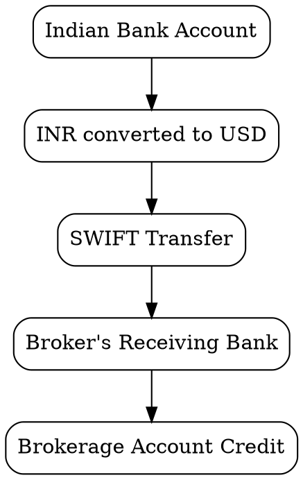

Before selecting a broker or investment instrument, it is important to understand how money actually moves from India to an overseas brokerage account.

For Indian retail investors, the remittance process itself can materially impact long-term returns. A seemingly small FX markup of ~₹1.50 per USD compounds significantly over decades of investing.

This chapter focuses on sending money abroad efficiently under the Liberalised Remittance Scheme (LRS).

---

## What is LRS?

The **Liberalised Remittance Scheme (LRS)** allows Indian residents to remit up to **$250,000 (~₹2.4 Crores @ 94.55) per financial year** for permitted purposes, including overseas investment in equities and ETFs.

Every rupee sent to a foreign brokerage account passes through the LRS framework. Understanding this process is essential before investing internationally.

### Tax Collected at Source (TCS)

Under current LRS rules, once your total foreign remittances in a financial year cross ₹10 lakhs, banks begin collecting TCS on the remittances.

For overseas investments, this can materially increase the upfront cash outflow during remittance. This was one of the major reasons I initially delayed international investing — I was concerned about the opportunity cost of capital temporarily locked until adjusted during income tax filing.

Later in this chapter, we will look at practical ways to reduce the impact of this cash-flow friction.

---

## How the Money Flows

The remittance chain typically looks like this:




In practice, there are 4 major cost components:

1. **FX markup** (most important)
2. SWIFT / remittance charges
3. GST on charges
4. FX GST

For long-term investors, FX markup dominates all other costs.

---

## Understanding the Different Remittance Levels

There are multiple ways to remit money abroad. The convenience and FX efficiency vary significantly.

### Level 0 — Standard Bank card rate

The simplest approach is:

- Log into your bank website (I have used ICICI Bank / HDFC Bank online)
- Use the standard outward remittance flow
- Accept the bank-provided exchange rate

This is the default experience most retail users see.

The process is frictionless, but usually expensive.

Typical markup:
- ~₹1.50/USD above interbank rates (Rate shown in Google)

This is effectively the "retail card rate" offered by banks.

### Level 1 - Promoted Bank card rate

Same as Level 0 but with some discounts.

When I started, there was promotion code offered by bank specifically for the IBKR remittance (ICICI Direct Global provided the promo code for ICICI Bank). This waived the processing fee of 1,000 + GST and applied a 40p/USD discount on bank card rate.

Also based on the broker, there is a waiver of the processing fee. At lower volume, this plays a significant role. But, as your investment scales the markup cost will become significant.

### Level 2 - Negotiated Bank card rate

Later 

### Level 3 - FX Retail Web + Private Banks

### Level 4 - FX Retail + Bharat Connect / Forex + Private Banks

### Level 5 - FX Retail + Public Sector Banks

---

# The Remittance Efficiency Ladder

From worst to best FX efficiency:

| Method | Typical Markup |
|---|---|
| Standard bank card rate | ~₹1.50/USD |
| Negotiated bank rate | ~₹0.50/USD |
| FX Retail Web + Private Banks | ~₹0.50/USD |
| FX Retail + Bharat Connect / Forex + Private Banks | ~₹0.20/USD |
| FX Retail + Public Sector Banks | ~₹0.10/USD |

---

# My Practical Experience

I have personally executed remittances through:

- Standard bank remittance
- Negotiated bank FX rates
- FX Retail with public sector banks

I also attempted the Bharat Connect flow, though my initial setup failed due to UPI linkage issues. I plan to retry this again.

Based on my experience:

## Best Balance for Most Retail Investors

### FX Retail + Bharat Connect + Private Banks

This currently appears to be the most practical setup for most investors because it combines:

- Private bank convenience
- Near-public-bank FX pricing
- Fully online flow
- Fast execution

Typical characteristics:
- ~₹0.20/USD markup by default
- Works well up to ₹5 lakhs per transfer
- UPI transaction limit becomes the practical ceiling

This effectively provides:

> private-bank speed at near public-bank pricing.

---

## Best for Large Transfers

### FX Retail + Public Sector Banks

Public sector banks can offer:
- ~₹0.10/USD markup
- Extremely competitive rates for large remittances
- Better inward remittance conversion as well

However:
- The process is usually semi-manual
- Requires coordination with branch forex teams
- Not fully online
- Slower operationally

This setup is best suited for:
- Large periodic remittances
- High-volume investors
- Investors optimizing every basis point

---

# Bank Experience Comparison

## ICICI Bank

ICICI has been the fastest in my experience.

I have seen:
- Money credited to IBKR within a couple of hours
- Same-day deployment possible into US markets

Operationally, ICICI feels closest to a modern real-time remittance workflow.

---

## HDFC Bank

HDFC generally processes by end-of-day.

Even then, I was still able to:
- Remit funds on the same day
- Buy Nasdaq 100 exposure through Irish ETFs during European market hours

The delay was manageable.

---

## Bank of Baroda (BoB)

BoB provided excellent FX pricing, but the operational flow was slower.

In one case:
- Funds reached the broker on the same date
- But after European markets had closed (~10 PM IST)

This delayed deployment until the next trading session.

---

# Setting Up Your Bank for LRS + FX Retail

The remittance itself is straightforward.

Getting competitive FX pricing is the harder part.

The setup process generally looks like this:

## 1. Choose the Right Bank

Commonly used banks include:

- HDFC Bank
- ICICI Bank
- Bank of Baroda (BoB)

Not all branches handle LRS and FX Retail efficiently.

Prefer:
- Authorised Dealer (AD) branches
- Forex-focused branches
- Branches already servicing HNI / remittance customers

Many regular branches are unfamiliar with FX Retail workflows.

---

## 2. Enable FX Retail Access

This is usually a one-time setup.

Each bank handles onboarding differently.

### HDFC
- Relatively smoother
- Good relationship managers can complete setup quickly

### ICICI
- Requires persistence
- Multiple touchpoints may be needed across:
  - customer care
  - relationship managers
  - forex teams

---

## 3. Add Your Broker as Beneficiary

Register your brokerage account details in the remittance portal.

For example:
- HDFC RemitNow
- ICICI Money2World

You will need:
- Beneficiary bank name
- SWIFT code
- Broker account number
- Broker address

---

# Do a Small Test Transfer First

Before sending a large amount, do a small test remittance.

Example:
- USD 50–100

This validates:
- Beneficiary details
- SWIFT routing
- Broker credit workflow

Do not judge FX efficiency from the test transfer.

Small transfers look expensive because:
- Fixed processing fees dominate
- Percentage cost appears artificially high

Once validated, proceed with larger transfers.

---

# Step-by-Step Transfer Flow

Using HDFC RemitNow (or equivalent):

1. Log into net banking
2. Open outward remittance / LRS section
3. Select purpose:
   - "Investment abroad"
   - "Investment in foreign securities"
4. Enter USD amount
5. If using FX Retail:
   - Book the FX deal separately
   - Enter the FX Retail trade number
6. Confirm the exchange rate
7. Submit the transfer
8. Save the transfer receipt

---

# Documents Typically Required

Most banks require:

- PAN card
- Passport
- LRS declaration
- Form 15CA / 15CB workflow
  - Often automated for investment remittances
- Broker details
  - Account number
  - SWIFT code
  - Receiving bank information

---

# Expected Timelines

Typical settlement timeline:

- T day
- T+1 business day

Operational efficiency depends heavily on:
- Bank cut-off times
- SWIFT processing
- Whether deposit notification was added at the broker

For IBKR, adding:

```text
Funding → Notify Deposit
```

before remittance significantly improves matching speed.

---

# What You Should Track

Maintain a remittance log containing:

- Transfer date
- INR debited
- USD credited
- FX rate achieved
- Charges paid
- Bank used

This becomes useful for:
- XIRR calculations
- Portfolio analytics
- Tax reporting
- Auditing remittance efficiency over time

---

# Key Takeaway

For long-term international investors:

- Brokerage fees matter less
- Expense ratios matter less
- FX conversion efficiency matters far more than most people realise

Reducing FX markup from:
- ₹1.50/USD
to
- ₹0.20/USD

creates a meaningful long-term compounding advantage.

The difference becomes substantial when investing consistently over decades.

---

# TODO

- Add detailed Form 15CA / 15CB walkthrough
- Add CCIL FX Retail booking screenshots
- Add Bharat Connect flow explanation
- Add inward remittance optimisation
- Add examples comparing FX markup impact over 20+ years