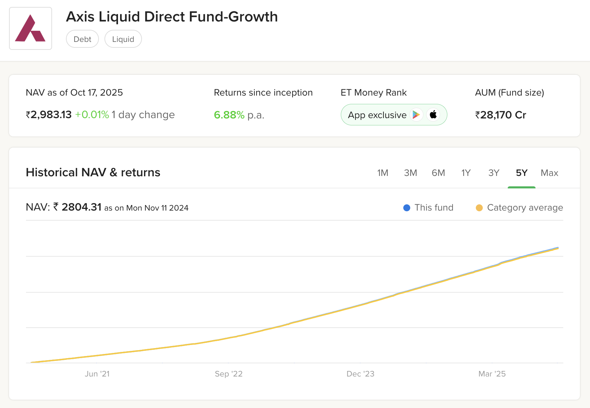
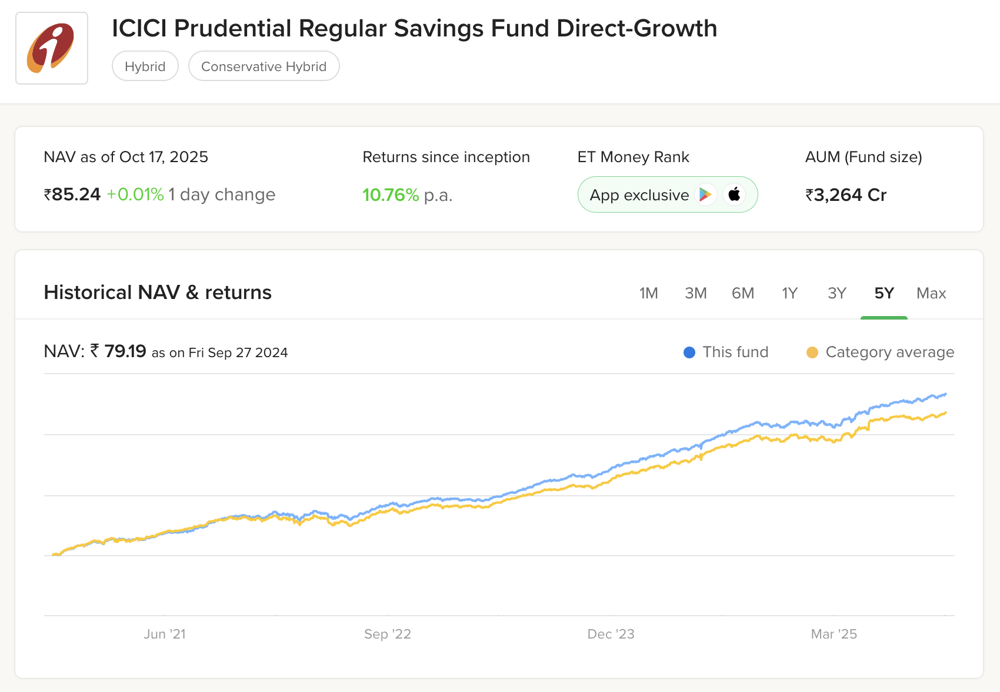
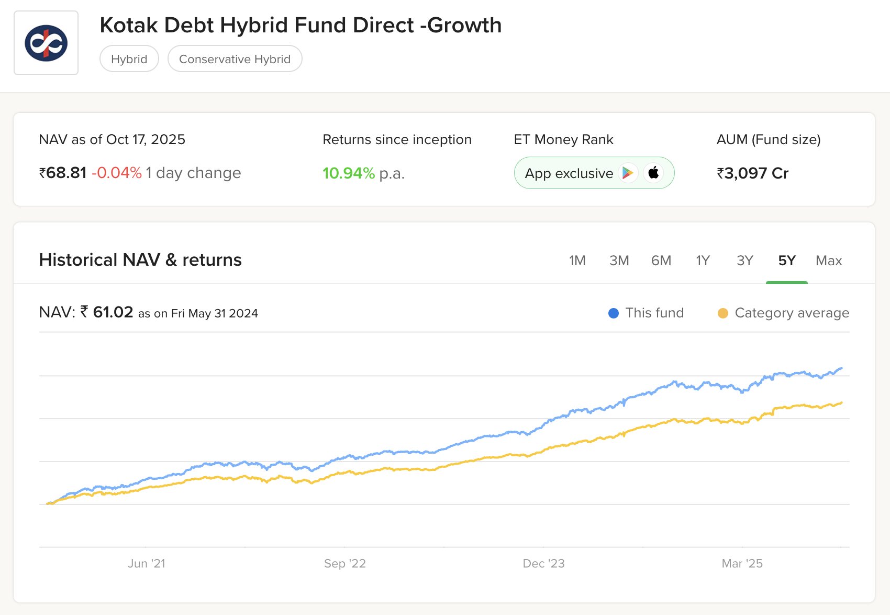
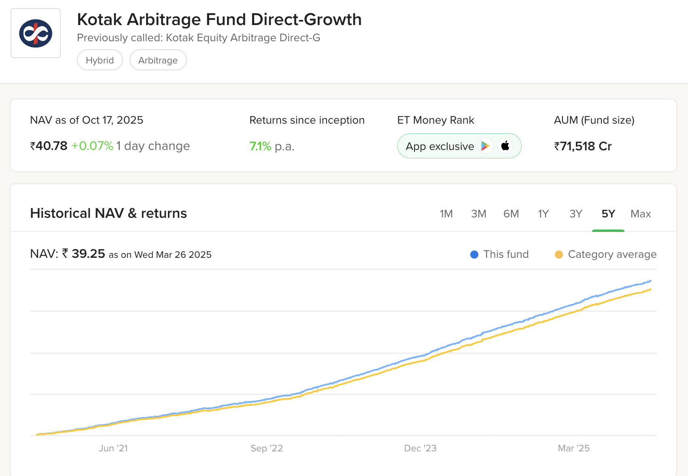
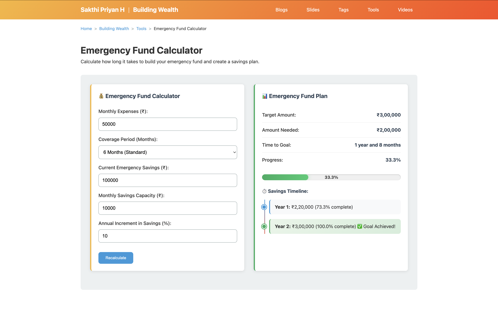

<section data-autoslide="2500">
  <small>sakthipriyan.com/building-wealth</small>
  <h2>Sakthi Priyan H</h2>
  <h2>Building Wealth</h2>
  <h4 class="fragment">presenting</h4>
</section>

<section data-autoslide="2500">
  <h2>Emergency Fund Setup</h2> using 
  <h3>Liquid/Hybrid Mutual Funds</h3>
  <h4 class="fragment">Oct 26, 2025</h4>
</section>
---

### Disclaimer
<!-- .slide: data-autoslide="5000" -->
|  | |
|---------------|----------------|
| **Personal Variation** | What works for me may not suit everyone. |
| **Educational Purpose** | For learning only, not financial advice. |
| **Investment Risk** | Values can rise or fall; capital may be lost. |
| **Regulatory Note** | Check local laws and tax rules before investing. |
| **Personal Responsibility** | Viewers are responsible for their own decisions             |

---

#### Contents

1. Emergency Fund
2. My Setup
3. Handling Emergencies
4. Emergency Fund Calculator

---

### 1. Emergency Fund

#### Why?

**Because life is uncertain 💡**

- Job loss or business slowdown  
- Medical emergency 
- Peace of mind — knowing you're covered  
- Building block for equity investing

--

#### How Much to Keep?

**Rule of thumb 🧮**

- **Basic safety:** 3–6 months of expenses  
- **Ideal safety:** 12 months — especially for families or self-employed  

**🛋️ Comfort and Opportunity cost ⏳**
- More months, we end up losing compounding on long-term wealth building. 
- For me, **12 months** feels ideal for peace of mind

--

#### Where to Keep?

- Cash in hand
- Bank
    - Savings Account
    - Sweep-in Fixed Deposit
- Mutual Funds
    - Debt: **Liquid Fund**
    - Debt: Ultra Short Duration Fund
    - Debt: Short Duration Debt Fund
    - Hybrid: **Arbitrage Fund**
    - Hybrid: **Conservative Hybrid Fund**

---

### 2. My Setup
> 💡 *12 months emergency fund diversified across liquidity and stability for faster access and steady growth.*

--

  

    <h4>Split across Liquid/Hybrid funds</h4>
    <table>
      <thead>
        <tr>
          <th>Months</th>
          <th>Type</th>
          <th>Fund</th>
          <th style="text-align:right;">XIRR</th>
        </tr>
      </thead>
      <tbody>
        <tr><td>2</td><td>Liquid</td><td>Axis Liquid Fund</td><td style="text-align:right;">6.93%</td></tr>
        <tr><td>6</td><td>Hybrid</td><td>ICICI Prudential Regular Savings Fund</td><td style="text-align:right;">10.02%</td></tr>
        <tr><td>4</td><td>Hybrid</td><td>Kotak Debt Hybrid Fund</td><td style="text-align:right;">11.63%</td></tr>
        <tr><td><strong>12</strong></td><td>-</td><td><strong>Blended XIRR</strong></td><td style="text-align:right;"><strong>10.04%</strong></td></tr>
        <tr><td>-</td><td>Arbitrage</td><td>Kotak Arbitrage Fund</td><td style="text-align:right;">7.37%</td></tr>
      </tbody>
    </table>
  

  
  
  
  

--
#### 💡 Key Insights
- **Maintains liquidity** for quick access when needed  
- **Grows steadily** with compounding returns  
- **Keeps pace with inflation** over time  
- **One-time setup** 
  - no need to top up unless it is used

--

#### ⚖️ Risk & Considerations
- Involves **moderate risk** due to hybrid fund exposure  
- Coverage may drop if  
  - an emergency occurs soon after setup and  
  - market correct sharply in initial years  
- **Conservative investors** can choose either **Liquid** or **Arbitrage** Funds
- **Post-tax returns** vary — an important factor in fund selection  

--

#### Emergency Fund Growth 📈
**Monthly Expenses:** ₹85,000
**Time Horizon:** 4 years  
  
| Category | XIRR  | Value  | <nobr>Tax Rate</nobr>  | Post-Tax  |
|-----------|-----------|------------------|--------------|--------------------|
| Liquid Only | 6.93% | ₹1,11,000 | 30% | ₹1,03,000 |
| <nobr>Arbitrage Only</nobr> | 7.37% | ₹1,13,000 | 12.5% | ₹1,10,000 |
| Blended | 10.04% | ₹1,25,000 | 30% | ₹1,13,000 |
| Hybrid Only | 11.63% | ₹1,31,000 | 30% | ₹1,17,000 |
| **Blended<small>&lt;Apr,'23</small>** | **10.04%** | **₹1,25,000** | **12.5%** | **₹1,20,000** |
  
<small>All values are rounded to the nearest 1,000.</small>

---

### 3. Handling Emergencies

Emergencies usually fall into two major categories:

1. **Medical Emergency 🏥**  
2. **Job Loss or Income Interruption 💼**

--

#### Handling a Medical Emergency

Step-by-step approach to manage liquidity smartly:

1. **Health Insurance Policy** — first line of defense 🛡️  
2. **Use Credit Card** — short-term buffer for timing gap 💳  
3. **Redirect Next Month's Investments** — temporarily pause investments/SIPs  
4. **Redeem from Liquid Fund** — instant access to cash 💧  
5. **Redeem Hybrid Fund(s)** — only if required after above steps 🧱  

> 💡 *The goal is to keep the emergency fund last in the chain — not first.*

--

#### Handling a Job Loss

1. **Reassess Expenses:** Contain all discretionary spending  
2. **Monthly Redemptions:**  
   - Withdraw 1 month’s expense from **Liquid Fund**  
   - After 2 months, start partial redemptions from **Hybrid Fund(s)**  
3. **Maintain Financial Stability:** Ensure essential expenses are covered while minimizing risk to remaining investments  

> 💡 *Treat your emergency fund as a personal salary continuity plan.*

--

#### Rebuilding Emergency Fund

- **Restart contributions immediately** once regular income resumes  
- **Prioritize liquidity first:** Refill Liquid Fund portion before hybrids  
- **Gradual top-up:** Restore hybrid allocations over multiple months to rebuild full coverage  
- **Maintain target months:** Keep 12 months (or your chosen comfort level)

> 💡 *The goal is to always have the emergency fund ready for future contingencies.*

---
### 4. Emergency Fund Calculator

---
<section data-autoslide="1000">
  <h2>Sakthi Priyan H</h2>
  <h2>Building Wealth</h2>
  <h4 class="fragment" data-fragment-index="1">Nice! You watched till the end 🎉</h4>  
  Found this helpful? 💡  
  
    👍 Like & 💬 Share with friends & family! 
    📌 Subscribe for more videos.
   
</section>
