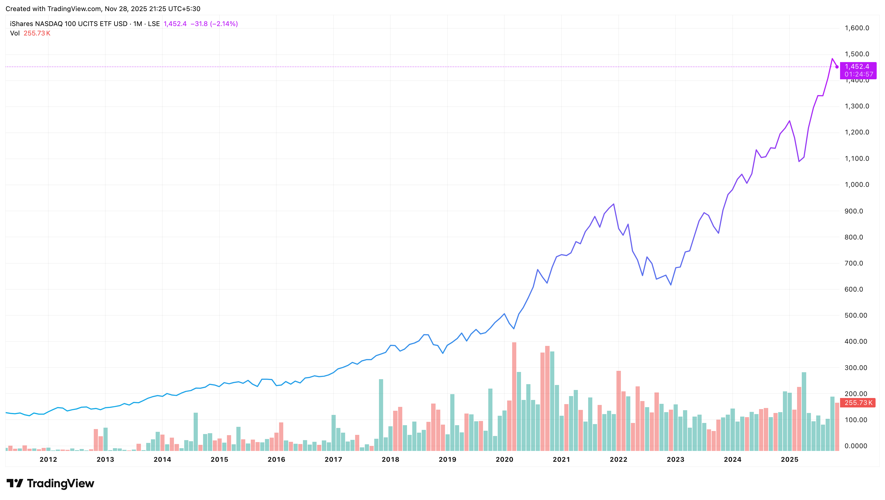
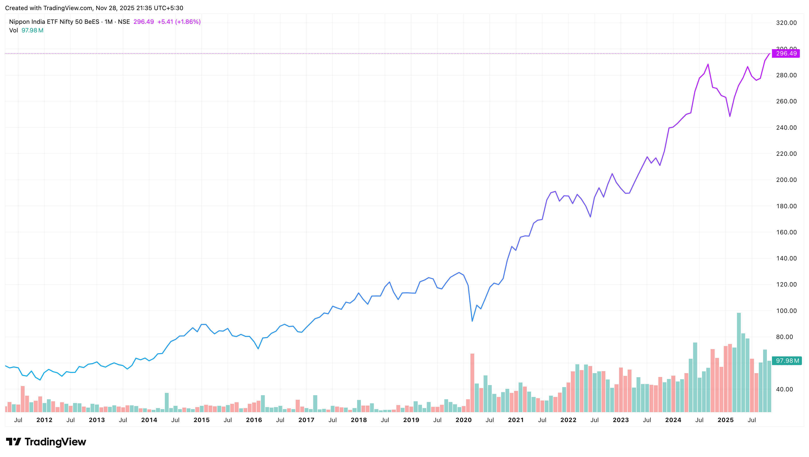

sakthipriyan.com/building-wealth

## How I missed a Crore
 

#### A Personal Journey in Building Wealth
 

#### Nov 30, 2025
 
 
--

### Disclaimer
|                    |                                                             |
|--------------------|-------------------------------------------------------------|
| **Personal Fit**   | Based on my experience & comfort.                     |
| **Purpose**        | Educational — not financial advice.                    |
| **Risk**           | Markets involve capital risk.                    |
| **Rules**          | Verify tax/regulatory details.                        |
| **Responsibility** | Make decisions aligned with your goals.                     |

--

### Contents
 
<ol class="fragment grow">
  <li>Why Nasdaq 100 Matters?</li>
  <li>What I Did?</li>
  <li>Equity vs Gold vs Inflation</li>
  <li>Asset Allocation</li>
  <li>Key Learnings</li>
</ol>
 
 
 

---
### 1️⃣ Why Nasdaq 100 Matters?
🇺🇸 **iShares NASDAQ 100 UCITS ETF USD (Acc)**  
LSE:CNDX  

|                      |     1&nbsp;Apr&nbsp;2011 |     3 Nov 2025 | Growth |   CAGR |
|----------------------|----------------:|----------------:|-------:|-------:|
| **Nasdaq&nbsp;100** | $ 127.24        | $ 1,452.40      | 11.41x | 18.16% |
| **1 USD**     | ₹ 44.22         | ₹  89.31         | 2.02x  | 4.94%  |
| **Nasdaq 100** | ₹ 5,626.55      | ₹&nbsp;1,29,713.84   | 23.05x | **24.00%** |

--

🇺🇸 LSE:CNDX — $127.24 → $1,452.40 <small>(1 Apr 2011 → 3 Nov 2025)</small>

--

🇺🇸 / 🇮🇳 FX_IDC:USDINR — ₹44.22 → ₹89.31 <small>(1 Apr 2011 → 3 Nov 2025)</small>

---

### 2️⃣ What I Did?

> 22 years old me 🧑‍💼 bought a  
> **📱&nbsp;Samsung&nbsp;Galaxy&nbsp;S** for **₹ 24,999**  
> on 📅 **14 Mar 2011**

 <!-- .element: class="fragment" --> 

💡 I didn’t know how to build wealth.  <!-- .element: class="fragment" --> 

--

### 2️⃣ What I Did / What if?

 <ul>
    <li class="fragment fade-up">I bought <strong>Nasdaq 100 ETF</strong> instead of a <strong>Galaxy S</strong>?</li>
    <li class="fragment fade-up"><strong>4.44</strong> units for <strong>₹&nbsp;24,999</strong> on <strong>1 Apr 2011</strong></li>
    <li class="fragment fade-up">On <strong>3 Nov 2025</strong>, <strong>4.44</strong> units is <strong>₹&nbsp;5,76,324</strong></li>
    <li class="fragment fade-up">What if I continued holding and it performed similarly?</li>
    <li class="fragment fade-up">On <strong>1 Apr 2041</strong> it will be <b class="fragment fade-up">₹&nbsp;1,58,69,864</b></li>
  </ul>

<blockquote class="fragment fade-up">💡 A single decision at 22 created a ₹1.58 crore opportunity difference.</blockquote>
--

### 2️⃣ The Missed Opportunity

> On **1 Apr 2011**,  
> If I spent **₹&nbsp;8,999** on a phone &  
> invested **₹&nbsp;16,000** in a Nasdaq 100 ETF,   
> it is **₹ 3,68,862** on 3 Nov 2025,  
> it would be **₹&nbsp;1,01,57,119** by 1 Apr 2041.

FV = IV x (1+CAGR)years  
₹ 16,000 × (1.24)³⁰ = ₹ 1,01,57,119

--
### 2️⃣ Course Correction
| Date         | Mobile                     | Cost&nbsp;₹ | Monthly&nbsp;₹ |
|-------------:|-----------------------------|---------:|------------------:|
| 14&nbsp;Mar&nbsp;2011  | Samsung Galaxy S            | 24,999             | 596               |
| 17 Sep 2014  | Redmi 1S                    | 5,999        | 182               |
| 25 Jun 2017  | OnePlus 5                   | 32,999    | 892               |
| 06&nbsp;Aug&nbsp;2020  | Samsung Galaxy M31s         | 21,499   | 566               |
| 23 Oct 2023  | Samsung&nbsp;Galaxy&nbsp;M34&nbsp;5G       | 18,104   | *482               |

> 💡 Phones depreciate. Investments grow.  
> *482 projected using 37.5m lifespan.

---
### 3️⃣ Equity vs Gold vs Inflation
Let's compare
- 🇮🇳 **Nippon India ETF Nifty 50 BeES**  
  NSE:NIFTYBEES 
- 🇮🇳 **Nippon India ETF Nifty Next 50 Junior BeES**  
  NSE:JUNIORBEES 
- ⭐ **Nippon India ETF Gold BeES**  
  NSE:GOLDBEES 
- 🇮🇳 🛒 **India Consumer Price Index**  
  ECONOMICS:INCPI 

--
🇮🇳 NSE:NIFTYBEES — ₹ 56.27 → ₹ 296.49 <small>(1 Apr 2011 → 3 Nov 2025)</small> 

--
🇮🇳 NSE:JUNIORBEES — ₹ 113.08 → ₹ 744.12 <small>(1 Apr 2011 → 3 Nov 2025)</small>

--
⭐ NSE:GOLDBEES — ₹ 21.57 → ₹ 104.62 <small>(1 Apr 2011 → 3 Nov 2025)</small>

--
🇮🇳 🛒 ECONOMICS:INCPI 88.20 → 197.30 <small>(1 Apr 2011 → 3 Nov 2025)</small>

--

### 3️⃣ Equity vs Gold vs Inflation

> 💡 Let's see how various assets performed.  
> 💎 Price of 1 unit / Index.

| Asset        | 1&nbsp;Apr&nbsp;'11 | 3 Nov '25   | Growth | CAGR    |
|--------------|-----------:|-------------:|-------:|--------:|
| Nasdaq&nbsp;100   | ₹&nbsp;5,626.55 | ₹&nbsp;1,29,713.84 | 23.05x | 24.00%  |
| Next 50      | ₹ 113.08   | ₹ 744.12     | 6.58x  | 13.79%  |
| Nifty 50     | ₹ 56.27    | ₹ 296.49     | 5.27x  | 12.07%  |
| Gold         | ₹ 21.57    | ₹ 104.62     | 4.85x  | 11.43%  |
| Inflation    | 88.20       | 197.30 | 2.24x | 5.71% | 

--

### 3️⃣ Equity vs Gold vs Inflation Growth
> 📈 **₹ 16,000** invested on **1&nbsp;Apr&nbsp;'11**.  
> **1&nbsp;Apr&nbsp;'41** projected using past CAGR. 

|              | 3 Nov '25   | 1&nbsp;Apr&nbsp;'41 |
|--------------|-------------:|-------:|
| Nasdaq&nbsp;100 | ₹&nbsp;3,68,862 | ₹&nbsp;1,01,57,119 |
| Next 50      | ₹ 1,05,288   | ₹ 7,71,334     |
| Nifty 50     | ₹ 84,305    | ₹ 4,88,428     |
| Gold         | ₹ 77,604    | ₹ 4,11,323     |
| Inflation    | ₹ 35,791    | ₹ 84,645 |

---

### 4️⃣ Asset Allocation

> 🧩 Diversify to reduce risk.  

|Allocation           | Nasdaq100 | Next50 | Nifty50 | Gold | CAGR |
|-------------------------|-----------:|--------:|---------:|-----:|----------------:|
| US Tilt             | 40%        | 30%     | 20%      | 10%  | 17.29%          |
| Balanced           | 30%        | 30%     | 30%      | 10%  | 16.10%          |
| India Tilt          | 25%        | 40%     | 25%      | 10%  | 15.68%          |
| India&nbsp;Only        | 0%        | 30%     | 50%      | 20%  | 12.46%          |

> 💡 My Portfolio: + Midcap, Smallcap & Debt
--

### 4️⃣ Asset Allocation / Growth

> 📈 **₹ 16,000** invested on **1&nbsp;Apr&nbsp;'11**.  
> 📉 Real value using **5.71%** as on **1&nbsp;Apr&nbsp;'11**.

|   |  |  |  |  |
|----------------|------------------:|-------------------:|------------------:|-------------------:|
| **Allocation**    | **3&nbsp;Nov&nbsp;'25** Nominal | **3&nbsp;Nov&nbsp;'25** Real | **1&nbsp;Apr&nbsp;'41** Nominal | **1&nbsp;Apr&nbsp;'41** Real |
| US Tilt        | ₹1,63,975           | ₹79,173             | ₹19,15,993         | ₹4,28,724           |
| Balanced       | ₹1,41,255           | ₹67,682             | ₹14,09,934         | ₹3,10,549       |
| India Tilt     | ₹1,33,905           | ₹63,983             | ₹12,63,206         | ₹2,76,651           |
| India Only     | ₹88,718            | ₹41,482             | ₹5,41,790          | ₹1,13,478             |

---

### 5️⃣ Key Learnings

- Buying expensive depreciating items → long-term cost <!-- .element: class="fragment fade-up" -->
- Compare purchases vs long-term opportunity cost <!-- .element: class="fragment fade-up" -->
- Start investing early — time > timing <!-- .element: class="fragment fade-up" -->
- Asset allocation matters more than picking winners <!-- .element: class="fragment fade-up" -->
- Equity compounds wealth; gold protects wealth <!-- .element: class="fragment fade-up" -->
- Inflation silently destroys purchasing power <!-- .element: class="fragment fade-up" -->
---

sakthipriyan.com/building-wealth

### Sakthi Priyan H
### Building Wealth
 

#### Found this useful?
| | |
|-|-|
|👍 Like | 💬 Comment
|🔄 Share | 📌 Subscribe  |
for more videos...

**✨ Thank You 🙏**
