sakthipriyan.com/building-wealth

## How to Invest in Debt
for
## Building Wealth
  
#### Nov 23, 2025
 
 
--

### Disclaimer
<!-- .slide: data-autoslide="5000" -->

|                    |                                                             |
|--------------------|-------------------------------------------------------------|
| **Personal Fit**   | Based on my experience & comfort level.                     |
| **Purpose**        | Educational only — not financial advice.                    |
| **Risk**           | Debt also carries varying capital risk.                     |
| **Rules**          | Verify tax rules & fund regulations.                        |
| **Responsibility** | Make decisions aligned with your goals.                     |

--

### Contents
 
<ol class="fragment grow">
  <li>Asset Classes</li>
  <li>What is Debt?</li>
  <li>Forms of Debt/Hybrid</li>
  <li>Debt/Hybrid Mutual Funds</li>
  <li>Usage</li>
  <li>Taxation</li>
</ol>

---

### 1️⃣ Asset Classes

📈 Know Your Asset Classes for **Building Wealth**  

|               |                |                        |     |
|---------------|----------------|------------------------|-----|
| 🟢 **Equity** | Ownership      | Index Funds / ETFs     | 80% |
| 🟢 **Debt**   | Lending        | Debt / Hybrid / PPF    | 10% |
| 🟢 **Gold**   | Store of Value | ETF / MF / SGB         | 10% |

> Debt is **not** a wealth creator — it is a  
> **wealth stabilizer + risk reducer**.

---

### 2️⃣ What is Debt?
> **Debt means you lend your money safely to an institution and earn steady interest in return.**

> These institutions can include Governments, Banks or Companies.

--

#### 🧭 Debt Behavior

|  |
|--------------|
| 💰 Earn **interest**, not market-driven returns |
| 📉 Offer lower volatility than equity |
| 🛡️ Preserve capital & provide predictable returns |
| 💧 Provide short/medium-term liquidity |
| 🎯 Help match time-bound goals & emergencies |
| 🪨 Reduce overall portfolio drawdowns |

---

### 3️⃣ Forms of Debt/Hybrid

```dot
digraph Debt {
  graph [bgcolor=transparent];

  node [
    shape=box,
    style="rounded,filled",
    fontname="Helvetica",
    fontsize=14,
    color="#000000"
  ];

  // Top Level
  Debt         [label="🟢 Debt / Hybrid", fillcolor="#D1FAE5"];

  // Bank (replacing Cash & Cash Equivalents)
  Bank         [label="🏦 Bank", fillcolor="#F0FDF4"];
  Savings      [label="💰 Savings", fillcolor="#FFFFFF"];
  FD           [label="📄 FD", fillcolor="#FFFFFF"];
  RD           [label="📆 RD", fillcolor="#FFFFFF"];

  // Mutual Funds
  MutualFund   [label="📊 Mutual Funds", fillcolor="#FFF3CD"];
  DebtFunds    [label="💼 Debt Funds", fillcolor="#F0FDF4"];
  Hybrid       [label="⚖️ Hybrid Funds", fillcolor="#F0FDF4"];

  PPF          [label="📘 PPF", fillcolor="#D1FAE5"];             
  LiquidFund   [label="💧 A. Liquid Fund", fillcolor="#D1FAE5"];     
  DynamicBond  [label="📉 B. Dynamic Bond", fillcolor="#FDE68A"];   
  ConsHybrid   [label="🟨 C. Conservative Hybrid", fillcolor="#FDE68A"]; 
  Arbitrage    [label="🔀 D. Arbitrage Fund", fillcolor="#D1FAE5"]; 

  // Govt Schemes
  Govt         [label="🏛️ Retirement Schemes", fillcolor="#E0F7FA"];
  EPF          [label="📗 EPF", fillcolor="#CCFFFF"];
  NPS          [label="📙 NPS", fillcolor="#CCFFFF"];

  // Connections
  Debt -> Bank;
  Debt -> Govt;
  Debt -> MutualFund;

  // Bank breakdown
  Bank -> Savings;
  Bank -> FD;
  Bank -> RD;

  // Mutual Fund structure
  MutualFund -> DebtFunds;
  MutualFund -> Hybrid;

  Hybrid -> ConsHybrid;
  Hybrid -> Arbitrage;
  
  Govt -> PPF;
  Govt -> EPF;
  Govt -> NPS;

  DebtFunds -> LiquidFund;
  DebtFunds -> DynamicBond;
}
```

---
### 4️⃣ Debt/Hybrid Mutual Funds
> Let's dive deep into the Debt/Hybrid Mutual Funds I am using.

| |
|-|
|A. Liquid Fund  |
|B. Dynamic Bond Fund  |
|C. Conservative Hybrid Fund  |
|D. Arbitrage Fund  |
--

### 4️⃣ A. Liquid Fund
> A Liquid Fund invests in **very short-term debt** (<= 91 days) (T-bills, commercial paper) with **high liquidity and very low risk**.

 
 <table> <thead> <tr><th>Pros</th></tr> </thead> <tbody> <tr><td>Very low risk</td></tr> <tr><td>T+0 / T+1 liquidity</td></tr> <tr><td>Better than savings interest</td></tr> </tbody> </table> 
 
 <table> <thead> <tr><th>Cons</th></tr> </thead> <tbody> <tr><td>Returns fluctuate slightly</td></tr> <tr><td>Not meant for long-term growth</td></tr> <tr><td>Lower returns vs. other debt categories</td></tr> </tbody> </table> 
 

--

### 4️⃣ B. Dynamic Bond Fund
> A Dynamic Bond Fund invests across **short, medium, and long-term debt**, adjusting based on **interest rate cycles**.

 
 <table> <thead> <tr><th>Pros</th></tr> </thead> <tbody>  <tr><td>Higher return potential than liquid/ultra-short funds</td></tr> <tr><td>Professional duration management</td></tr> <tr><td>Can benefit from falling interest rates</td></tr></tbody> </table> 
 
 <table> <thead> <tr><th>Cons</th></tr> </thead> <tbody> <tr><td>Interest-rate timing risk</td></tr> <tr><td>Higher NAV volatility</td></tr> <tr><td>Not suitable for < 3-year goals</td></tr> </tbody> </table> 
 

--

### 4️⃣ C. Conservative Hybrid Fund
> A hybrid fund investing **75–90% in debt** and **10–25% in equity**.

 
 <table> <thead> <tr><th>Pros</th></tr> </thead> <tbody> <tr><td>Can outperform pure debt funds</td></tr> <tr><td>Slight equity kicker with controlled risk</td></tr> <tr><td>Suitable for 2–3 year goals</td></tr> </tbody> </table> 
 
 <table> <thead> <tr><th>Cons</th></tr> </thead> <tbody> <tr><td>Equity exposure → NAV volatility</td></tr> <tr><td>Taxed as debt (less efficient)</td></tr> </tbody> </table> 
 

--

### 4️⃣ D. Arbitrage Fund
> A hybrid-equity strategy that earns low-risk returns by exploiting **price differences** between cash and futures markets.

 
 <table> <thead> <tr><th>Pros</th></tr> </thead> <tbody> <tr><td>Taxed as equity (favorable for >1 year)
</td></tr> <tr><td>Low volatility (similar to liquid fund)</td></tr> <tr><td>Good for parking money 3-12 months</td></tr> <tr><td>No credit risk</td></tr> </tbody> </table> 
 
 <table> <thead> <tr><th>Cons</th></tr> </thead> <tbody> <tr><td>Returns depend on market arbitrage spreads</td></tr> <tr><td>Not ideal in extremely low-vol periods</td></tr> <tr><td>Slightly more complex product</td></tr> </tbody> </table> 
 

--

### 4️⃣ Debt/Hybrid Mutual Funds / Performance

  

    <table>
      <thead>
        <tr>
          <th>Type</th>
          <th>Fund</th>
          <th style="text-align:right;">XIRR</th>
        </tr>
      </thead>
      <tbody>
        <tr><td>A. Liquid Fund</td><td>Axis Liquid Fund</td><td style="text-align:right;">6.93%</td></tr>
        <tr><td>B. Dynamic Bond</td><td>ICICI Prudential All Seasons Bond Fund</td><td style="text-align:right;">8.35%</td></tr>
        <tr><td>C.&nbsp;Conservative&nbsp;Hybrid</td><td>ICICI Prudential Regular Savings Fund</td><td style="text-align:right;">9.93%</td></tr>
        <tr><td>D. Arbitrage Fund</td><td>Kotak Arbitrage Fund</td><td style="text-align:right;">7.23%</td></tr>
      </tbody>
    </table>
  

  
  
  
    

---

### 5️⃣ Usage

> How I plan and use various funds across my financial goals

|                                          |                                                                    |
|------------------------------------------|--------------------------------------------------------------------|
| **Emergency Fund**   Unknown         | 🟢 Liquid Fund   🟡 Conservative Hybrid   🔵 Arbitrage Fund |
| **Travel/Medical Fund**   Short Term | 🟢 Arbitrage Fund                                                  |
| **Core Portfolio**   Long Term       | 🟡 Dynamic Bond   🟢 PPF    🔵 Arbitrage Fund               |

---

### 6️⃣ Taxation

| Investment    | STCG Period | STCG Tax | LTCG Tax | 
| ------------- | ----------- | -------- | -------- | 
| Liquid Fund  | NA       | Slab     | Slab    |
| Dynamic Bond  | NA       | Slab     | Slab    |
| Conservative&nbsp;Hybrid   | NA       | Slab     | Slab    |
| **Arbitrage Fund** | <&nbsp;12&nbsp;months       | 20%     | 12.5%    |

---

sakthipriyan.com/building-wealth

### Sakthi Priyan H
### Building Wealth
 

#### Found this useful?
| | |
|-|-|
|👍 Like | 💬 Comment
|🔄 Share | 📌 Subscribe  |
for more videos...

**✨ Thank You 🙏**
