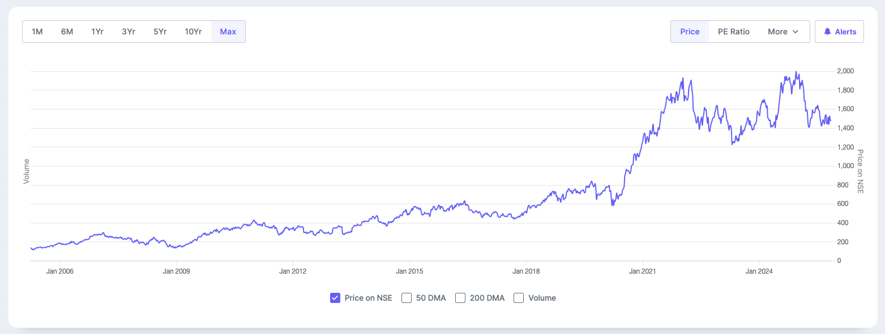
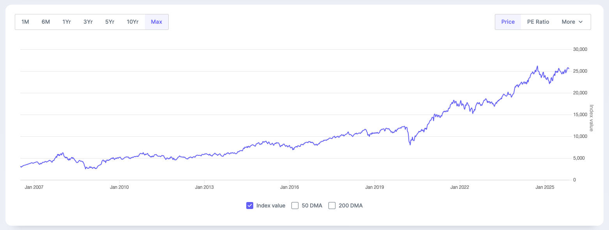

 sakthipriyan.com/building-wealth 

## Equity & Index Funds 
for
## Building Wealth 
  
#### Nov 09, 2025
 
 
--

### Disclaimer
<!-- .slide: data-autoslide="5000" -->
<!-- Before we begin - a quick disclaimer. -->
|  |  |
| --------------------------- | ---------------------------------------------------------- |
| **Personal Fit**      | Strategies shared reflect my experience and comfort level. |
| **Purpose**     | For learning and awareness, not financial advice.          |
| **Risk**         | Market values fluctuate; capital is always at risk.        |
| **Rules**         | Verify local tax and investment regulations.               |
| **Responsibility** | Make informed choices that align with your goals.          |

---

### Contents

1. Asset classes <!-- .element: class="fragment zoom-in" -->
2. Equity <!-- .element: class="fragment zoom-in" -->
3. Index Fund <!-- .element: class="fragment zoom-in" -->
4. My Equity Allocation <!-- .element: class="fragment zoom-in" -->
5. My Equity Portfolio <!-- .element: class="fragment zoom-in" -->
6. Why "Boring" Works   <!-- .element: class="fragment zoom-in" -->

---

### 1️⃣ Asset classes

📈 Know Your Asset Classes for **Building Wealth**  

|            |                         |                           |
|------------|-------------------------|---------------------------|
| **Equity** | Ownership in companies  | Infosys shares /   Nifty 50 |
| **Debt**   | Lending to institutions | Bonds / Debt Fund         |
| **Gold**   | Store of value          | ETF / Jewellery           |

> Diversify across asset classes to manage risk.

---

### 2️⃣ Equity

- When you buy a **share** via **NSE** / **BSE**, you buy **a small piece of a company**.  
- Prices change not every time value changes, but when **expectations** change.  
- Over time, as companies grow, **your ownership grows in value**.
  - Price Appreciation
  - Dividends (If reinvested)
  - Buybacks
  - Stock Splits / Bonus Shares
- 📈 Growth is never a straight line 

--

### 2️⃣ Equity / Infosys 

> 📊 CAGR 12% (20 years)

---

### 3️⃣ Index Fund

> A **Mutual Fund** that buys all companies in an index — automatically.

- No fund manager guessing which stock will win.  
- Just **track the index** — low cost, no bias.  
- When Nifty 50 grows, your fund grows.

> 💰 **Low Cost + Diversification = Smart Investing**

--
### 3️⃣ Index Fund / NSE

> **Index Funds** track baskets of top Indian companies across various market segments.

|  |  |  |
|--------|--------|-------------|
| 🟢 **Nifty 50**  | 1–50 | Top large-cap companies |
| 🟢 **Nifty Next 50**  | 51–100 | Emerging large caps |
| 🟢 **Midcap 150**  | 101–250 | Mid-sized growth firms |
| 🟢 **Smallcap 250**  | 251–500 | Smaller, high-growth firms |

> 🧭 Broadly covers India’s top **500 companies**

--

### 3️⃣ Index Fund / Nifty 50 

> 📊 CAGR 14% (20 years)

--

### 3️⃣ Index Fund / More

*Index funds track major indices across 🌏 and 🇮🇳 exchanges.*

|  |  |  |
|--|--|--|
| 🟡 **Sensex**  | 🇮🇳 BSE | Top 30 Indian companies |
| 🟢 **Nifty 50** | 🇮🇳 NSE | Top 50 Indian companies |
| 🟢&nbsp;**Nasdaq&nbsp;100** | 🇺🇸 NASDAQ | Top 100 non-financial tech-focused firms |
| ⚪ **S&P 500** | 🇺🇸 NASDAQ / 🇺🇸 NYSE  | Top 500 US companies. Broad market exposure | |

> Combine 🇮🇳 + 🇺🇸 for balanced diversification

---

### 4️⃣ My Equity Allocation
*My personal mix — diversified yet simple.*

|  |  |  |
|-----------|------------:|----------|
| 🇮🇳 **Nifty 50**  | 20% | Core stability |
| 🇮🇳 **Nifty Next 50** | 10% | Emerging large-caps |
| 🇮🇳 **Midcap 150** | 10% | Growth drivers |
| 🇮🇳 **Smallcap 250** | 5% | Long-term compounding |
| 🇺🇸 **Nasdaq 100**  | 35% | Geo/Currency diversification |

> 💡 *A balanced mix of stability, growth & diversification — all via index funds.*  

---
<section>
  <h3>5️⃣ My Equity Portfolio <small>~ 600 companies</small></h3>

  

  <table class="equity-portfolio">
    <thead>
      <tr>
        <th></th>
        <th colspan="9"></th>
      </tr>
    </thead>
    <tbody>
      <tr>
        <td>Nasdaq&nbsp;100</td>
        <td></td>
        <td></td>
        <td></td>
        <td></td>
        <td></td>
        <td></td>
        <td></td>
        <td></td>
        <td><em>+92</em></td>
      </tr>
      <tr>
        <td>Nifty 50</td>
        <td></td>
        <td></td>
        <td></td>
        <td></td>
        <td></td>
        <td></td>
        <td></td>
        <td></td>
        <td><em>+42</em></td>
      </tr>
      <tr>
        <td>Nifty Next 50</td>
        <td></td>
        <td></td>
        <td></td>
        <td></td>
        <td></td>
        <td></td>
        <td></td>
        <td></td>
        <td><em>+42</em></td>
      </tr>
      <tr>
        <td>Midcap 150</td>
        <td></td>
        <td></td>
        <td></td>
        <td></td>
        <td></td>
        <td></td>
        <td></td>
        <td></td>
        <td><em>+142</em></td>
      </tr>
      <tr>
        <td>Smallcap&nbsp;250</td>
        <td></td>
        <td></td>
        <td></td>
        <td></td>
        <td></td>
        <td></td>
        <td></td>
        <td></td>
        <td><em>+242</em></td>
      </tr>
    </tbody>
  </table>
</section>

---

### 6️⃣ Why “Boring” Works

> Boring ≠ Bad.  
> It means consistent, long-term,  
> rules-based investing.

- No predictions, no emotions  
- Just buy and hold the indexes
- Simple, Smart, Boring — but **Powerful**

> You start **Building Wealth** by letting Compounding work uninterrupted.

---

sakthipriyan.com/building-wealth

### Sakthi Priyan H
### Building Wealth
 

#### Found this useful?
👍 Like,  💬 Share & 📌 Subscribe  
for more videos...
 
 
