sakthipriyan.com/building-wealth

## How to Invest in Gold
for
## Building Wealth
  
#### Nov 15, 2025
 
 
--

### Disclaimer
<!-- .slide: data-autoslide="5000" -->

|                    |                                                   |
|--------------------|---------------------------------------------------|
| **Personal Fit**   | Based on my experience & comfort level.           |
| **Purpose**        | Educational only — not financial advice.          |
| **Risk**           | Gold prices fluctuate; capital is always at risk. |
| **Rules**          | Verify tax rules & investment regulations.        |
| **Responsibility** | Make decisions aligned with your goals.           |

--
### Contents
 
<ol class="fragment grow">
  <li>Asset classes</li>
  <li>Forms of Gold</li>
  <li>Physical Gold</li>
  <li>Regulated Gold</li>
  <li>Unregulated Gold</li>
  <li>Taxation</li>
</ol>

---

### 1️⃣ Asset classes

📈 Know Your Asset Classes for **Building Wealth**  

|               |                |                        |     |
|---------------|----------------|------------------------|-----|
| 🟢 **Equity** | Ownership      | Index Funds / ETFs     | 80% |
| 🟢 **Debt**   | Lending        | Debt Funds / Arbitrage | 10% |
| 🟢 **Gold**   | Store of Value | ETF / MF / Jewellery   | 10% |

<!-- Gold badge (HTML + inline CSS) -->
> GOLD
> is **not a wealth creator** — it's a **wealth protector**.

---

### 2️⃣ Forms of Gold

```dot
digraph G {
  graph [bgcolor=transparent];

  node [
    shape=box,
    style="rounded,filled",
    fontname="Helvetica",
    fontsize=14,
    color="#000000"
  ];

  Gold        [label="🪙 Gold",               fillcolor="#FFD700"];

  Physical    [label="🏺 Physical Gold",      fillcolor="#FFECB3"];
  Regulated   [label="🏦 Regulated Gold",     fillcolor="#E6F4EA"];
  Unregulated [label="🌐 Unregulated Gold",   fillcolor="#F8D7DA"];

  Jewellery   [label="💍 Jewellery",          fillcolor="#F8E6A0"];
  CoinsBars   [label="🧱 Coins / Bars",       fillcolor="#CCFFCC"];

  ETF         [label="📈 Gold ETF",           fillcolor="#E6C200"];
  MutualFund  [label="📊 Gold Mutual Fund",    fillcolor="#F0D46A"];
  SGB         [label="🏛️ SGB",                fillcolor="#E6FFE6"];

  DigitalGold [label="📱 Digital Gold",       fillcolor="#F8D7DA"];

  // Top-level
  Gold -> Physical;
  Gold -> Regulated;
  Gold -> Unregulated;

  // Physical
  Physical -> Jewellery;
  Physical -> CoinsBars;

  // Regulated
  Regulated -> ETF;
  Regulated -> MutualFund;
  Regulated -> SGB;

  // Unregulated
  Unregulated -> DigitalGold;
}
```

---
### 3️⃣ Physical Gold
#### 💍 Jewellery

  

    <table>
      <thead>
        <tr><th>Pros</th></tr>
      </thead>
      <tbody>
        <tr><td>Emotional&nbsp;+&nbsp;Traditional</td></tr>
        <tr><td>Can be pledged easily</td></tr>
        <tr><td>Easy to understand</td></tr>
      </tbody>
    </table>
  

  

    <table>
      <thead>
        <tr><th>Cons</th></tr>
      </thead>
      <tbody>
        <tr><td>High making charges / transaction cost</td></tr>
        <tr><td>Purity issues</td></tr>
        <tr><td>Not an investment-grade product</td></tr>
      </tbody>
    </table>
  

> 🟢 Buy **jewellery for wearing**, not investing.

--

### 3️⃣ Physical Gold 
#### 🧱 Coins / Bars

  

    <table>
      <thead>
        <tr><th>Pros</th></tr>
      </thead>
      <tbody>
        <tr><td>Purity: 24K (999/995)</td></tr>
        <tr><td>Lesser transaction cost</td></tr>
        <tr><td>Sold by banks, jewellers, etc</td></tr>
      </tbody>
    </table>
  

  

    <table>
      <thead>
        <tr><th>Cons</th></tr>
      </thead>
      <tbody>
        <tr><td>Storage risk/cost</td></tr>
        <tr><td>Limited pledging</td></tr>
        <tr><td>Buy/sell spreads are high</td></tr>
      </tbody>
    </table>
  

> ⚪ Still **Not ideal** for portfolio building.

---
### 4️⃣ Regulated Gold
#### 📈 Gold ETF

  

    <table>
      <thead>
        <tr><th>Pros</th></tr>
      </thead>
      <tbody>
        <tr><td>Backed&nbsp;by&nbsp;Physical&nbsp;Gold</td></tr>
        <tr><td>Easy buy/sell/plegde</td></tr>
        <tr><td>Intraday liquidity</td></tr>
      </tbody>
    </table>
  

  

    <table>
      <thead>
        <tr><th>Cons</th></tr>
      </thead>
      <tbody>
        <tr><td>Requires Demat + brokerage</td></tr>
        <tr><td>Bid–ask spread can slightly reduce returns</td></tr>
        <tr><td>Market-hours liquidity only</td></tr>
      </tbody>
    </table>
  

> 🟢 **Best option**: Lowest-cost gold exposure + users comfortable with trading.

--
### 4️⃣ Regulated Gold
#### 📊 Gold Mutual Funds

  

    <table>
      <thead>
        <tr><th>Pros</th></tr>
      </thead>
      <tbody>
        <tr><td>Backed&nbsp;by&nbsp;Gold&nbsp;ETF</td></tr>
        <tr><td>Anytime&nbsp;buy/sell/pledge</td></tr>
        <tr><td>No DEMAT required</td></tr>
        <tr><td>SIP available</td></tr>
      </tbody>
    </table>
  

  

    <table>
      <thead>
        <tr><th>Cons</th></tr>
      </thead>
      <tbody>
        <tr><td>ETF tracking error</td></tr>
        <tr><td>T+1/T+2 liquidity</td></tr>
      </tbody>
    </table>
  

> 🟡 **Second Best option**: Highest liquidity with marginal cost.

--

### 4️⃣ Regulated Gold
#### 🏛️ Sovereign Gold Bond (SGB)

  

    <table>
      <thead>
        <tr><th>Pros</th></tr>
      </thead>
      <tbody>
        <tr><td>2.5% Annual Interest</td></tr>
        <tr><td>Tax-Free Capital Gains (after 8 years)</td></tr>
        <tr><td>No Storage or Purity Issues</td></tr>
      </tbody>
    </table>
  

  

    <table>
      <thead>
        <tr><th>Cons</th></tr>
      </thead>
      <tbody>
        <tr><td>Limited Buy/Sell Windows</td></tr>
        <tr><td>8-Year Lock-in (illiquid)</td></tr>
        <tr><td>Early Exit Penalty (No Tax-Free Benefit)</td></tr>
      </tbody>
    </table>
  

> ⚪ *SGB issuance likely to be discontinued or changed in future*  

---

### 5️⃣ Unregulated Gold
#### 📱 Digital Gold

  

    <table>
      <thead>
        <tr><th>Pros</th></tr>
      </thead>
      <tbody>
        <tr><td>Easy to Buy & Sell</td></tr>
        <tr><td>Convenient Storage</tr>
        <tr><td>Fractional Ownership</td></tr>
      </tbody>
    </table>
  

  

    <table>
      <thead>
        <tr><th>Cons</th></tr>
      </thead>
      <tbody>
        <tr><td>No SEBI/RBI Regulation</td></tr>
        <tr><td>No Clear Rules on Redemption</td></tr>
        <tr><td>Risk of Platform Shutting Down</td></tr>
      </tbody>
    </table>
  

> 🔴 Do NOT buy Unregulated Digital Gold.

---

### 6️⃣ Taxation

| Investment    | STCG Period | STCG Tax | LTCG Tax | STT/GST         |
| ------------- | ----------- | -------- | -------- | ----------- |
| 🟢 **Gold ETF**  | < 12m       | Slab     | 12.5%    | ❌           |
| 🟡 **Gold MF**   | < 24m       | Slab     | 12.5%    | ❌           |
| 🟢&nbsp;**Jewellery** | < 24m       | Slab     | 12.5%    | 3%&nbsp;+&nbsp;5% |

---

sakthipriyan.com/building-wealth

### Sakthi Priyan H
### Building Wealth
Thank You!

#### Found this useful?
👍 Like,  💬 Share & 📌 Subscribe  
for more videos...
