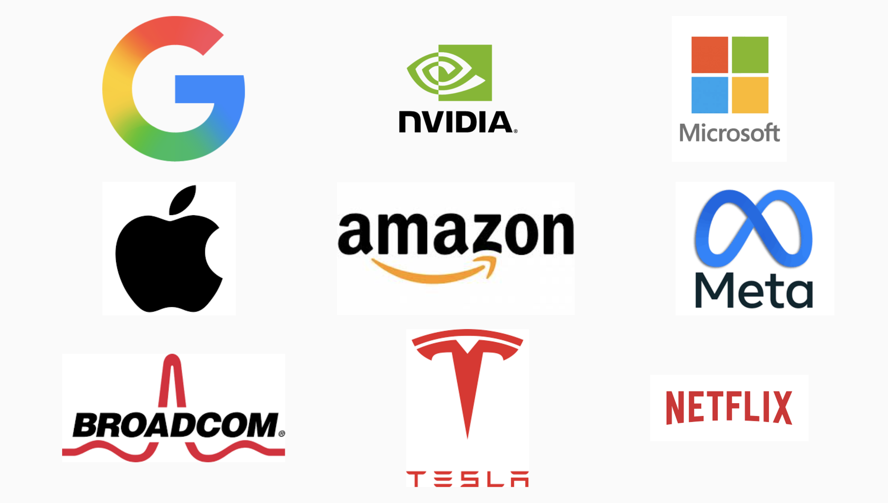
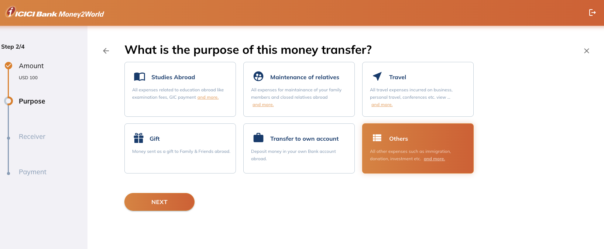
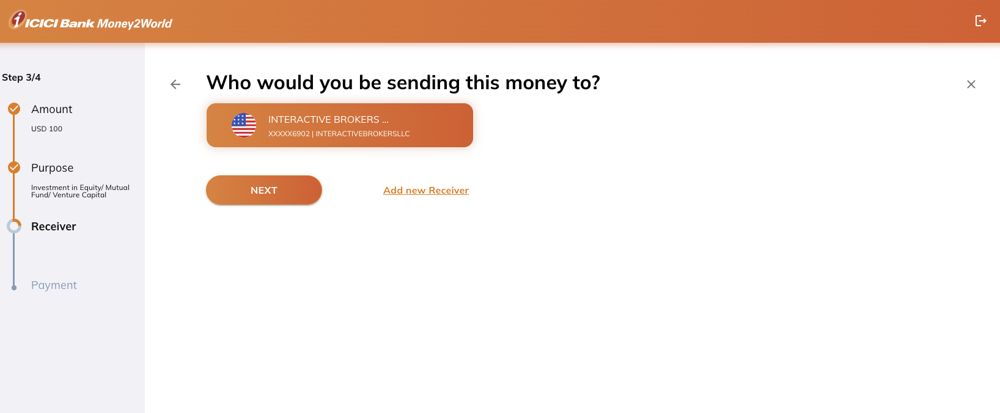
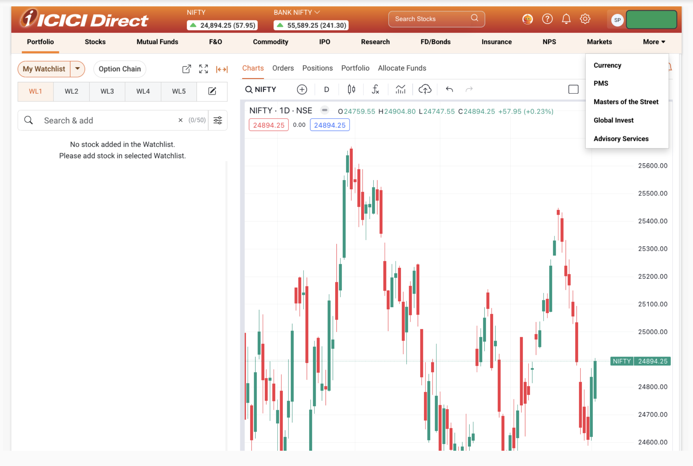
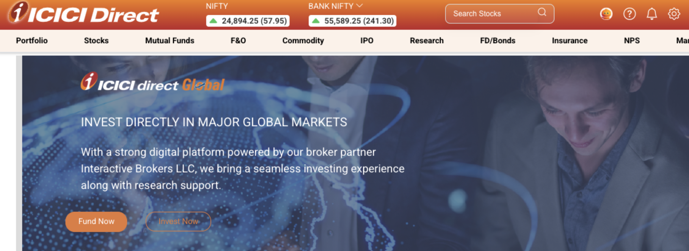
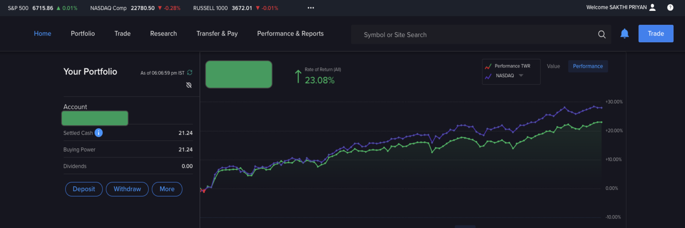
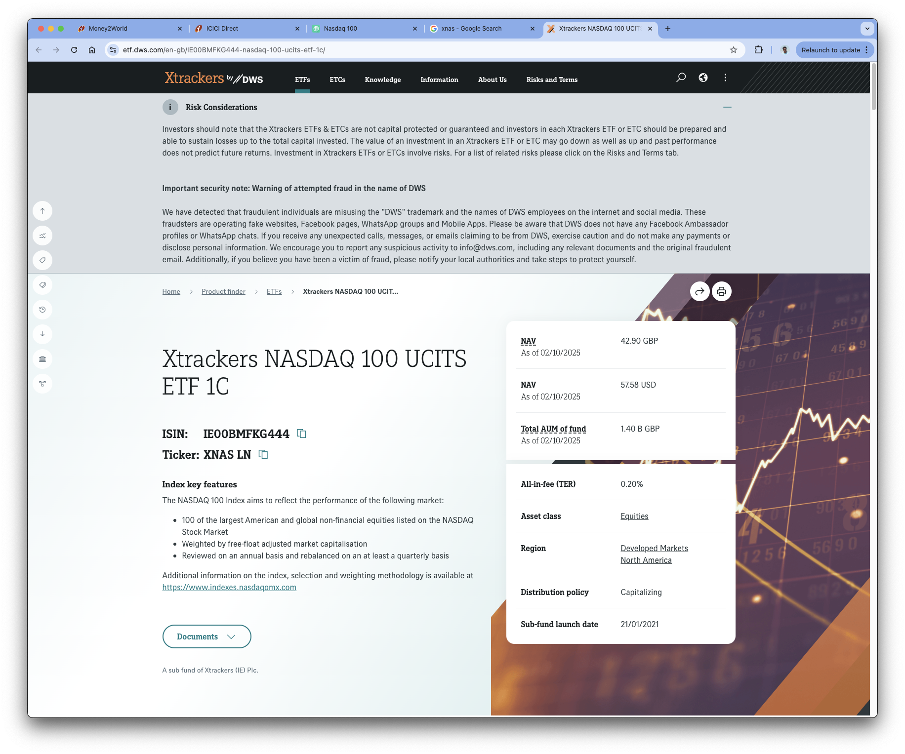

<section data-autoslide="2500">
  <h2>Sakthi Priyan H</h2>
  <h2>Building Wealth</h2>
  <h4 class="fragment">presenting</h4>
</section>
<section data-autoslide="2500">
  <h2>Invest in NASDAQ 100  from India</h2>
  <h4 class="fragment">Oct 12, 2025</h4>
</section>
---
### Disclaimer
<!-- .slide: data-autoslide="5000" -->
|                         |                                                             |
|-------------------------|-------------------------------------------------------------|
| Investment Risk         | Investments may go up or down; principal may be lost        |
| Past Performance        | Past results do not guarantee future outcomes               |
| Not Financial Advice    | For educational purposes only; consult a financial advisor  |
| Personal Responsibility | Viewers are responsible for their own decisions             |
| Regulatory Note         | Follow laws; international investments may have extra rules |

---

### Contents

- NASDAQ 100 Index
- How to buy from India?
- Buying NASDAQ 100 Index: My Choice
- Buying Cost
- Taxation

---

## What is NASDAQ 100 Index?

  
  
  72%

--

## Why NASDAQ 100 Index?
- Exposure to world-leading tech innovators
- Geographical and currency diversification of the portfolio
- Phenomenal growth engine over past decade
- 23% CAGR for NASDAQ (in INR) vs 11-12% for Nifty 50/Nifty Next 50
- Long term growth of these top companies in Cloud/AI era

--

## Risks of the NASDAQ 100 Index
- Heavy tech concentration & limited sector diversification
- Top-heavy with a few dominant companies  
- INR vs USD currency movements (historically around -4% yearly)
- Sensitive to global regulatory or backlash events impacting U.S. tech firms

---

## How to buy from India?

1. Mutual Funds
2. ETF listed in Indian stock exchanges
3. Managing via LRS route

--

### 1. Mutual Funds
- Kotak US Specific Equity Passive FOF (ETF)
- ICICI Prudential NASDAQ 100 Index Fund (Stocks)
  

#### Challenges
- Access Restricted : Mutual fund houses are not accepting new lump sum or SIP registrations.
- Investment Limits: Overall industry cap of $7B, with $1B per AMC and $1B for international ETFs.

--
### 2. ETF listed in Indian stock exchanges
- Motilal Oswal NASDAQ 100 ETF
  

#### Challenges
- Due to set limits ETF is not really tracking the index

--
### 3. Managing via LRS route
- Liberalised Remittance Scheme (LRS): Allows Indian residents to remit up to $250,000 per year abroad for permitted purposes, including investments, education, travel and gifts.
  

#### Challenges
- Manage buying Stocks/ETFs ourself
- Need to setup international brokering account
- \> ₹10,00,000 incurs TCS @ 20%

---

### Buying NASDAQ 100 Index: My Choice

#### Direct US Stocks/ETFs 
1. Easy NASDAQ access 
2. 30% US dividend tax and no accumulation
3. Higher India taxation overhead
  

#### My Choice – XNAS (LSE)
Xtrackers NASDAQ 100 UCITS ETF 1C → tracks NASDAQ 100
1. Irish-domiciled → 15% US dividend tax  
2. Accumulating ETF → no dividend payout → minimal tax reporting in India 
3. Traded in USD on LSE
4. Competitive TER (Total Expense Ratio) → better volume compared to alternate USD based ETFs

--

#### Why XNAS Listed in LSE?
- **India:** Via ICICI Direct Global / Interactive Brokers (IBKR)  
- **UK:** XNAS (USD) listed on London Stock Exchange (LSE)
- **Ireland:** Domicile reduces US dividend tax
- **Germany:** Managed by DWS Group (ETF manager)  
- **US:** NASDAQ 100 made up of top 100 non-financial US companies

--
<h4>Step 1/2: Transfer Money to IBKR</h4>

  <ul>
    <li>ICICI Bank > Fund Transfer > Money2World</li>
    <li>Converts ₹ (INR) to $ (USD) </li>
    <li>Typically T/T+1 day for amount to be credited</li>
  </ul>
  
  
  
  
  
  
  
  

--
<h4>Step 2/2: Place Buy Order on XNAS via IBKR</h4>

  <ul>
    <li>ICICI Direct > Global Invest > Invest Now</li>
    <li>Check previous day NAV vs market price </li>
    <li>Buy using current market price</li>
  </ul>
  
  
  
  
  
  
  

---

## Buying Cost Overhead
- **INR to USD conversion loss** (Bank spread ~1%, charges may vary)
- **ETF buying cost** (NAV ±2%, IBKR $4 per order)
- **ETF management cost** (TER: XNAS 0.2%, ANAU 0.14%, CSNDX 0.3%)

---

## Taxation
### TCS adjustment via form 12BAA
- Earlier: TCS adjusted only at ITR filing
- Form 12BAA: Companies can adjust TCS/TDS against salary TDS
  

### Tax Filing using ITR 2
- Disclose foreign assets & income as per Indian law
- Non-disclosure → penalties (Black Money Act 2015)
- Foreign Assets: Schedule FA
- Foreign Income: Schedule FSI
- More paperwork compared to mutual funds

---
<section data-autoslide="2500">
  <h2>Sakthi Priyan H</h2>
  <h2>Building Wealth</h2>
  <h4 class="fragment">Thank you !</h4>  
  Found this helpful? 💡  
  👍 Like & 💬 Share with friends! 
  📌 Subscribe for more videos. 

</section>
