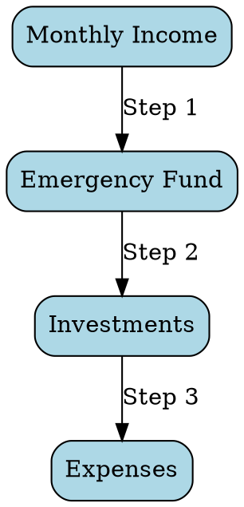
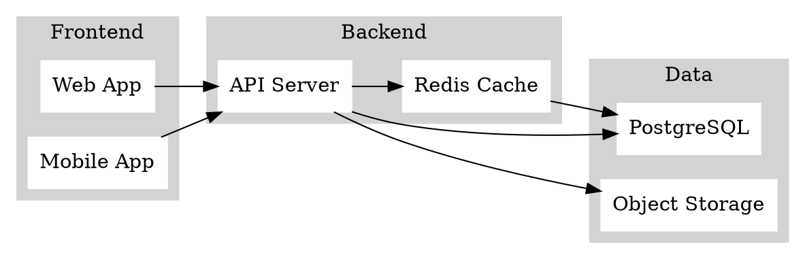

---

## JavaScript Tools Demo
### ECharts • GSAP • Viz.js
<p class="demo-subtitle" data-gsap='{"opacity": 0,"y": 300,"duration": 1}'>
    Interactive visualizations and animations in Reveal.js
</p>

---

### GSAP Animations

<div class="animation-demo">
    <p class="fade-in-text" data-gsap='{"from": {"opacity": 0}, "duration": 2}'>✨ Fade in</p>
    <p class="slide-in-text" data-gsap='{"from": {"x": -100, "opacity": 0}, "duration": 0.5, "delay": 0.5}'>➡️ Slide in</p>
    <p class="scale-in-text" data-gsap='{"from": {"scale": 0}, "duration": 0.5, "delay": 1}'>🎯 Scale in</p>
</div>

---

### ECharts - Bar Chart

<div id="bar-chart" class="echarts-container" data-chart='{
    "title": { "text": "Monthly Revenue", "left": "center" },
    "tooltip": { "trigger": "axis" },
    "xAxis": {
        "type": "category",
        "data": ["Jan", "Feb", "Mar", "Apr", "May", "Jun"]
    },
    "yAxis": { "type": "value" },
    "series": [{
        "name": "Revenue",
        "type": "bar",
        "data": [120, 200, 150, 80, 70, 110],
        "itemStyle": { "color": "#5470c6" }
    }],
    "animation": true,
    "animationDuration": 3000,
    "animationEasing": "elasticOut",
    "animationDelay": 0
}'></div>

---

### ECharts - Line Chart

<div id="line-chart" class="echarts-container" data-chart='{
    "title": { "text": "Portfolio Growth", "left": "center" },
    "tooltip": { "trigger": "axis" },
    "legend": { "data": ["Equity", "Debt", "Gold"], "bottom": 10 },
    "xAxis": {
        "type": "category",
        "data": ["2020", "2021", "2022", "2023", "2024", "2025"]
    },
    "yAxis": { "type": "value" },
    "series": [
        {
            "name": "Equity",
            "type": "line",
            "data": [100, 120, 110, 140, 160, 190],
            "smooth": true
        },
        {
            "name": "Debt",
            "type": "line",
            "data": [100, 105, 110, 116, 122, 128],
            "smooth": true
        },
        {
            "name": "Gold",
            "type": "line",
            "data": [100, 110, 105, 115, 120, 125],
            "smooth": true
        }
    ],
    "animationDuration": 2000,
    "animationEasing": "cubicOut"
}'></div>

---

### ECharts - Pie Chart

<div id="pie-chart" class="echarts-container" data-chart='{
    "title": { "text": "Asset Allocation", "left": "center" },
    "tooltip": { "trigger": "item" },
    "legend": { "orient": "vertical", "left": "left" },
    "series": [{
        "name": "Assets",
        "type": "pie",
        "radius": "50%",
        "data": [
            { "value": 40, "name": "Nasdaq 100" },
            { "value": 20, "name": "Nifty 50" },
            { "value": 10, "name": "Next 50" },
            { "value": 10, "name": "Midcap" },
            { "value": 10, "name": "Debt" },
            { "value": 10, "name": "Gold" }
        ],
        "emphasis": {
            "itemStyle": {
                "shadowBlur": 10,
                "shadowOffsetX": 0,
                "shadowColor": "rgba(0, 0, 0, 0.5)"
            }
        }
    }],
    "animationDuration": 2000,
    "animationEasing": "cubicOut"
}'></div>

---

### Viz.js - Flowchart



---

### Viz.js - System Architecture



---

### Combined: Animation + Chart

<h2 class="chart-title" data-gsap='{"from": {"opacity": 0, "y": -50}, "duration": 1}'>Investment Returns</h2>
<div id="animated-chart" class="echarts-container" data-chart='{
    "title": { "text": "Growth Over Time", "left": "center" },
    "tooltip": { "trigger": "axis" },
    "xAxis": {
        "type": "category",
        "data": ["Year 1", "Year 5", "Year 10", "Year 15", "Year 20"]
    },
    "yAxis": { "type": "value" },
    "series": [{
        "data": [100000, 180000, 320000, 580000, 1050000],
        "type": "line",
        "smooth": true,
        "areaStyle": {
            "color": "rgba(84, 112, 198, 0.3)"
        }
    }],
    "animationDuration": 2000
}'></div>

---

## Summary

✅ **GSAP** - Smooth animations  
✅ **ECharts** - Interactive charts  
✅ **Viz.js** - Diagram rendering  

All can be enabled via front matter:

```yaml
js_tools:
  - all
```

---

## Thank You! 🙏

<p class="final-message" data-gsap='{"from": {"scale": 0, "rotation": 360}, "duration": 1, "ease": "back.out(1.7)"}'>Start creating amazing presentations!</p>

