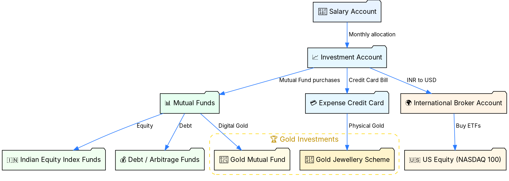
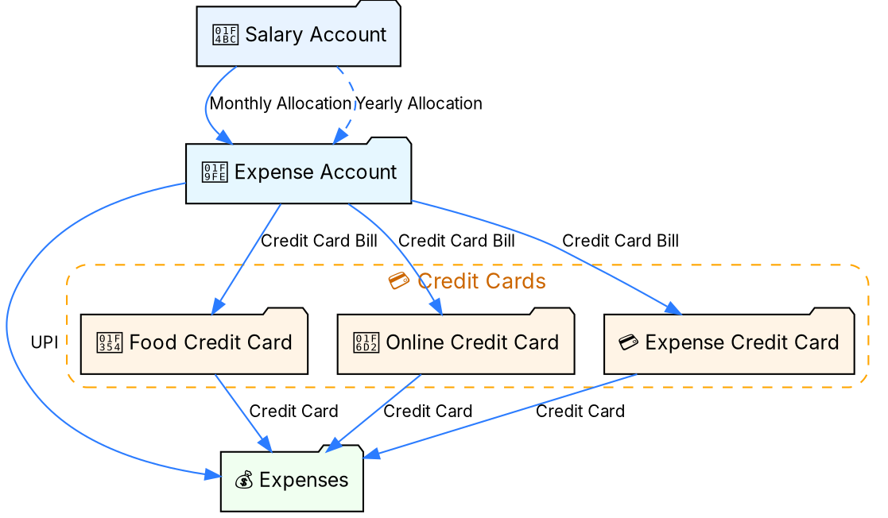
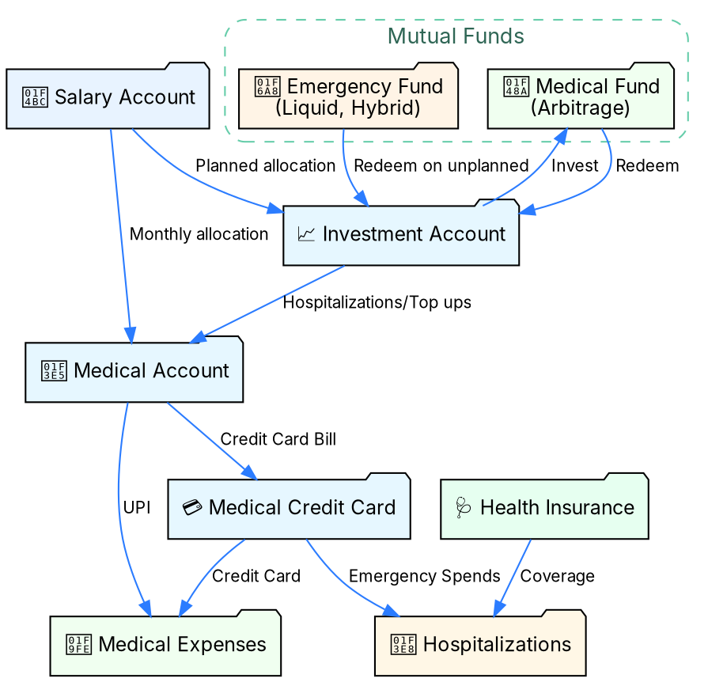
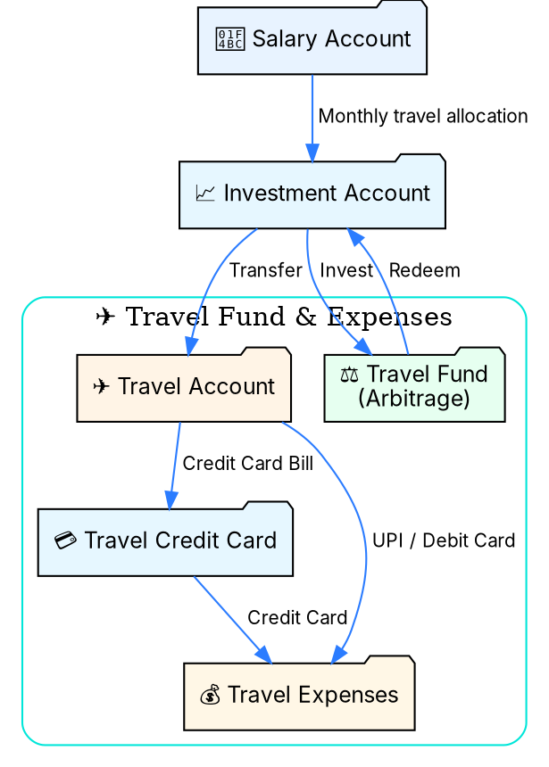

<section data-autoslide="2500">
  <h2>Sakthi Priyan H</h2>
  <h2>Building Wealth</h2>
  <h4 class="fragment">presenting</h4>
</section>
<section data-autoslide="2500">
  <h2>Managing Money Flows</h2> via <h3> Bank Accounts, Credit Cards  & Mutual Funds</h3>
  <h4 class="fragment">Oct 19, 2025</h4>
</section>

---

### Disclaimer
<!-- .slide: data-autoslide="5000" -->
|  | |
|---------------|----------------|
| **Personal Variation** | What works for me may not suit everyone. |
| **Educational Purpose** | For learning only, not financial advice. |
| **Investment Risk** | Values can rise or fall; capital may be lost. |
| **Regulatory Note** | Check local laws and tax rules before investing. |
| **Personal Responsibility** | Viewers are responsible for their own decisions             |

---

#### Contents

1. The Core Idea
2. Investments
3. Living Expenses
4. Medical Expenses
5. Travel Spends
6. Key Takeaways 

---

## 1. The Core Idea  

> Money separated by **purpose**, **budgeted** yearly & **allocated** monthly.  
> Each bank account or credit card serves a specific purpose.  

--

### My Bank Accounts  
| 🏦 **Account Type** | 💡 **Purpose** |
|----------------------|------------------------|
| 💰 **Income** | Where salary or income lands |
| 📈 **Investment** | For long-term wealth building  |
| 🧾 **Expense** | For all regular bills and daily expenses |
| 🏥 **Medical** | For health-related expenses |
| ✈️ **Travel** | For trips, vacations and experiences |
--

### My Credit Cards
| 💳 **Credit Card** | 💡 **Purpose** |
|--------------------|----------------------|
| 🧾 **Expense** | General Expenses and Jewellery |
| 🍔 **Food** | Food/Quick commerce |
| 🛒 **Online** | Exclusive for Online purchases |
| 🏥 **Medical** | Exclusive for Medical Expenses |
| 🌏 **Travel** | Domestic/International travel spends |

---

## 2. 📈 Investments
- Monthly flow from Salary Account to Investment Account
- Investment Account to Mutual Funds, International ETFs, Gold Jewellery Scheme
- Mutual Funds cover Equity, Debt and Gold funds
- Gold Scheme routed via Expense Credit Card for rewards

--
### Investment Flow

---
## 3. 🧾 Living Expenses
- Covers all expenses except Medical and Travel
- Using Expense Account and various Credit Cards
- Reserve allocated within Salary Account for yearly expenses
- Relatively less complex one without a Mutual Fund

--
### Expense Flow

---

## 4. 🏥 Medical Expenses
- Upfront allocate for monthly/planned medical expenses
- Keeping it separate to ensure immediate availability
- Using both Medical Account and Medical Credit Card
- Hospitalizations covered by insurance and   
  funded by Medical Fund/Emergency Fund

--
### Medical Flow

---

## 5. ✈️ Travel Spends
- Covers domestic/international trips
- Travel budgeted yearly & allocated monthly
- Expenses via bank account + credit card
- Backed by **Arbitrage Fund**

--

### Travel Flow

---

## 6. Key Takeaways  
- Segment money → reduce stress  
- Budget/Allocate → everything is planned
- Automate transfers → reduce friction  
- Use credit cards smartly → earn rewards  
- Short-term needs → back with liquid assets

---
<section data-autoslide="1000">
  <h2>Sakthi Priyan H</h2>
  <h2>Building Wealth</h2>
  <h4 class="fragment" data-fragment-index="1">Thank you! 🎉</h4>  
  Found this helpful? 💡  
  
    👍 Like & 💬 Share with friends & family! 
    📌 Subscribe for more videos.
   
</section>

