<span style="
 display:inline-block;
 background: linear-gradient(90deg, #fbbf24, #f59e0b);
 color: #fff;
 padding: 4px 30px;
 border-radius: 30px;
">
sakthipriyan.com/building-wealth
</span>

<h2 class="title-scramble">Managing Money Flows 2026</h2>
<br/>
<h3 class="subtitle-fade" data-gsap='{"from": {"opacity": 0, "y": 30}, "duration": 1, "delay": 2.5}'>Designing a Personal Finance System</h3>
<h4 class="subtitle-fade" data-gsap='{"from": {"opacity": 0, "y": 30}, "duration": 1, "delay": 4.5}'>using Bank Accounts, Credit Cards & Mutual Funds</h4>
<h4 class="subtitle-fade2" data-gsap='{"from": {"opacity": 0, "y": 30}, "duration": 1, "delay": 5}'>Apr 25, 2026</h4>
<br/><br/>
<br/>

---

### Disclaimer
<!-- .slide: data-autoslide="5000" -->
|  | |
|---------------|----------------|
| **Personal Variation** | What works for me may not suit everyone. |
| **Educational Purpose** | For learning only, not financial advice. |
| **Investment Risk** | Values can rise or fall; capital may be lost. |
| **Regulatory Note** | Check local laws and tax rules before investing. |
| **Personal Responsibility** | Viewers are responsible for their own decisions             |

---

## 1️⃣ The Core Idea  

> Money separated by **purpose**,  
> **budgeted** yearly & **allocated** monthly.  

*Each bank account serves a specific purpose.*
<br/>
<br/>
<br/>
<br/>
<br/>
--

### My Bank Accounts  
| 🏦 **Account Type** | 💡 **Purpose** |
|----------------------|------------------------|
| 💰 **Income** | Where salary or income lands |
| 📈 **Investment** | For long-term wealth building  |
| 📈 **Investment Intl.** | For international forex routing  |
| 🧾 **Expense** | For all regular bills and daily expenses |
| 🏥 **Medical** | For health-related expenses |
| ✈️ **Travel** | For trips, vacations and experiences |
--

### My Credit Cards
| 💳 **Credit Card** | 💡 **Purpose** |
|--------------------|----------------------|
| 🧾 **Primary** | All Expenses, Travel and Gold schemes |
| 🏥 **Medical (Addon)** | Exclusive for Medical Expenses |
| 🛒 **Back up** | Bank redundancy in case Primary fails |

--

### Overview

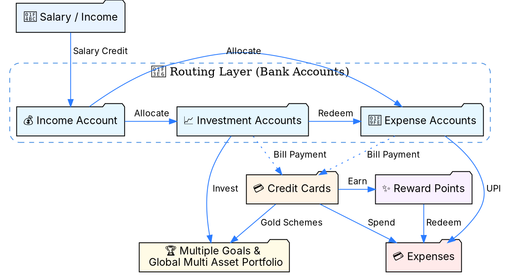

---
<!-- .slide: data-transition="fade" -->
## 2️⃣ Investments 📈


--
<!-- .slide: data-transition="fade" -->
## 2️⃣ Investments 📈
```dot
digraph InvestmentFlow {
  rankdir=TB; // top-to-bottom
  bgcolor=transparent;
  splines=true;
  overlap=false;

  node [shape=rectangle, style="rounded,filled", fontname="Inter", fontsize=12, fillcolor="#f7fbff"];
  edge [arrowsize=0.9, fontname="Inter", fontsize=10, color="#2b7cff"];

  // --- Bank Accounts Cluster ---
  subgraph cluster_banks {
    label="🏦 Bank Accounts";
    style="rounded,dashed";
    color="#4a90e2";
    fontcolor="#1a4b99";
    fontsize=13;
    fontname="Inter";
    margin=12;
    invis=true;
    Salary [label="💼 Salary Account", shape=folder, fillcolor="#e8f3ff"];
    Investment [label="📈 Investment Account", shape=folder, fillcolor="#e6f7ff"];
    IntlAccount [label="🏦 Investment Intl. Account", shape=folder, fillcolor="#e6f7ff", style="invis"];

    { rank=same; Salary; Investment; IntlAccount; }
  }

  // --- Mutual Funds and Categories ---
  MutualFunds [label="📊 Mutual Funds / ETFs", shape=folder, fillcolor="#e6fff0"];
  INEquity [label="🇮🇳 Indian Equity Index Funds", shape=folder, fillcolor="#f0fff0"];
  DebtMF [label="💰 Debt / Arbitrage Funds", shape=folder, fillcolor="#f0fff0"];

  // --- International Investments ---
  IntlBroker [label="🌍 International Broker Account", shape=folder, fillcolor="#fff4e6", style="invis"];
  USEquity [label="🇺🇸 US Equity (NASDAQ 100)", shape=folder, fillcolor="#fff7e6", style="invis"];

  // --- Credit Cards & Rewards Cluster ---
  subgraph cluster_credit_cards {
    label="💳 Credit Cards & Rewards";
    style="rounded,dashed";
    color="#ffa500";
    fontcolor="#cc6600";
    fontsize=13;
    fontname="Inter";
    style="invis";

    CreditCard [label="🧾 Primary Credit Card", shape=folder, fillcolor="#fff4e6", style="invis"];
    RewardPoints [label="✨ Reward Points", shape=folder, fillcolor="#f9f0ff", style="invis"];
  }

  // --- Gold Cluster ---
  subgraph cluster_gold {
    label="🏆 Gold Investments";
    style="rounded,dashed";
    color="#ffd700";
    fontcolor="#c09000";
    fontsize=13;
    fontname="Inter";

    GoldMF [label="🏅 Gold Mutual Fund / ETFs", shape=folder, fillcolor="#fffbe6"];
    GoldScheme [label="👑 Gold Jewellery Scheme", shape=folder, fillcolor="#fff4cc", style="invis"];
  }

  // --- Flows ---
  
  Salary -> Investment [label=" Monthly allocation"];
  Investment -> IntlAccount [label=" Fund allocation", style="invis"];
  Investment -> MutualFunds [label=" Mutual Fund purchases"];
  MutualFunds -> INEquity [label="Equity"];
  MutualFunds -> DebtMF [label="Debt"];
  MutualFunds -> GoldMF [label=" Digital Gold"];
  edge [style="invis"];
  // --- Updated International Flow ---
  IntlAccount -> IntlBroker [label=" INR to USD"];
  IntlBroker -> USEquity [label=" Buy ETFs"];

  // --- Credit Card & Rewards Flow ---
  Investment -> CreditCard [label=" Bharat Connect (Bill Pay)", style="dotted,invis"];
  CreditCard -> GoldScheme [label=" Physical Gold"];
  CreditCard -> RewardPoints [label=" Earn"];
}
```

--
<!-- .slide: data-transition="fade" -->
## 2️⃣ Investments 📈
```dot
digraph InvestmentFlow {
  rankdir=TB; // top-to-bottom
  bgcolor=transparent;
  splines=true;
  overlap=false;

  node [shape=rectangle, style="rounded,filled", fontname="Inter", fontsize=12, fillcolor="#f7fbff"];
  edge [arrowsize=0.9, fontname="Inter", fontsize=10, color="#2b7cff"];

  // --- Bank Accounts Cluster ---
  subgraph cluster_banks {
    label="🏦 Bank Accounts";
    style="rounded,dashed";
    color="#4a90e2";
    fontcolor="#1a4b99";
    fontsize=13;
    fontname="Inter";
    margin=12;
    invis=true;
    Salary [label="💼 Salary Account", shape=folder, fillcolor="#e8f3ff"];
    Investment [label="📈 Investment Account", shape=folder, fillcolor="#e6f7ff"];
    IntlAccount [label="🏦 Investment Intl. Account", shape=folder, fillcolor="#e6f7ff", style="invis"];

    { rank=same; Salary; Investment; IntlAccount; }
  }

  // --- Mutual Funds and Categories ---
  MutualFunds [label="📊 Mutual Funds / ETFs", shape=folder, fillcolor="#e6fff0"];
  INEquity [label="🇮🇳 Indian Equity Index Funds", shape=folder, fillcolor="#f0fff0"];
  DebtMF [label="💰 Debt / Arbitrage Funds", shape=folder, fillcolor="#f0fff0"];

  // --- International Investments ---
  IntlBroker [label="🌍 International Broker Account", shape=folder, fillcolor="#fff4e6", style="invis"];
  USEquity [label="🇺🇸 US Equity (NASDAQ 100)", shape=folder, fillcolor="#fff7e6", style="invis"];

  // --- Credit Cards & Rewards Cluster ---
  subgraph cluster_credit_cards {
    label="💳 Credit Cards & Rewards";
    style="rounded,dashed";
    color="#ffa500";
    fontcolor="#cc6600";
    fontsize=13;
    fontname="Inter";

    CreditCard [label="🧾 Primary Credit Card", shape=folder, fillcolor="#fff4e6"];
    RewardPoints [label="✨ Reward Points", shape=folder, fillcolor="#f9f0ff"];
  }

  // --- Gold Cluster ---
  subgraph cluster_gold {
    label="🏆 Gold Investments";
    style="rounded,dashed";
    color="#ffd700";
    fontcolor="#c09000";
    fontsize=13;
    fontname="Inter";

    GoldMF [label="🏅 Gold Mutual Fund / ETFs", shape=folder, fillcolor="#fffbe6"];
    GoldScheme [label="👑 Gold Jewellery Scheme", shape=folder, fillcolor="#fff4cc"];
  }

  // --- Flows ---
  
  Salary -> Investment [label=" Monthly allocation"];
  Investment -> IntlAccount [label=" Fund allocation", style="invis"];
  Investment -> MutualFunds [label=" Mutual Fund purchases"];
  MutualFunds -> INEquity [label="Equity"];
  MutualFunds -> DebtMF [label="Debt"];
  MutualFunds -> GoldMF [label=" Digital Gold"];

  // --- Updated International Flow ---
  IntlAccount -> IntlBroker [label=" INR to USD", style="invis"];
  IntlBroker -> USEquity [label=" Buy ETFs", style="invis"];

  // --- Credit Card & Rewards Flow ---
  Investment -> CreditCard [label=" Bharat Connect (Bill Pay)", style="dotted"];
  CreditCard -> GoldScheme [label=" Physical Gold"];
  CreditCard -> RewardPoints [label=" Earn"];
}
```

--
<!-- .slide: data-transition="fade" -->
## 2️⃣ Investments 📈

```dot
digraph InvestmentFlow {
  rankdir=TB; // top-to-bottom
  bgcolor=transparent;
  splines=true;
  overlap=false;

  node [shape=rectangle, style="rounded,filled", fontname="Inter", fontsize=12, fillcolor="#f7fbff"];
  edge [arrowsize=0.9, fontname="Inter", fontsize=10, color="#2b7cff"];

  // --- Bank Accounts Cluster ---
  subgraph cluster_banks {
    label="🏦 Bank Accounts";
    style="rounded,dashed";
    color="#4a90e2";
    fontcolor="#1a4b99";
    fontsize=13;
    fontname="Inter";
    margin=12;
    invis=true;
    Salary [label="💼 Salary Account", shape=folder, fillcolor="#e8f3ff"];
    Investment [label="📈 Investment Account", shape=folder, fillcolor="#e6f7ff"];
    IntlAccount [label="🏦 Investment Intl. Account", shape=folder, fillcolor="#e6f7ff"];

    { rank=same; Salary; Investment; IntlAccount; }
  }

  // --- Mutual Funds and Categories ---
  MutualFunds [label="📊 Mutual Funds / ETFs", shape=folder, fillcolor="#e6fff0"];
  INEquity [label="🇮🇳 Indian Equity Index Funds", shape=folder, fillcolor="#f0fff0"];
  DebtMF [label="💰 Debt / Arbitrage Funds", shape=folder, fillcolor="#f0fff0"];

  // --- International Investments ---
  IntlBroker [label="🌍 International Broker Account", shape=folder, fillcolor="#fff4e6"];
  USEquity [label="🇺🇸 US Equity (NASDAQ 100)", shape=folder, fillcolor="#fff7e6"];

  // --- Credit Cards & Rewards Cluster ---
  subgraph cluster_credit_cards {
    label="💳 Credit Cards & Rewards";
    style="rounded,dashed";
    color="#ffa500";
    fontcolor="#cc6600";
    fontsize=13;
    fontname="Inter";

    CreditCard [label="🧾 Primary Credit Card", shape=folder, fillcolor="#fff4e6"];
    RewardPoints [label="✨ Reward Points", shape=folder, fillcolor="#f9f0ff"];
  }

  // --- Gold Cluster ---
  subgraph cluster_gold {
    label="🏆 Gold Investments";
    style="rounded,dashed";
    color="#ffd700";
    fontcolor="#c09000";
    fontsize=13;
    fontname="Inter";

    GoldMF [label="🏅 Gold Mutual Fund / ETFs", shape=folder, fillcolor="#fffbe6"];
    GoldScheme [label="👑 Gold Jewellery Scheme", shape=folder, fillcolor="#fff4cc"];
  }

  // --- Flows ---
  Salary -> Investment [label=" Monthly allocation"];
  Investment -> MutualFunds [label=" Mutual Fund purchases"];
  MutualFunds -> INEquity [label="Equity"];
  MutualFunds -> DebtMF [label="Debt"];
  MutualFunds -> GoldMF [label=" Digital Gold"];

  // --- Updated International Flow ---
  Investment -> IntlAccount [label=" Fund allocation"];
  IntlAccount -> IntlBroker [label=" INR to USD"];
  IntlBroker -> USEquity [label=" Buy ETFs"];

  // --- Credit Card & Rewards Flow ---
  Investment -> CreditCard [label=" Bharat Connect (Bill Pay)", style="dotted"];
  CreditCard -> GoldScheme [label=" Physical Gold"];
  CreditCard -> RewardPoints [label=" Earn"];
}
```

---
<!-- .slide: data-transition="fade" -->
## 3️⃣ Living Expenses 🧾

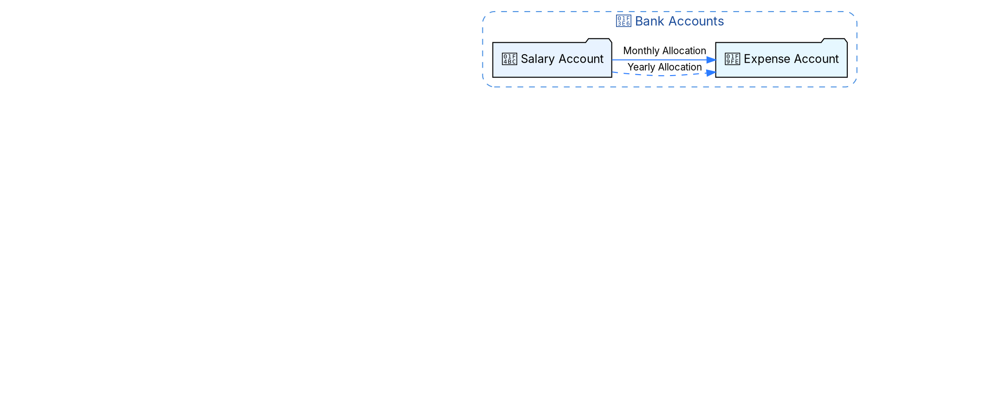

--
<!-- .slide: data-transition="fade" -->
## 3️⃣ Living Expenses 🧾

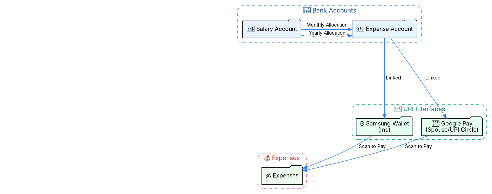

--
<!-- .slide: data-transition="fade" -->
## 3️⃣ Living Expenses 🧾

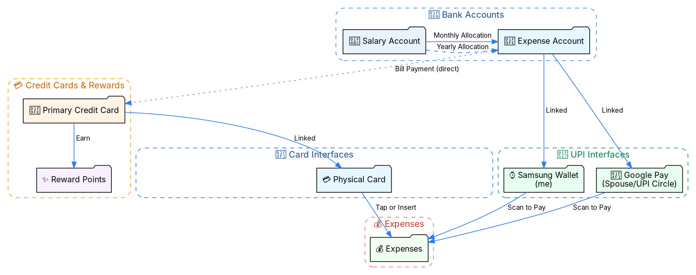

--
<!-- .slide: data-transition="fade" -->
## 3️⃣ Living Expenses 🧾

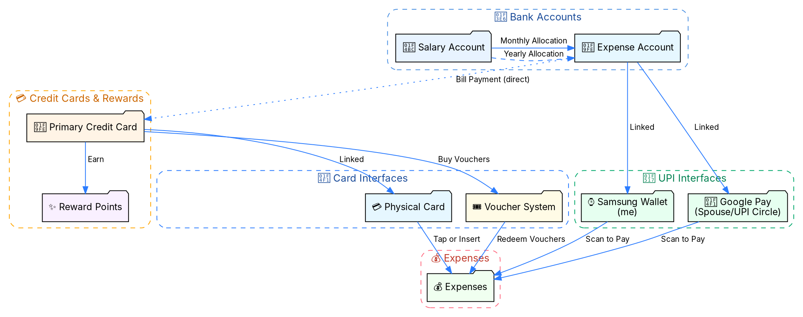

--
<!-- .slide: data-transition="fade" -->
## 3️⃣ Living Expenses 🧾

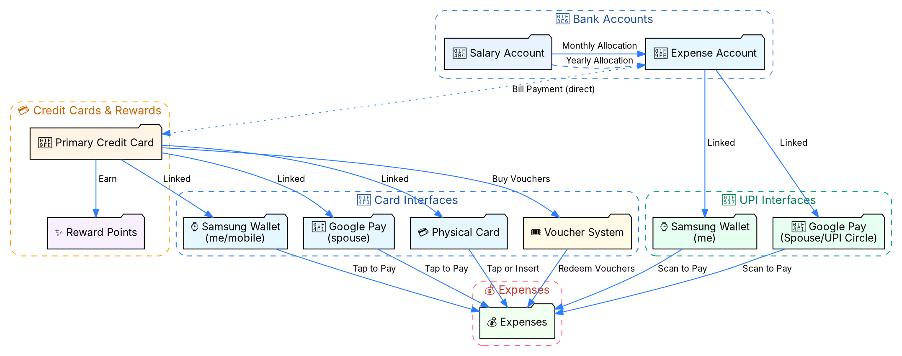

---
<!-- .slide: data-transition="fade" -->
## 4️⃣ Medical Expenses 🏥
```dot
digraph MedicalFlow {
  compound=true; 
  rankdir=TB; 
  bgcolor=transparent;
  splines=true;
  overlap=false;

  node [shape=rectangle, style="rounded,filled", fontname="Inter", fontsize=12, fillcolor="#f7fbff"];
  edge [arrowsize=0.9, fontname="Inter", fontsize=10, color="#2b7cff"];

  // --- Bank Accounts Cluster ---
  subgraph cluster_banks {
    label="🏦 Bank Accounts";
    style="rounded,dashed";
    color="#4a90e2";
    fontcolor="#1a4b99";
    fontsize=13;
    fontname="Inter";
    margin=10;

    Salary [label="💼 Salary Account", shape=folder, fillcolor="#e8f3ff"];
    Investment [label="📈 Investment Account", shape=folder, fillcolor="#e6f7ff", style="invis"];
    Medical [label="🏥 Medical Account", shape=folder, fillcolor="#e6f7ff"];
    
    { rank=same; Salary; Investment; Medical; }
  }

  // --- Medical Mutual Funds Cluster ---
  subgraph cluster_medical_funds {
    label="Mutual Funds";
    style="rounded,dashed,invis";
    color="#66cdaa";
    fontcolor="#2f6655";
    fontsize=13;
    fontname="Inter";

    MedFund [label="💊 Medical Fund\n(Arbitrage)", shape=folder, fillcolor="#f0fff0", style="invis"];
    Emergency [label="🚨 Emergency Fund\n(Liquid, Hybrids)", shape=folder, fillcolor="#fff4e6", style="invis"];
    
    { rank=same; MedFund; Emergency; }
  }

  // --- Credit Cards & Rewards Cluster ---
  subgraph cluster_credit_cards {
    label="💳 Credit Cards & Rewards";
    style="rounded,dashed,invis";
    color="#ffa500";
    fontcolor="#cc6600";
    fontsize=13;
    fontname="Inter";
    
    MedCard [label="💳 Medical Credit Card", shape=folder, fillcolor="#fff4e6", style="invis"];
    RewardPoints [label="✨ Reward Points", shape=folder, fillcolor="#f9f0ff", style="invis"];
  }

  // --- Health Insurance Cluster ---
  subgraph cluster_insurance {
    label="🩺 Health Insurance";
    style="rounded,dashed,invis";
    color="#20b2aa";
    fontcolor="#105955";
    fontsize=13;
    fontname="Inter";

    PersonalIns [label="🛡️ Personal Policy", shape=folder, fillcolor="#e6fff0", style="invis"];
    SpouseIns [label="🏢 Spouse Employer", shape=folder, fillcolor="#e6fff0", style="invis"];
    EmpIns [label="🏢 My Employer", shape=folder, fillcolor="#e6fff0", style="invis"];
    
    { rank=same; EmpIns; SpouseIns; PersonalIns; }
  }

  // --- Expenses & Destinations Cluster ---
  subgraph cluster_expenses {
    label="💰 Expenses";
    style="rounded,dashed,invis";
    color="#ff6b81";
    fontcolor="#c0392b";
    fontsize=13;
    fontname="Inter";

    MedExpenses [label="🧾 Medical Expenses", shape=folder, fillcolor="#f0fff0", style="invis"];
    Hospital [label="🏨 Hospitalizations", shape=folder, fillcolor="#fff7e6", style="invis"];
    
    { rank=same; MedExpenses; Hospital; }
  }

  // --- Flows (Investments) ---
  Salary -> Medical [label=" Monthly allocation"];
  edge [style="invis"];
  Salary -> Investment [label=" Planned allocation"];
  Investment -> MedFund [label=" Invest"];
  MedFund -> Investment [label=" Redeem"];
  Emergency -> Investment [label=" Redeem on unplanned"];
  Investment -> Medical [label=" Hospitalizations/Top ups"];

  // --- Credit Card Bill Payment Flow ---
  Medical -> MedCard [label=" Bill Payment (direct)", style="invis"];

  // --- Spending Flows ---
  Medical -> MedExpenses [label=" UPI Scan to Pay"];
  MedCard -> MedExpenses [label=" Card Spend"];
  MedCard -> Hospital [label=" Emergency Spends"];

  // --- Insurance Flow ---
  SpouseIns -> Hospital [label=" Coverage", ltail=cluster_insurance];

  // --- Rewards Flow ---
  MedCard -> RewardPoints [label=" Earn"];
}
```

--
<!-- .slide: data-transition="fade" -->
## 4️⃣ Medical Expenses 🏥
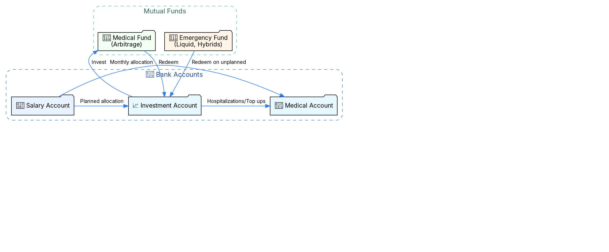


--
<!-- .slide: data-transition="fade" -->
## 4️⃣ Medical Expenses 🏥
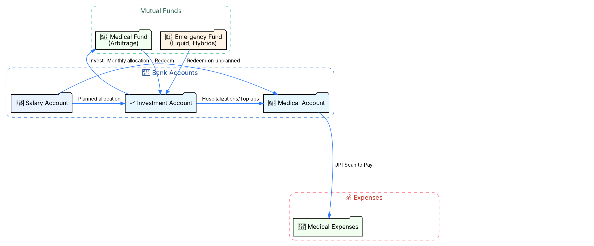

--
<!-- .slide: data-transition="fade" -->
## 4️⃣ Medical Expenses 🏥
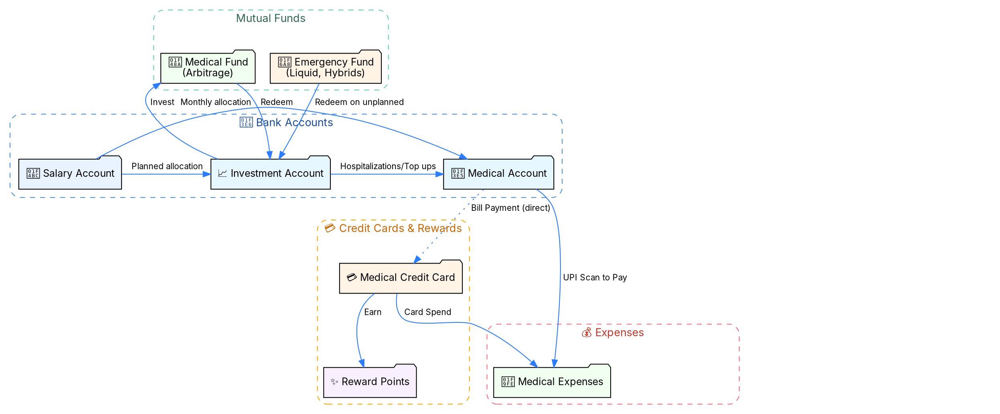

--
<!-- .slide: data-transition="fade" -->
## 4️⃣ Medical Expenses 🏥
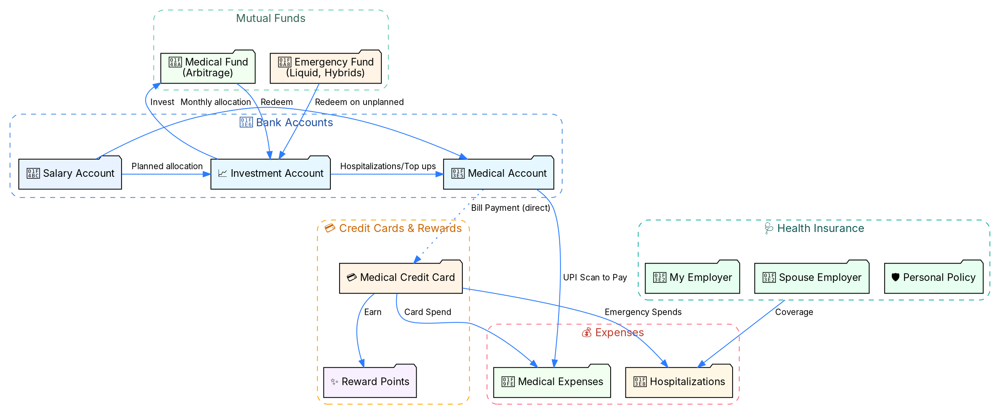

---
<!-- .slide: data-transition="fade" -->
## 5️⃣ Travel Spends ✈️
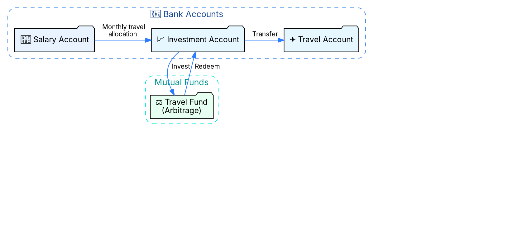

--
<!-- .slide: data-transition="fade" -->
## 5️⃣ Travel Spends ✈️
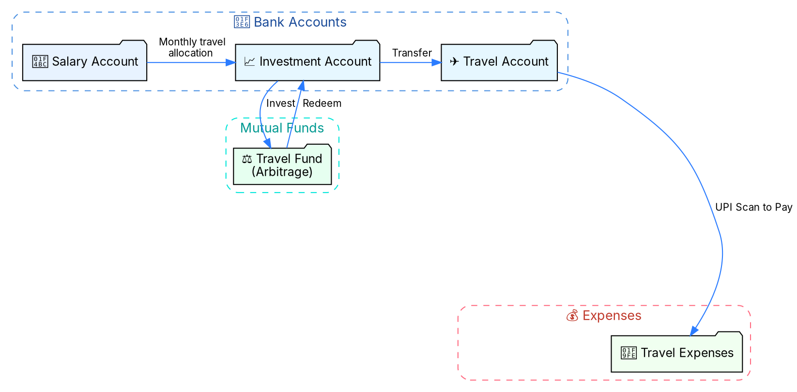

--
<!-- .slide: data-transition="fade" -->
## 5️⃣ Travel Spends ✈️
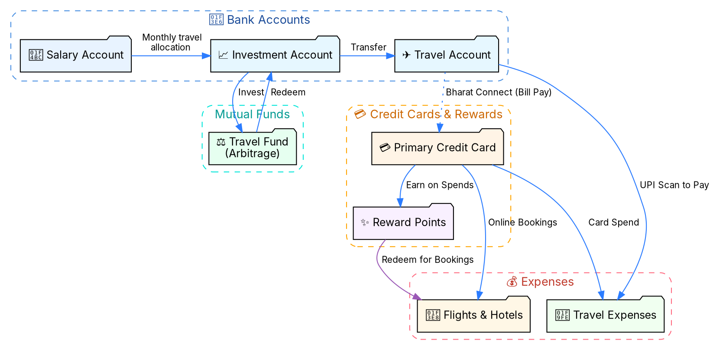
---

## 6️⃣ Bill Payment Overhead
- Earlier I used to have multiple credit cards each assigned to its own purpose
- Now, consolidated all them into a 1 Primary Credit Card
- Overhead is in marking each entry for a specific purpose
- Pay parts of credit card bill from the corresponding bank account

---

## 7️⃣ Summary
1. **Segment money by purpose** → clarity & reduced financial stress
2. **Budget yearly, allocate monthly** → spending is always planned
3. **Automate transfers** → less friction, fewer missed allocations
4. **Credit cards as tools** → earn rewards on every rupee spent
5. **Match liquidity to time horizon** → short-term needs backed by liquid assets

---

<span style="
 display:inline-block;
 background: linear-gradient(90deg, #fbbf24, #f59e0b);
 color: #fff;
 padding: 4px 30px;
 border-radius: 30px;
">
sakthipriyan.com/building-wealth
</span>

<div style="margin-top: 30px;">
<h3 data-gsap='{"from": {"opacity": 0, "y": -50, "scale": 1.5}, "duration": 0.8, "delay": 1.2}'>
<strong>Found this useful? 🙂</strong>
</h3>
</div>

<div style="font-size: 1.4em; margin: 35px 0;">
<p data-gsap='{"from": {"opacity": 0, "x": -100, "rotation": -45}, "duration": 0.6, "delay": 2, "ease": "elastic.out(1, 0.5)"}'>
👍 Like
</p>
<p data-gsap='{"from": {"opacity": 0, "x": 100, "rotation": 45}, "duration": 0.6, "delay": 2.4, "ease": "elastic.out(1, 0.5)"}'>
💬 Comment
</p>
<p data-gsap='{"from": {"opacity": 0, "scale": 0}, "duration": 0.6, "delay": 2.8, "ease": "back.out(2)"}'>
🔄 Share
</p>
<p data-gsap='{"from": {"opacity": 0, "y": 100}, "duration": 0.6, "delay": 3.2, "ease": "bounce.out"}'>
📌 Subscribe
</p>
<p style="font-size: 0.9em; opacity: 0.8;" data-gsap='{"from": {"opacity": 0}, "duration": 0.5, "delay": 3.8}'>
for more...
</p>
</div>

<h3 data-gsap='{"from": {"opacity": 0, "scale": 3, "rotation": 360}, "duration": 1.5, "delay": 4.5, "ease": "elastic.out(1, 0.3)"}'>
<strong>✨ Thank You 🙏</strong>
</h3>
