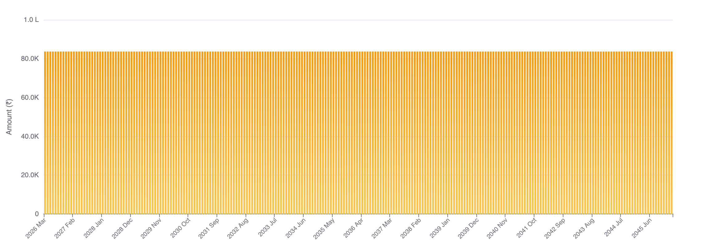
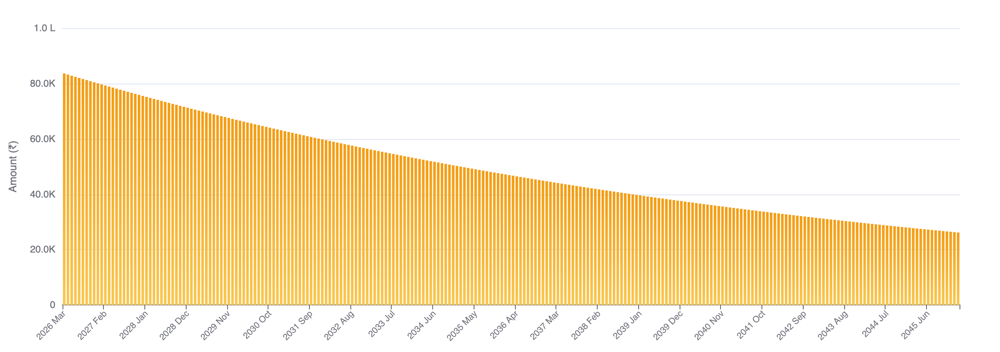
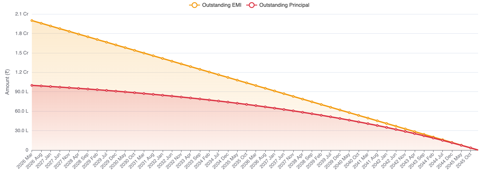
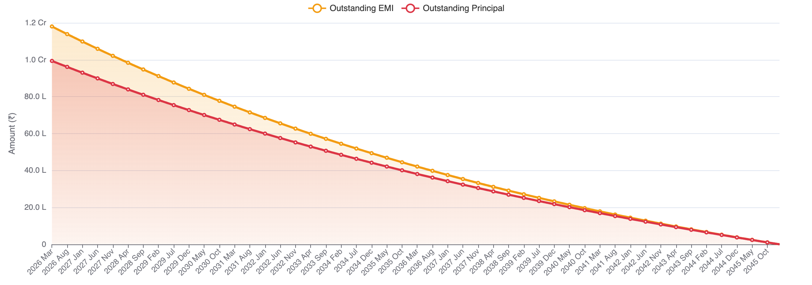

sakthipriyan.com/building-wealth

<h2 class="title-scramble">₹1 Crore Home Loan</h2>
 
<h4 class="subtitle-fade" data-gsap='{"from": {"opacity": 0, "y": 30}, "duration": 1, "delay": 2.5}'>The Reality Behind the Numbers</h4>
<h4 class="subtitle-fade2" data-gsap='{"from": {"opacity": 0, "y": 30}, "duration": 1, "delay": 3}'>Mar 04, 2026</h4>
  
 
--

### Disclaimer
|                    |                                                             |
|--------------------|-------------------------------------------------------------|
| **Personal Fit**   | Based on my experience & comfort                     |
| **Purpose**        | Educational — not financial advice                    |
| **Risk**           | Borrowing involves interest & repayment obligations                     |
| **Rules**          | Verify tax/regulatory details                        |
| **Responsibility** | Make decisions aligned with your goals                     |

---

### 1️⃣ The Setup 🏠

<table>
<tr class="fragment fade-up"><td><strong>Loan Amount</strong></td><td>₹1 Crore</td></tr>
<tr class="fragment fade-up"><td><strong>Interest Rate</strong></td><td>8% per annum</td></tr>
<tr class="fragment fade-up"><td><strong>Inflation Rate</strong></td><td>6% per annum</td></tr>
<tr class="fragment fade-up"><td><strong>Tenures</strong></td><td>20 Years</td></tr>
<tr class="fragment fade-up"><td><strong>Monthly EMI</strong></td><td>₹83,644</td></tr>
<tr class="fragment fade-up"><td><strong>Nominal Interest Paid</strong></td><td>₹1.01 Cr (101%)</td></tr>
</table>

On a 20-year loan — you pay back <strong>₹2.01 Cr</strong> for a ₹1 Cr loan. Scary? 😱

<strong>That's the nominal story. Not the full story.</strong>

---

### 2️⃣ Inflation Works For You 📉

<strong>Inflation. 6% per year.</strong>

₹83,644 in 2026 &nbsp;≠&nbsp; ₹83,644 in 2036 &nbsp;≠&nbsp; ₹83,644 in 2046.

Nominal EMI stays fixed. Real burden shrinks every year.

📊 Monthly EMI — Nominal (₹83,644 fixed amount)

📉 Monthly EMI — Real (₹83,644 -> ₹26,206)

🏦 Outstanding Loan — Nominal (slow decline)

🏦 Outstanding Loan — Real (relatively drops fast)

---

### 3️⃣ The Full Picture 📊

<table>
<tr class="fragment fade-up"><th>Tenure</th><th style="color: #ef4444;">10 Years</th><th style="color: #f59e0b;">15 Years</th><th style="color: #10b981;">20 Years</th></tr>
<tr class="fragment fade-up"><td><strong>Monthly EMI</strong></td><td>₹1,21,328</td><td>₹95,565</td><td>₹83,644</td></tr>
<tr class="fragment fade-up"><td><strong>Nominal Interest</strong></td><td style="color: #ef4444;">₹45.59 L</td><td style="color: #ef4444;">₹72.02 L</td><td style="color: #ef4444;">₹1.01 Cr</td></tr>
<tr class="fragment fade-up"><td><strong>Nominal Total</strong></td><td>₹1.46 Cr</td><td>₹1.72 Cr</td><td>₹2.01 Cr</td></tr>
<tr class="fragment fade-up"><td><strong>Real Interest</strong></td><td style="color: #10b981;"><strong>₹10.61 L</strong></td><td style="color: #10b981;"><strong>₹14.97 L</strong></td><td style="color: #10b981;"><strong>₹18.84 L</strong></td></tr>
<tr class="fragment fade-up"><td><strong>Real Total</strong></td><td>₹1.11 Cr</td><td>₹1.15 Cr</td><td>₹1.19 Cr</td></tr>
</table>

The "scary" ₹1.01 Cr interest on 20 years?

<strong>In real terms — only ~19% of the loan.</strong>

Real total gap between 10 and 20 years: just <strong>₹8.2L</strong>.

---

### 4️⃣ Key Insight 🧠

<ul style="list-style: none">
<li class="fragment fade-up">📈 10yr vs 20yr EMI diff: <strong>₹38K/month</strong> — invest it at 12% (real, inflation-adjusted):
  <ul style="list-style: none; margin-top: 6px; font-size: 0.9em; color: #6b7280;">
    <li style="color: #f59e0b;">⏱️ <strong>First 10 years</strong> — invest the ₹38K/month diff while repaying 20yr loan</li>
    <li style="padding-left: 1.2em;">→ <a href="https://sakthipriyan.com/building-wealth/tools/realvalue-sip-engine/#v1otd10yf202603c0lm34kg12h0i6t0" target="_blank">Flat SIP × 10 yrs</a> → <strong style="color: #f59e0b;">₹42.53L</strong></li>
    <li style="color: #10b981; margin-top: 6px;">⏱️ <strong>Next 10 years</strong> — corpus grows (no new SIP, just compounding)</li>
    <li style="padding-left: 1.2em;">→ <a href="https://sakthipriyan.com/building-wealth/tools/realvalue-sip-engine/#v1otd10yf202603c4253.416km0kg12h0i6t0" target="_blank">Corpus × 10 yrs @ 12%</a> → <strong style="color: #10b981;">₹73.77L</strong></li>
    <li style="margin-top: 6px; color: #ef4444;">↳ vs real interest gap (10yr vs 20yr): just <strong>₹8.2L</strong></li>
  </ul>
</li>
</ul>

The wrong question: "How much total interest will I pay?"

<strong>The right question: "What EMI fits my cashflow — and can I invest the rest?"</strong>

><!-- .element: class="fragment fade-up" --> 💡 <b>Choose tenure by cashflow, not nominal interest fear</b>

---

### 5️⃣ RealValue EMI Engine 🛠️

 Explore Scenarios:
🔗 <a href="/building-wealth/tools/realvalue-emi-engine/#v1oed10yl1ce0tr8i6s202603" target="_blank">10 Years</a> &nbsp;|&nbsp;
<a href="/building-wealth/tools/realvalue-emi-engine/#v1oed15yl1ce0tr8i6s202603" target="_blank">15 Years</a> &nbsp;|&nbsp;
<a href="/building-wealth/tools/realvalue-emi-engine/#v1oed20yl1ce0tr8i6s202603" target="_blank">20 Years</a>

<iframe src="/building-wealth/tools/realvalue-emi-engine/#v1oed20yl1ce0tr8i6s202603"
        style="width: 100%; height: 900px; border: 2px solid #e5e7eb; border-radius: 10px; box-shadow: 0 4px 6px rgba(36, 31, 31, 0.1);">
</iframe>

---

### 6️⃣ Summary 📝

🏠 ₹1 Cr @ 8% — 10, 15, 20 year tenures

😱 Nominal interest: ₹46L → ₹1.01 Cr (illusion!)

✅ Real interest: ₹11L → ₹19L (manageable)

📉 Real burden shrinks every year — inflation works for you

💰 Longer tenure = lower EMI = optionality/more to invest

🧠 Choose by cashflow, not nominal interest fear

---

sakthipriyan.com/building-wealth

<h3 data-gsap='{"from": {"opacity": 0, "y": -50, "scale": 1.5}, "duration": 0.8, "delay": 1.2}'>
<strong>Found this useful? 🙂</strong>
</h3>

👍 Like

💬 Comment

🔄 Share

📌 Subscribe

for more videos...

<h3 data-gsap='{"from": {"opacity": 0, "scale": 3, "rotation": 360}, "duration": 1.5, "delay": 4.5, "ease": "elastic.out(1, 0.3)"}'>
<strong>✨ Thank You 🙏</strong>
</h3>
