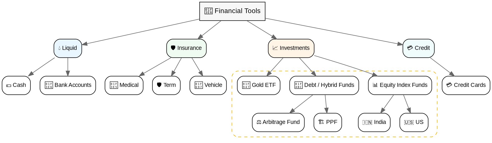

<small style="
  display:inline-block;
  background: linear-gradient(90deg, #f4b400, #fcd34d);
  color: white;
  padding: 4px 10px;
  border-radius: 6px;
  font-weight: 800;
">
sakthipriyan.com/building-wealth
</small>

## Sakthi Priyan H  
## Building Wealth
#### presenting  <!-- .element: class="fragment" -->

--

## Financial Tools  

### needed for Building Wealth  
#### Nov 02, 2025  <!-- .element: class="fragment" -->
--

### Disclaimer
<!-- .slide: data-autoslide="5000" -->
|  |  |
| --------------------------- | ---------------------------------------------------------- |
| **Personal Fit**      | Strategies shared reflect my experience and comfort level. |
| **Purpose**     | For learning and awareness, not financial advice.          |
| **Risk**         | Market values fluctuate; capital is always at risk.        |
| **Rules**         | Verify local tax and investment regulations.               |
| **Responsibility** | Make informed choices that align with your goals.          |

---

### Contents

1. Cash & Bank Accounts  
2. Insurance 
3. Investments  
  a. Equity  
  b. Hybrid & Debt  
  c. Gold  
  d. Real Assets  
4. Credit Cards & Loans
5. Summary  

---

### 1. Cash & Bank Accounts

**Purpose:** Liquidity and easy access 💧  

|  |  |  |
|------|--------------|---------|
| Bank Accounts | For salary credit, bill payments and daily expenses | 🟢&nbsp;Continue |
| Cash in Hand | Limited non-digital usage | 🟡&nbsp;Minimal |
| FD/RD | Used once; very tax inefficient | 🔴&nbsp;Exited |

> 💡 Keeps money flowing smoothly for expenses.

---

### 2. Insurance

**Purpose:** Risk management, not returns 🛡️  

|  |  |  |
|------|--------------|---------|
| Health | Covers hospitalization & health-related expenses | 🟢&nbsp;Continue |
| Term / Accident | Protects dependents in case of untimely demise | 🟢&nbsp;Continue |
| Motor | Mandatory for all vehicles | 🟢&nbsp;Continue |
| Home | Protects property & belongings | 🟡&nbsp;Optional |

> 💡 First line of defense for **Building Wealth.**

---

### 3 Investments

**Purpose:** 📈 Long-term growth for building wealth  

--
#### 3a. Equity

|  |  |  |
|------|--------------|---------|
| Index Funds | Low-cost, broad-market | 🟢&nbsp;Continue |
| Active Funds | Higher cost, inconsistent | 🟡&nbsp;Paused |
| Demat Account | For direct equity holdings | 🟡&nbsp;Paused |
| US Equity | Global diversification via International Broker | 🟢&nbsp;Continue |

> 📈 Grow wealth by owning businesses.

--

#### 3b. Hybrid & Debt
|  |  |  |
|------|--------------|---------|
| Arbitrage Funds | Short-term parking for travel/medical corpus | 🟢&nbsp;Continue |
| Debt/Hybrid Funds | Used in the past; paused post-tax change | 🟡&nbsp;Paused |
| Debt Mutual Funds | Reduced benefit after Apr 2023 taxation | 🟡&nbsp;Paused |

> 💰 Debt funds provide steady income and lower volatility.

--
#### 3b. Hybrid & Debt / Retirement
|  |  |  |
|------|--------------|---------|
| PPF | Long-term, government-backed, tax-efficient savings | 🟢&nbsp;Continue |
| EPF | Mandatory for salaried; offers tax-free compounding | 🟡&nbsp;Minimum |
| NPS | Limited flexibility and withdrawal constraints | 🟡&nbsp;Minimum |

> 💡 Provides long-term stability and retirement-focused growth.

--

#### 3c. Gold

**Purpose:** Inflation hedge, diversification and jewellery 💍  

|  |  |  |
|------|--------------|---------|
| Gold ETF | Preferred for future investments — lower cost | 🟢&nbsp;Planned |
| Gold Mutual Fund | Existing investment, held for diversification | 🟡&nbsp;Paused |
| Physical Gold | Minimal jewellery holding as required | 🟡&nbsp;Minimal |

> 💡 Acts as a portfolio stabilizer.

--

#### 3d. Real Assets

**Purpose:** Tangible assets for utility and lifestyle 🏠  

|  |  |  |
|------|--------------|---------|
| House | Primary residence with potential appreciation | 🟡&nbsp;Minimal |
| Vehicle | Utility, not investment; manage depreciation sensibly | 🟡&nbsp;Minimal |

> 💡 Offers stability, but comes with ongoing costs.

---

### 4. Credit Cards & Loans

**Purpose:** Smart leverage and cash-flow management 💳  

|  |  |  |
|------|--------------|---------|
| Credit Cards | Use responsibly for rewards and short-term credit | 🟢&nbsp;Continue |
| Loans | Avoid for consumption; consider only for appreciating assets | 🟡&nbsp;Minimal |

> 💡 *Use credit but, don’t let it use you.*

---

### 5. Summary

---

<section data-autoslide="1000">
  <h2>Sakthi Priyan H</h2>
  <h2>Building Wealth</h2>
  <h4 class="fragment" data-fragment-index="1">Thank you! 🎉</h4>  
  Found this helpful? 💡  
  
    👍 Like & 💬 Share with friends & family! 
    📌 Subscribe for more videos.
   
</section>
