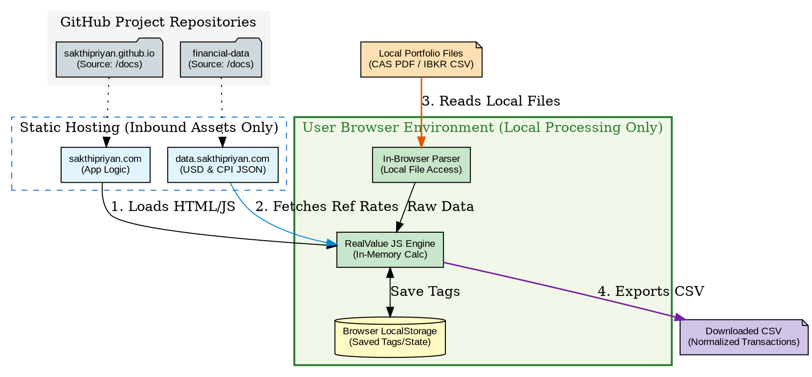

## Overview

Gain clarity on your mutual fund investments by parsing your combined CAS directly in your browser. Tag each holding with custom Categories, Asset Classes, and Statuses, which are automatically saved to your browser's local storage for future reference.

### Key Features

| Feature | Description |
|---------|-------------|
| **100% Private** | PDF parsing happens entirely in your browser; your financial data never leaves your device. |
| **Auto-Extraction** | Automatically pulls out your holdings, folios, ISINs, and current market values. |
| **Custom Tagging** | Create and assign custom Categories and Asset Classes to group related funds together. |
| **Status Tracking** | Mark funds to "Buy", "Hold", or "Sell" to keep your portfolio strategy clear. |
| **Visual Summary** | Get instant aggregated views and charts of your entire portfolio broken down by Asset Class and Category. |

### Full Capability Matrix

| Capability | What It Does |
|------------|---------------|
| **CAS PDF Parsing (CAMS/KFinTech)** | Parses consolidated CAS PDFs (including password-protected files) directly in the browser and extracts folio-wise holdings, units, NAV, market value, and cost value. |
| **IBKR CSV Parsing** | Parses Interactive Brokers activity/open position CSV data for stock holdings, cost basis, market value, trades, and account mapping. |
| **Unified Portfolio View** | Combines CAS and IBKR holdings into one table with consistent tagging, valuation display, and status workflow. |
| **Transaction-Based XIRR (Not Manual Input)** | Computes XIRR from actual transaction cashflows plus terminal value; supports fund-level and aggregated report-level computation. |
| **INR + USD Analytics for IBKR** | Computes and displays both INR and USD values/XIRR for IBKR holdings where transaction history is available. |
| **Historical FX Conversion** | Converts IBKR transaction cashflows to INR using SBI historical TT Buy rates on transaction date (or previous available date). |
| **Invested Value Integrity for IBKR** | Uses open-lot FIFO-based invested value estimation (transaction-date FX adjusted) so invested vs market vs XIRR are more internally consistent. |
| **NAV + Date Display** | Shows NAV per unit and valuation date with market value context; IBKR supports INR and USD NAV display. |
| **Quantity Reconciliation Guardrails** | Skips/flags XIRR when parsed transaction quantity does not reconcile with reported holdings quantity. |
| **Category / Asset Class / Status Tagging** | Lets you tag each holding with your custom Category, Asset Class, and Buy/Hold/Sell status. |
| **Allocation Report Modes** | Provides overview and category-scoped asset-class breakdowns with table + chart visualization. |
| **Persistent Local State** | Saves funds, tags, and settings in browser local storage for continuity across sessions/uploads. |
| **Download Transactions CSV** | Exports normalized cashflow rows (`TRANSACTION` + `TERMINAL`) in INR/USD for offline XIRR verification in Excel/Sheets/Python. |

### CAS Parser Limitation

> ⚠️ Parsing is based on heuristics and has been tested with 3 CAS PDFs so far. Working with friends & family to improve parser quality. Transaction units and total units are validated — any discrepancies will be flagged in the UI. 🙏

### Exported Transactions CSV Format

The **Download Transactions** button exports one row per normalized flow with these columns:

`fundId, fundName, source, folioNo, isin, category, assetClass, flowType, date, usdAmount, inrAmount`

Where:
- `flowType` is either `TRANSACTION` (historical cashflow) or `TERMINAL` (current market value)
- `inrAmount` is populated for all CAS funds and IBKR holdings with INR valuation
- `usdAmount` is populated for IBKR holdings where USD transaction data is available
- Use `inrAmount` for INR XIRR and `usdAmount` for USD XIRR in Excel/Sheets/Python

---

## Usage Guide

### 1. First-Time Setup (Full History Upload)

For accurate XIRR and invested-value computation, your **first upload should include complete transaction history from the first transaction date**.

#### 1a. CAS (Mutual Funds)
1. Visit the [CAMS CAS Request Page](https://www.camsonline.com/Investors/Statements/Consolidated-Account-Statement).
2. Request a **Detailed** statement (not Summary).
3. Select a period starting from your earliest transaction date.
4. Download the CAS PDF (password-protected is fine).
5. Use **Import CAS PDF** in this tool and enter the password if required.

  

#### 1b. IBKR (International Holdings)
1. Generate an [IBKR](https://www.interactivebrokers.co.in/en/home.php) statement/CSV that includes trade history from the first transaction date.
2. Ensure the export includes open positions and trades.
3. Use **Upload IBKR CSV** in this tool.

  

### 2. Ongoing Updates (Current-Year Incremental Upload)

After the first full-history upload, you can upload only the current year or latest period.

- The tool merges by fund and **replaces overlapping dates** with the latest uploaded records.
- This lets you keep data fresh without re-uploading entire historical files every time.
- Recommended cadence: monthly refresh before making new investments, so [RealValue Family SIP Allocator](/building-wealth/tools/realvalue-family-sip-allocator/) can be used with the latest portfolio state.

### 3. Tagging Holdings

Add these tags to each fund/holding:
- **Category**: e.g., Emergency, Travel, Core Portfolio, Retirement
- **Asset Class**: e.g., Nifty 50, Nasdaq 100, Debt, Gold
- **Status**: Buy, Hold, or Sell

Tags are stored in your browser and auto-applied on future uploads when the holding identity matches.

### 4. Reviewing Reports

Use **Allocation Report** to review:
- Category-level overview
- Asset-class breakdown within each category
- Market value, invested value, NAV context, allocation %, and XIRR
- Table + chart view toggle

### 5. Exporting Transactions for Offline Verification

Use **Download Transactions** to export normalized cashflows used by the analytics engine.

You can verify results offline in:
- Excel / Google Sheets (`XIRR`)
- Python / R (`xirr` libraries)
- Your own audit scripts

---

## Privacy & Trust

Your financial data never leaves your device.

| Aspect | Detail |
|--------|--------|
| **CAS PDF parsing** | Runs entirely in your browser using [PDF.js](https://mozilla.github.io/pdf.js/) — no file is ever uploaded |
| **IBKR CSV parsing** | Processed locally in your browser |
| **Tags & settings** | Saved only in your browser's local storage |
| **IBKR FX conversion** | SBI historical TT Buy rates pre-fetched and cached locally on page load from [data.sakthipriyan.com](https://data.sakthipriyan.com/); no network needed after initial load |

### How It Works

This tool uses **PDF.js** to parse the CAS file directly in your browser. No server is involved in reading or processing your document.

### Works Offline

SBI FX rates are pre-cached in your browser on page load. After that, you can disconnect the internet and all CAS and IBKR analysis runs fully offline.
